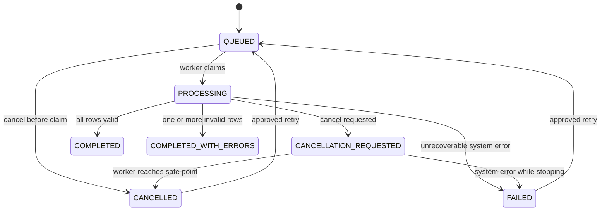

# Domain Model & Business Rules

# 6. Thuật ngữ

| Thuật ngữ | Định nghĩa |
|---|---|
| Import File | File CSV gốc đã được lưu thành công trong MinIO và có metadata trong PostgreSQL |
| Processing Job | Một yêu cầu xử lý một Import File |
| Processing Attempt | Một lần thực thi của Processing Job, gồm lần đầu hoặc lần retry |
| Logical Batch | Một nhóm dòng CSV được gom để validate và ghi database theo batch |
| Validation Error | Lỗi dữ liệu của một dòng, không phải lỗi hệ thống |
| System Error | Lỗi storage, database, timeout, mất kết nối hoặc lỗi không dự kiến |
| Error Report | File CSV chứa các dòng không hợp lệ và lý do lỗi |
| Duplicate File | File có cùng SHA-256 checksum và cùng owner với Import File đã tồn tại |
| Safe Point | Điểm giữa hai logical batch nơi worker có thể dừng mà không làm hỏng transaction đang chạy |
| Canonical Job | Job duy nhất được chấp nhận cho một file của một owner |
| Terminal State | Trạng thái không tự chuyển sang trạng thái khác nếu không có hành động retry mới |

---

# 7. Domain Analysis

## 7.1 Bounded context

Phiên bản đầu có hai bounded context logic trong cùng một modular monolith:

### A. File Import Context

Quản lý:

- Import File.
- Processing Job.
- Processing Attempt.
- Validation result.
- Error report.
- Progress.
- Retry và cancellation.

### B. Customer Context

Quản lý:

- Customer.
- Business identity `externalId`.
- Dữ liệu khách hàng đã chuẩn hóa.
- Nguồn import gần nhất.

Hai context nằm trong cùng application và cùng PostgreSQL nhưng không được trộn toàn bộ logic vào một service class.

## 7.2 Aggregate và entity

### Aggregate 1 — ImportFile

**Aggregate Root:** `ImportFile`

Trách nhiệm:

- Đại diện cho file vật lý đã lưu thành công.
- Giữ checksum và storage key.
- Bảo đảm một owner không có hai Import File canonical cùng checksum.
- Không quản lý tiến độ xử lý.

Thuộc tính logic:

| Thuộc tính | Ý nghĩa |
|---|---|
| id | UUID nội bộ |
| ownerId | User upload file |
| originalFilename | Tên file gốc để hiển thị |
| storageKey | Key nội bộ trên MinIO |
| checksumSha256 | Checksum SHA-256 |
| sizeBytes | Kích thước file |
| contentType | Content type đã xác định |
| createdAt | Thời điểm file được đăng ký |
| retentionUntil | Thời điểm file có thể được xóa theo retention policy |

Invariant:

- `storageKey` không được dùng trực tiếp từ filename của user.
- `checksumSha256` phải có trước khi Import File được xem là hợp lệ.
- Unique logic: `(ownerId, checksumSha256)`.
- Metadata chỉ được tạo sau khi object storage ghi file thành công.
- Import File không bị sửa nội dung sau khi tạo.

### Aggregate 2 — ProcessingJob

**Aggregate Root:** `ProcessingJob`

Trách nhiệm:

- Quản lý state machine.
- Quản lý progress và counters.
- Chấp nhận hoặc từ chối retry/cancel.
- Bảo đảm chỉ một attempt RUNNING tại một thời điểm.
- Ghi nhận kết quả cuối cùng.

Thuộc tính logic:

| Thuộc tính | Ý nghĩa |
|---|---|
| id | Job UUID trả cho client |
| importFileId | File được xử lý |
| ownerId | Chủ sở hữu |
| status | Trạng thái hiện tại |
| progressPercent | 0–100 |
| processedRows | Số dòng đã đọc xong |
| validRows | Dòng hợp lệ |
| invalidRows | Dòng lỗi validation |
| insertedRows | Customer mới |
| updatedRows | Customer đã tồn tại được cập nhật |
| totalRows | Tổng dòng dữ liệu, có thể chưa biết khi bắt đầu |
| currentAttempt | Số attempt gần nhất |
| cancelRequested | Cờ yêu cầu dừng |
| errorCode | Mã lỗi hệ thống cuối cùng |
| errorSummary | Mô tả đã được làm sạch |
| errorReportKey | Storage key của report |
| startedAt | Thời điểm bắt đầu attempt hiện tại |
| finishedAt | Thời điểm kết thúc |
| heartbeatAt | Dùng phát hiện stale job |
| version | Optimistic locking |
| createdAt | Thời điểm tạo job |
| updatedAt | Thời điểm cập nhật |

Invariant:

- Chỉ job QUEUED mới được claim để chạy.
- Một job chỉ có tối đa một attempt RUNNING.
- Progress không được giảm trong cùng một attempt.
- `processedRows = validRows + invalidRows`.
- `insertedRows + updatedRows <= validRows`.
- Job terminal không được cancel.
- Retry tạo attempt mới, không sửa lịch sử attempt cũ.
- COMPLETED không có invalid row.
- COMPLETED_WITH_ERRORS có ít nhất một invalid row.
- FAILED chỉ dùng cho lỗi hệ thống, không dùng cho validation error.
- CANCELLED chỉ được thiết lập sau khi worker dừng tại safe point.

### Entity — ProcessingAttempt

Nằm dưới vòng đời của ProcessingJob hoặc được lưu thành bảng lịch sử liên kết với Job.

Thuộc tính:

- id.
- jobId.
- attemptNumber.
- triggeredBy: `INITIAL`, `USER_RETRY`, `ADMIN_RETRY`, `RECOVERY`.
- status: `RUNNING`, `SUCCEEDED`, `FAILED`, `CANCELLED`.
- startedAt.
- finishedAt.
- processedRows.
- validRows.
- invalidRows.
- insertedRows.
- updatedRows.
- errorCode.
- errorSummary.

Business rule:

- `attemptNumber` tăng tuần tự từ 1.
- Lịch sử attempt không bị ghi đè.
- Retry tối đa 3 attempt do người dùng/admin chủ động.
- Automatic retry ở mức operation không làm tăng `attemptNumber`.
- Recovery run sau service restart tạo attempt mới với trigger `RECOVERY`.

### Aggregate — Customer

Thuộc Customer Context.

Thuộc tính:

| Thuộc tính | Quy tắc |
|---|---|
| id | UUID nội bộ |
| externalId | Business key duy nhất |
| fullName | Tên đã trim và normalize khoảng trắng |
| email | Lowercase, trim |
| phone | Chuẩn hóa về định dạng `+84xxxxxxxxx` |
| dateOfBirth | LocalDate |
| address | Trim, optional |
| lastImportJobId | Job gần nhất tạo/cập nhật record |
| createdAt | Audit |
| updatedAt | Audit |
| version | Optimistic locking nếu cần |

Invariant:

- `externalId` là duy nhất toàn hệ thống.
- Một dòng hợp lệ được **upsert** theo `externalId`.
- Nếu chưa tồn tại: insert và tăng `insertedRows`.
- Nếu đã tồn tại: update các trường dữ liệu và tăng `updatedRows`.
- Không xóa customer khi file mới không còn chứa customer đó.
- Import không được thay đổi `id` nội bộ của customer.

## 7.3 Value Object

### FileChecksum

- Algorithm cố định: SHA-256.
- Biểu diễn lowercase hexadecimal 64 ký tự.
- Không chấp nhận null hoặc format khác.

### JobProgress

- processedRows.
- totalRows nếu đã biết.
- percent.

Nếu chưa biết total rows, API trả `progressPercent = null` và vẫn trả `processedRows`.
Sau khi đọc hết file, total rows phải được xác định và progress cuối là 100.

### ValidationIssue

- rowNumber.
- externalId nếu đọc được.
- errorCode.
- field.
- message.
- rejectedValue đã mask nếu là dữ liệu nhạy cảm.

### CustomerImportRow

Dữ liệu tạm sau khi parse một dòng, chưa phải Customer cho đến khi vượt qua validation.

---

# 8. State Machine

## 8.1 Job statuses

| Status | Ý nghĩa | Terminal |
|---|---|---|
| QUEUED | Job đã tạo và đang chờ worker | Không |
| PROCESSING | Worker đã claim và đang xử lý | Không |
| CANCELLATION_REQUESTED | Người dùng yêu cầu dừng; worker sẽ dừng tại safe point | Không |
| COMPLETED | Xử lý xong, không có dòng validation lỗi | Có |
| COMPLETED_WITH_ERRORS | Xử lý xong nhưng có dòng validation lỗi | Có |
| FAILED | Job dừng do lỗi hệ thống | Có |
| CANCELLED | Worker đã dừng an toàn do yêu cầu cancel | Có |

## 8.2 Transition hợp lệ



Không cho phép:

- COMPLETED hoặc COMPLETED_WITH_ERRORS retry trong phiên bản đầu.
- FAILED chuyển thẳng PROCESSING.
- PROCESSING chuyển QUEUED mà không kết thúc attempt.
- Cancel COMPLETED, COMPLETED_WITH_ERRORS, FAILED hoặc CANCELLED.
- Hai worker cùng chuyển một job QUEUED sang PROCESSING.

## 8.3 Terminal state

Terminal state của một attempt:

- COMPLETED.
- COMPLETED_WITH_ERRORS.
- FAILED.
- CANCELLED.

FAILED và CANCELLED có thể tạo attempt mới thông qua nghiệp vụ retry; history cũ vẫn giữ nguyên.

---

# 9. Định dạng và business rules của CSV

## 9.1 Template bắt buộc

Header bắt buộc:

```csv
external_id,full_name,email,phone,date_of_birth,address
```

Quy định:

- Encoding: UTF-8, chấp nhận UTF-8 BOM.
- Delimiter: dấu phẩy `,`.
- Quote character: dấu ngoặc kép `"`.
- Header không phân biệt chữ hoa/thường sau khi trim.
- Thứ tự cột có thể thay đổi.
- Phải có đủ 6 cột bắt buộc.
- Không chấp nhận cột lạ trong phiên bản đầu.
- File chỉ có header và không có data row bị từ chối.
- Blank line được bỏ qua và không tính là data row.
- `row_number` trong report là số dòng vật lý trong file, header là dòng 1.
- Tối đa 1.000.000 data row.
- Kích thước tối đa mặc định 500 MB, cấu hình được.
- Filename phải có đuôi `.csv`, nhưng hệ thống không được chỉ tin vào extension.

## 9.2 Quy tắc field

### external_id

- Bắt buộc.
- Trim.
- Từ 1 đến 64 ký tự.
- Chỉ cho phép chữ cái, số, dấu gạch ngang và gạch dưới.
- Unique trong toàn hệ thống ở bảng customer.
- Trong cùng file: occurrence đầu tiên hợp lệ được xử lý; occurrence sau bị reject với `DUPLICATE_EXTERNAL_ID_IN_FILE`.

### full_name

- Bắt buộc.
- Trim đầu/cuối.
- Nhiều khoảng trắng liên tiếp được normalize thành một khoảng trắng.
- Từ 2 đến 150 ký tự sau normalize.

### email

- Bắt buộc.
- Trim và chuyển lowercase.
- Tối đa 254 ký tự.
- Phải thỏa email format được application sử dụng.
- Không yêu cầu xác minh email tồn tại thật.

### phone

- Bắt buộc.
- Bỏ khoảng trắng, dấu chấm và dấu gạch ngang.
- Chấp nhận dạng Việt Nam bắt đầu bằng `0` hoặc `+84`.
- Sau normalize phải về dạng `+84` và 9 chữ số phía sau.
- Không kiểm tra số điện thoại đang hoạt động.

### date_of_birth

- Bắt buộc.
- Format `yyyy-MM-dd`.
- Không được trong tương lai.
- Không được sớm hơn ngày hiện tại 120 năm.

### address

- Không bắt buộc.
- Trim.
- Tối đa 500 ký tự.
- Empty string được lưu thành null.

## 9.3 Nhiều lỗi trên cùng một dòng

Một dòng có thể có nhiều lỗi. Error report sử dụng **một record cho mỗi lỗi**, do đó một dòng gốc có thể xuất hiện nhiều lần.

Ví dụ:

```csv
row_number,external_id,error_code,field,error_message,original_data
25,CUS-100,INVALID_EMAIL,email,Email format is invalid,"..."
25,CUS-100,INVALID_PHONE,phone,Phone format is invalid,"..."
```

`invalidRows` chỉ tăng một lần cho dòng 25, không tăng theo số ValidationIssue.

## 9.4 Upsert customer

- Dòng hợp lệ được upsert theo `external_id`.
- Toàn bộ field trong file là snapshot mới nhất và thay thế giá trị cũ.
- `address` rỗng được hiểu là null và ghi đè address cũ.
- Nếu record mới hoàn toàn: `insertedRows + 1`.
- Nếu external_id đã tồn tại: `updatedRows + 1`, kể cả dữ liệu mới giống dữ liệu cũ.
- Mỗi logical batch dùng một transaction riêng.
- Validation error không được gửi vào transaction upsert.
- Khi một batch lỗi database sau retry operation, toàn bộ batch rollback và job FAILED.
- Các batch đã commit trước đó không rollback.
- Retry job đọc lại file từ đầu; upsert bảo đảm không tạo duplicate customer.
- Counters của attempt mới được tính lại từ 0.

Đây là mô hình **partial commit có idempotent retry**, không phải all-or-nothing import.

---

# 16. Logical Data Model

## 16.1 import_files

| Field | Gợi ý type | Constraint |
|---|---|---|
| id | UUID | PK |
| owner_id | UUID/string | NOT NULL |
| original_filename | varchar | NOT NULL |
| storage_key | varchar | UNIQUE, NOT NULL |
| checksum_sha256 | char(64) | NOT NULL |
| size_bytes | bigint | > 0 |
| content_type | varchar | NOT NULL |
| retention_until | timestamptz | NOT NULL |
| created_at | timestamptz | NOT NULL |
| version | bigint | optional |

Unique business constraint:

```text
(owner_id, checksum_sha256)
```

## 16.2 processing_jobs

| Field | Constraint |
|---|---|
| id | PK |
| import_file_id | FK, unique cho initial job của file |
| owner_id | NOT NULL |
| status | NOT NULL |
| processed_rows | default 0 |
| valid_rows | default 0 |
| invalid_rows | default 0 |
| inserted_rows | default 0 |
| updated_rows | default 0 |
| total_rows | nullable |
| progress_percent | nullable |
| current_attempt | default 0 |
| cancel_requested | default false |
| error_code | nullable |
| error_summary | nullable |
| error_report_key | nullable |
| started_at | nullable |
| finished_at | nullable |
| heartbeat_at | nullable |
| created_at | NOT NULL |
| updated_at | NOT NULL |
| version | optimistic locking |

Indexes tối thiểu:

- `(owner_id, created_at desc)`.
- `(status, created_at)`.
- `(heartbeat_at)` cho stale recovery.
- `(import_file_id)`.

## 16.3 processing_attempts

Unique:

```text
(job_id, attempt_number)
```

Index:

- `(job_id, attempt_number desc)`.
- `(status, started_at)`.

## 16.4 customers

Constraints:

- PK internal UUID.
- Unique `external_id`.
- Index email nếu có use case search; phiên bản này không bắt buộc.
- `last_import_job_id` FK có thể nullable theo lựa chọn triển khai.

## 16.5 audit_events

Fields:

- id.
- actor_type.
- actor_id.
- action.
- resource_type.
- resource_id.
- previous_status.
- new_status.
- metadata JSON đã loại bỏ secret.
- occurred_at.
- trace_id.

Audit event là append-only ở application level.

## 16.6 Error detail storage

Không lưu từng ValidationIssue vào PostgreSQL vì một file có thể tạo rất nhiều lỗi.

PostgreSQL chỉ lưu:

- invalidRows.
- errorReportKey.
- Có thể lưu summary count theo error code dưới dạng JSONB hoặc bảng summary nhỏ.

Chi tiết từng lỗi nằm trong Error Report trên MinIO.

---

# 20. Processing Consistency và Transaction Rules

## 20.1 Transaction boundary

- Upload metadata transaction không bao gồm việc stream toàn file.
- File phải lưu xong trước khi commit Import File + Job.
- Mỗi logical batch upsert là một transaction.
- Progress update nằm ngoài transaction batch hoặc được thiết kế không làm rollback business data.
- Job finalization là transaction riêng.
- Audit event nên commit nhất quán với state transition quan trọng.

## 20.2 Partial commit

Client đã chấp nhận:

- Customer của batch trước có thể đã được ghi khi batch sau làm job FAILED.
- Job detail phải thể hiện counters gần nhất.
- Retry xử lý lại toàn file bằng upsert.
- Hệ thống không cung cấp rollback toàn bộ customer theo job trong phiên bản đầu.

## 20.3 Concurrent import jobs

Hai file khác nhau có thể chứa cùng external_id và chạy đồng thời.

Business rule:

- Record commit sau cùng sẽ là dữ liệu cuối cùng theo database ordering thực tế.
- Không có merge field.
- `lastImportJobId` cho biết job cập nhật gần nhất.
- Database unique constraint ngăn insert duplicate.
- Upsert phải chịu được concurrent insert/update.
- Lost update cần được xử lý bằng câu lệnh upsert atomic hoặc retry transaction phù hợp.

Đây là last-write-wins ở mức record.

---

# 21. Audit Requirements

Audit action tối thiểu:

- FILE_UPLOADED.
- DUPLICATE_UPLOAD_REJECTED.
- JOB_CREATED.
- JOB_STARTED.
- JOB_COMPLETED.
- JOB_FAILED.
- JOB_RETRY_REQUESTED.
- JOB_CANCELLATION_REQUESTED.
- JOB_CANCELLED.
- ERROR_REPORT_DOWNLOADED.
- STALE_JOB_MARKED_FAILED.
- FILE_DELETED_BY_RETENTION.
- REPORT_DELETED_BY_RETENTION.

Mỗi event:

- actor.
- resource ID.
- timestamp.
- previous/new status nếu có.
- traceId.
- metadata cần thiết nhưng không chứa secret hoặc full customer row.

---
