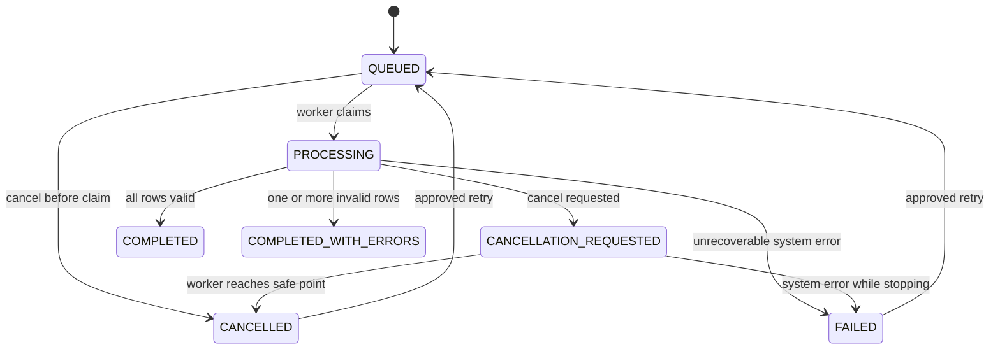

# BUSINESS REQUIREMENTS & SOFTWARE REQUIREMENTS SPECIFICATION
## Customer CSV File Processing Service

| Thuộc tính | Giá trị |
|---|---|
| Mã tài liệu | BA-FPS-001 |
| Phiên bản | 1.0 |
| Trạng thái | Approved for Development |
| Loại tài liệu | BRD + Functional Specification + SRS |
| Đối tượng đọc | Backend Developer, QA, Tech Lead, DevOps |
| Nền tảng mục tiêu | Java 21+, Spring Boot 4.x, PostgreSQL, MinIO, Redis/Redisson |
| Kiến trúc định hướng | Modular Monolith, DDD tactical ở mức vừa phải |
| Use case nghiệp vụ | Import dữ liệu khách hàng từ file CSV dung lượng lớn |

---

# 1. Mục đích tài liệu

Tài liệu này là đặc tả cuối cùng đã được thống nhất giữa Client, BA và Tech Lead cho phiên bản đầu tiên của **Customer CSV File Processing Service**.

Developer sử dụng tài liệu này để:

- Hiểu vấn đề nghiệp vụ cần giải quyết.
- Hiểu actor, quyền hạn và mục tiêu của từng chức năng.
- Xác định domain model và vòng đời của một file import.
- Thiết kế API, database và processing pipeline.
- Viết unit test, integration test và acceptance test.
- Triển khai tính năng mà không cần tự suy đoán các business rule quan trọng.

Tài liệu không cung cấp code, package structure hoặc schema SQL hoàn chỉnh. Developer phải tự thiết kế giải pháp kỹ thuật nhưng không được làm thay đổi hành vi nghiệp vụ đã được chốt.

---

# 2. Bối cảnh nghiệp vụ

Công ty thường xuyên nhận file CSV chứa dữ liệu khách hàng từ các đối tác và bộ phận vận hành. Mỗi file có thể chứa từ vài trăm đến một triệu dòng.

Quy trình hiện tại được thực hiện thủ công:

1. Nhân viên nhận file qua email hoặc công cụ chat.
2. Nhân viên gửi file cho bộ phận kỹ thuật.
3. Kỹ thuật chạy script để kiểm tra dữ liệu.
4. Dữ liệu hợp lệ được nhập vào database.
5. Dữ liệu lỗi được tổng hợp thủ công rồi gửi lại cho nhân viên.
6. Không có màn hình hoặc API để theo dõi tiến độ.
7. Cùng một file có thể bị gửi và xử lý nhiều lần.
8. Khi script dừng giữa chừng, không xác định được dữ liệu nào đã được ghi.
9. Không có audit log để biết ai upload, ai retry hoặc ai hủy job.

Client cần một backend service tập trung để quản lý toàn bộ vòng đời:

```text
Nhận file -> lưu file -> phát hiện trùng -> tạo job -> xử lý
-> theo dõi tiến độ -> lưu kết quả -> tải báo cáo lỗi -> retry/cancel
```

---

# 3. Business Goal

## 3.1 Mục tiêu chính

1. Tự động hóa việc tiếp nhận và import file khách hàng.
2. Giảm nguy cơ nhập trùng do cùng một file được upload nhiều lần.
3. Cho phép người dùng theo dõi trạng thái và kết quả xử lý.
4. Tách rõ lỗi dữ liệu và lỗi hệ thống.
5. Xử lý được file lớn mà không gây tràn bộ nhớ.
6. Có đủ log, metric và audit để điều tra lỗi production.

## 3.2 Chỉ số thành công của phiên bản đầu

| Mã | Chỉ số | Mục tiêu |
|---|---|---|
| BG-01 | Tỷ lệ file được xử lý mà không cần kỹ thuật chạy script thủ công | 100% đối với file đúng template |
| BG-02 | File trùng của cùng người dùng tạo thêm job xử lý | 0 |
| BG-03 | Job có thể tra cứu được trạng thái sau khi upload | 100% |
| BG-04 | Dòng lỗi nghiệp vụ xuất hiện trong error report | 100% |
| BG-05 | Job bị crash hoặc service restart bị treo ở PROCESSING vĩnh viễn | 0 |
| BG-06 | Dữ liệu nhạy cảm bị ghi đầy đủ vào application log | 0 |

Các mục tiêu hiệu năng chi tiết được quy định trong phần Non-functional Requirements.

---

# 4. Phạm vi

## 4.1 In scope

Phiên bản đầu gồm đúng 5 nhóm tính năng:

1. Upload và đăng ký file CSV.
2. Phát hiện file trùng và tạo processing job an toàn.
3. Xử lý file bất đồng bộ: parse, normalize, validate và upsert customer.
4. Theo dõi danh sách, tiến độ và kết quả job.
5. Quản lý kết quả lỗi: download error report, retry và cancel job.

Các chức năng hỗ trợ bắt buộc:

- JWT authentication.
- Role-based authorization.
- Lưu file trên MinIO.
- PostgreSQL lưu metadata, job và customer.
- Redis/Redisson phục vụ distributed coordination.
- Audit log.
- Metrics, health check và structured logging.
- Database migration.
- Docker Compose.
- Automated tests.

## 4.2 Out of scope

- Frontend hoàn chỉnh.
- Import Excel, JSON, XML hoặc PDF.
- Upload nhiều file trong một request.
- Tự động nhận file từ email, SFTP hoặc cloud drive.
- Xử lý ảnh.
- OCR.
- Kafka hoặc RabbitMQ.
- Event Sourcing.
- CQRS framework.
- Workflow engine.
- Multi-tenant billing.
- Antivirus enterprise.
- Resume chính xác từ byte cuối cùng sau khi process crash.
- Sửa nội dung CSV trực tiếp trên hệ thống.
- Tự động gửi email thông báo.

---

# 5. Stakeholder và actor

## 5.1 Stakeholder

| Stakeholder | Mối quan tâm |
|---|---|
| Client/Product Owner | Quy trình import rõ ràng, giảm thao tác thủ công |
| Operation Team | Upload nhanh, xem tiến độ, nhận report dễ hiểu |
| Admin/Support | Điều tra lỗi, retry, cancel và xem toàn bộ job |
| Tech Lead | Tính đúng, khả năng vận hành, giới hạn concurrency |
| Backend Developer | Đặc tả rõ ràng để thiết kế và implement |
| QA | Acceptance Criteria đủ để tạo test case |
| DevOps | Health check, shutdown, configuration và monitoring |

## 5.2 Actor

### ACT-01 — Operator

Người dùng nghiệp vụ thực hiện import.

Quyền:

- Upload file.
- Xem các job do chính mình tạo.
- Xem tiến độ và kết quả job của mình.
- Tải error report của mình.
- Retry job FAILED của mình.
- Yêu cầu cancel job QUEUED hoặc PROCESSING của mình.

Không có quyền:

- Xem job của người khác.
- Xem technical stack trace.
- Xem dashboard toàn hệ thống.
- Retry hoặc cancel job của người khác.

### ACT-02 — Admin

Người quản trị hoặc support.

Có toàn bộ quyền của Operator và thêm:

- Xem mọi job.
- Lọc job theo owner, trạng thái và thời gian.
- Xem technical error code và error summary đã được làm sạch.
- Retry/cancel mọi job.
- Xem audit history.
- Xem metrics/dashboard tổng hợp thông qua công cụ monitoring.

### ACT-03 — Processing Worker

Actor hệ thống nội bộ.

Trách nhiệm:

- Claim job đang QUEUED.
- Đọc file gốc.
- Xử lý từng logical batch.
- Cập nhật progress.
- Tạo error report.
- Hoàn tất, fail hoặc dừng job tại safe point.

Processing Worker không có API public và không sử dụng JWT của người dùng.

---

# 6. Thuật ngữ

| Thuật ngữ | Định nghĩa |
|---|---|
| Import File | File CSV gốc đã được lưu thành công trong MinIO và có metadata trong PostgreSQL |
| Processing Job | Một yêu cầu xử lý một Import File |
| Processing Attempt | Một lần thực thi của Processing Job, gồm lần đầu hoặc lần retry |
| Logical Batch | Một nhóm dòng CSV được gom để validate và ghi database theo batch |
| Validation Error | Lỗi dữ liệu của một dòng, không phải lỗi hệ thống |
| System Error | Lỗi storage, database, timeout, mất kết nối hoặc lỗi không dự kiến |
| Error Report | File CSV chứa các dòng không hợp lệ và lý do lỗi |
| Duplicate File | File có cùng SHA-256 checksum và cùng owner với Import File đã tồn tại |
| Safe Point | Điểm giữa hai logical batch nơi worker có thể dừng mà không làm hỏng transaction đang chạy |
| Canonical Job | Job duy nhất được chấp nhận cho một file của một owner |
| Terminal State | Trạng thái không tự chuyển sang trạng thái khác nếu không có hành động retry mới |

---

# 7. Domain Analysis

## 7.1 Bounded context

Phiên bản đầu có hai bounded context logic trong cùng một modular monolith:

### A. File Import Context

Quản lý:

- Import File.
- Processing Job.
- Processing Attempt.
- Validation result.
- Error report.
- Progress.
- Retry và cancellation.

### B. Customer Context

Quản lý:

- Customer.
- Business identity `externalId`.
- Dữ liệu khách hàng đã chuẩn hóa.
- Nguồn import gần nhất.

Hai context nằm trong cùng application và cùng PostgreSQL nhưng không được trộn toàn bộ logic vào một service class.

## 7.2 Aggregate và entity

### Aggregate 1 — ImportFile

**Aggregate Root:** `ImportFile`

Trách nhiệm:

- Đại diện cho file vật lý đã lưu thành công.
- Giữ checksum và storage key.
- Bảo đảm một owner không có hai Import File canonical cùng checksum.
- Không quản lý tiến độ xử lý.

Thuộc tính logic:

| Thuộc tính | Ý nghĩa |
|---|---|
| id | UUID nội bộ |
| ownerId | User upload file |
| originalFilename | Tên file gốc để hiển thị |
| storageKey | Key nội bộ trên MinIO |
| checksumSha256 | Checksum SHA-256 |
| sizeBytes | Kích thước file |
| contentType | Content type đã xác định |
| createdAt | Thời điểm file được đăng ký |
| retentionUntil | Thời điểm file có thể được xóa theo retention policy |

Invariant:

- `storageKey` không được dùng trực tiếp từ filename của user.
- `checksumSha256` phải có trước khi Import File được xem là hợp lệ.
- Unique logic: `(ownerId, checksumSha256)`.
- Metadata chỉ được tạo sau khi object storage ghi file thành công.
- Import File không bị sửa nội dung sau khi tạo.

### Aggregate 2 — ProcessingJob

**Aggregate Root:** `ProcessingJob`

Trách nhiệm:

- Quản lý state machine.
- Quản lý progress và counters.
- Chấp nhận hoặc từ chối retry/cancel.
- Bảo đảm chỉ một attempt RUNNING tại một thời điểm.
- Ghi nhận kết quả cuối cùng.

Thuộc tính logic:

| Thuộc tính | Ý nghĩa |
|---|---|
| id | Job UUID trả cho client |
| importFileId | File được xử lý |
| ownerId | Chủ sở hữu |
| status | Trạng thái hiện tại |
| progressPercent | 0–100 |
| processedRows | Số dòng đã đọc xong |
| validRows | Dòng hợp lệ |
| invalidRows | Dòng lỗi validation |
| insertedRows | Customer mới |
| updatedRows | Customer đã tồn tại được cập nhật |
| totalRows | Tổng dòng dữ liệu, có thể chưa biết khi bắt đầu |
| currentAttempt | Số attempt gần nhất |
| cancelRequested | Cờ yêu cầu dừng |
| errorCode | Mã lỗi hệ thống cuối cùng |
| errorSummary | Mô tả đã được làm sạch |
| errorReportKey | Storage key của report |
| startedAt | Thời điểm bắt đầu attempt hiện tại |
| finishedAt | Thời điểm kết thúc |
| heartbeatAt | Dùng phát hiện stale job |
| version | Optimistic locking |
| createdAt | Thời điểm tạo job |
| updatedAt | Thời điểm cập nhật |

Invariant:

- Chỉ job QUEUED mới được claim để chạy.
- Một job chỉ có tối đa một attempt RUNNING.
- Progress không được giảm trong cùng một attempt.
- `processedRows = validRows + invalidRows`.
- `insertedRows + updatedRows <= validRows`.
- Job terminal không được cancel.
- Retry tạo attempt mới, không sửa lịch sử attempt cũ.
- COMPLETED không có invalid row.
- COMPLETED_WITH_ERRORS có ít nhất một invalid row.
- FAILED chỉ dùng cho lỗi hệ thống, không dùng cho validation error.
- CANCELLED chỉ được thiết lập sau khi worker dừng tại safe point.

### Entity — ProcessingAttempt

Nằm dưới vòng đời của ProcessingJob hoặc được lưu thành bảng lịch sử liên kết với Job.

Thuộc tính:

- id.
- jobId.
- attemptNumber.
- triggeredBy: `INITIAL`, `USER_RETRY`, `ADMIN_RETRY`, `RECOVERY`.
- status: `RUNNING`, `SUCCEEDED`, `FAILED`, `CANCELLED`.
- startedAt.
- finishedAt.
- processedRows.
- validRows.
- invalidRows.
- insertedRows.
- updatedRows.
- errorCode.
- errorSummary.

Business rule:

- `attemptNumber` tăng tuần tự từ 1.
- Lịch sử attempt không bị ghi đè.
- Retry tối đa 3 attempt do người dùng/admin chủ động.
- Automatic retry ở mức operation không làm tăng `attemptNumber`.
- Recovery run sau service restart tạo attempt mới với trigger `RECOVERY`.

### Aggregate — Customer

Thuộc Customer Context.

Thuộc tính:

| Thuộc tính | Quy tắc |
|---|---|
| id | UUID nội bộ |
| externalId | Business key duy nhất |
| fullName | Tên đã trim và normalize khoảng trắng |
| email | Lowercase, trim |
| phone | Chuẩn hóa về định dạng `+84xxxxxxxxx` |
| dateOfBirth | LocalDate |
| address | Trim, optional |
| lastImportJobId | Job gần nhất tạo/cập nhật record |
| createdAt | Audit |
| updatedAt | Audit |
| version | Optimistic locking nếu cần |

Invariant:

- `externalId` là duy nhất toàn hệ thống.
- Một dòng hợp lệ được **upsert** theo `externalId`.
- Nếu chưa tồn tại: insert và tăng `insertedRows`.
- Nếu đã tồn tại: update các trường dữ liệu và tăng `updatedRows`.
- Không xóa customer khi file mới không còn chứa customer đó.
- Import không được thay đổi `id` nội bộ của customer.

## 7.3 Value Object

### FileChecksum

- Algorithm cố định: SHA-256.
- Biểu diễn lowercase hexadecimal 64 ký tự.
- Không chấp nhận null hoặc format khác.

### JobProgress

- processedRows.
- totalRows nếu đã biết.
- percent.

Nếu chưa biết total rows, API trả `progressPercent = null` và vẫn trả `processedRows`.
Sau khi đọc hết file, total rows phải được xác định và progress cuối là 100.

### ValidationIssue

- rowNumber.
- externalId nếu đọc được.
- errorCode.
- field.
- message.
- rejectedValue đã mask nếu là dữ liệu nhạy cảm.

### CustomerImportRow

Dữ liệu tạm sau khi parse một dòng, chưa phải Customer cho đến khi vượt qua validation.

---

# 8. State Machine

## 8.1 Job statuses

| Status | Ý nghĩa | Terminal |
|---|---|---|
| QUEUED | Job đã tạo và đang chờ worker | Không |
| PROCESSING | Worker đã claim và đang xử lý | Không |
| CANCELLATION_REQUESTED | Người dùng yêu cầu dừng; worker sẽ dừng tại safe point | Không |
| COMPLETED | Xử lý xong, không có dòng validation lỗi | Có |
| COMPLETED_WITH_ERRORS | Xử lý xong nhưng có dòng validation lỗi | Có |
| FAILED | Job dừng do lỗi hệ thống | Có |
| CANCELLED | Worker đã dừng an toàn do yêu cầu cancel | Có |

## 8.2 Transition hợp lệ



Không cho phép:

- COMPLETED hoặc COMPLETED_WITH_ERRORS retry trong phiên bản đầu.
- FAILED chuyển thẳng PROCESSING.
- PROCESSING chuyển QUEUED mà không kết thúc attempt.
- Cancel COMPLETED, COMPLETED_WITH_ERRORS, FAILED hoặc CANCELLED.
- Hai worker cùng chuyển một job QUEUED sang PROCESSING.

## 8.3 Terminal state

Terminal state của một attempt:

- COMPLETED.
- COMPLETED_WITH_ERRORS.
- FAILED.
- CANCELLED.

FAILED và CANCELLED có thể tạo attempt mới thông qua nghiệp vụ retry; history cũ vẫn giữ nguyên.

---

# 9. Định dạng và business rules của CSV

## 9.1 Template bắt buộc

Header bắt buộc:

```csv
external_id,full_name,email,phone,date_of_birth,address
```

Quy định:

- Encoding: UTF-8, chấp nhận UTF-8 BOM.
- Delimiter: dấu phẩy `,`.
- Quote character: dấu ngoặc kép `"`.
- Header không phân biệt chữ hoa/thường sau khi trim.
- Thứ tự cột có thể thay đổi.
- Phải có đủ 6 cột bắt buộc.
- Không chấp nhận cột lạ trong phiên bản đầu.
- File chỉ có header và không có data row bị từ chối.
- Blank line được bỏ qua và không tính là data row.
- `row_number` trong report là số dòng vật lý trong file, header là dòng 1.
- Tối đa 1.000.000 data row.
- Kích thước tối đa mặc định 500 MB, cấu hình được.
- Filename phải có đuôi `.csv`, nhưng hệ thống không được chỉ tin vào extension.

## 9.2 Quy tắc field

### external_id

- Bắt buộc.
- Trim.
- Từ 1 đến 64 ký tự.
- Chỉ cho phép chữ cái, số, dấu gạch ngang và gạch dưới.
- Unique trong toàn hệ thống ở bảng customer.
- Trong cùng file: occurrence đầu tiên hợp lệ được xử lý; occurrence sau bị reject với `DUPLICATE_EXTERNAL_ID_IN_FILE`.

### full_name

- Bắt buộc.
- Trim đầu/cuối.
- Nhiều khoảng trắng liên tiếp được normalize thành một khoảng trắng.
- Từ 2 đến 150 ký tự sau normalize.

### email

- Bắt buộc.
- Trim và chuyển lowercase.
- Tối đa 254 ký tự.
- Phải thỏa email format được application sử dụng.
- Không yêu cầu xác minh email tồn tại thật.

### phone

- Bắt buộc.
- Bỏ khoảng trắng, dấu chấm và dấu gạch ngang.
- Chấp nhận dạng Việt Nam bắt đầu bằng `0` hoặc `+84`.
- Sau normalize phải về dạng `+84` và 9 chữ số phía sau.
- Không kiểm tra số điện thoại đang hoạt động.

### date_of_birth

- Bắt buộc.
- Format `yyyy-MM-dd`.
- Không được trong tương lai.
- Không được sớm hơn ngày hiện tại 120 năm.

### address

- Không bắt buộc.
- Trim.
- Tối đa 500 ký tự.
- Empty string được lưu thành null.

## 9.3 Nhiều lỗi trên cùng một dòng

Một dòng có thể có nhiều lỗi. Error report sử dụng **một record cho mỗi lỗi**, do đó một dòng gốc có thể xuất hiện nhiều lần.

Ví dụ:

```csv
row_number,external_id,error_code,field,error_message,original_data
25,CUS-100,INVALID_EMAIL,email,Email format is invalid,"..."
25,CUS-100,INVALID_PHONE,phone,Phone format is invalid,"..."
```

`invalidRows` chỉ tăng một lần cho dòng 25, không tăng theo số ValidationIssue.

## 9.4 Upsert customer

- Dòng hợp lệ được upsert theo `external_id`.
- Toàn bộ field trong file là snapshot mới nhất và thay thế giá trị cũ.
- `address` rỗng được hiểu là null và ghi đè address cũ.
- Nếu record mới hoàn toàn: `insertedRows + 1`.
- Nếu external_id đã tồn tại: `updatedRows + 1`, kể cả dữ liệu mới giống dữ liệu cũ.
- Mỗi logical batch dùng một transaction riêng.
- Validation error không được gửi vào transaction upsert.
- Khi một batch lỗi database sau retry operation, toàn bộ batch rollback và job FAILED.
- Các batch đã commit trước đó không rollback.
- Retry job đọc lại file từ đầu; upsert bảo đảm không tạo duplicate customer.
- Counters của attempt mới được tính lại từ 0.

Đây là mô hình **partial commit có idempotent retry**, không phải all-or-nothing import.

---

# 10. Feature 1 — Upload và đăng ký file CSV

## 10.1 Mục tiêu

Cho phép Operator hoặc Admin gửi một file CSV lên hệ thống. API chỉ trả thành công khi file đã được lưu an toàn, checksum đã được tính và metadata/job đã được tạo.

## 10.2 Use Case UC-01 — Upload customer CSV

| Thuộc tính | Nội dung |
|---|---|
| Primary actor | Operator, Admin |
| Trigger | Actor gửi HTTP multipart request có file CSV |
| Preconditions | JWT hợp lệ; actor có quyền upload |
| Success result | Import File và Processing Job QUEUED được tạo |
| Failure result | Không tạo job hợp lệ và trả error response rõ ràng |

## 10.3 Main flow

1. Actor gửi một file qua multipart upload.
2. Hệ thống xác thực JWT.
3. Hệ thống kiểm tra quyền.
4. Hệ thống kiểm tra request có đúng một file.
5. Hệ thống kiểm tra filename, extension và size.
6. Hệ thống stream file vào storage tạm, đồng thời tính SHA-256.
7. Hệ thống kiểm tra file có thể mở như CSV UTF-8 và có header hợp lệ.
8. Hệ thống thực hiện duplicate control theo Feature 2.
9. Nếu không trùng, hệ thống chuyển object tạm sang storage key chính thức.
10. Hệ thống tạo Import File.
11. Hệ thống tạo Processing Job trạng thái QUEUED.
12. Hệ thống ghi audit event `FILE_UPLOADED`.
13. API trả `202 Accepted` cùng job summary.

## 10.4 Alternate và exception flow

### AF-01 — Không có file

- Trả `400`.
- Error code: `FILE_REQUIRED`.
- Không tạo object hoặc metadata.

### AF-02 — Nhiều hơn một file

- Trả `400`.
- Error code: `ONLY_ONE_FILE_ALLOWED`.

### AF-03 — File rỗng

- Trả `400`.
- Error code: `EMPTY_FILE`.

### AF-04 — File quá lớn

- Trả `413`.
- Error code: `FILE_SIZE_EXCEEDED`.

### AF-05 — Extension hoặc nội dung không phù hợp

- Trả `415`.
- Error code: `UNSUPPORTED_FILE_TYPE`.

### AF-06 — Header không hợp lệ

- Trả `422`.
- Error code: `INVALID_CSV_HEADER`.
- Response trả danh sách `missingColumns` và `unexpectedColumns`.

### AF-07 — Storage lỗi

- Operation storage được retry theo policy kỹ thuật.
- Nếu vẫn lỗi, trả `503`.
- Error code: `STORAGE_UNAVAILABLE`.
- Object tạm phải được cleanup bằng best effort.
- Không tạo Import File hoặc Job.

### AF-08 — Client ngắt kết nối giữa upload

- Không tạo Import File hoặc Job.
- Object tạm được cleanup ngay hoặc bởi scheduled cleanup.

## 10.5 Business rules

- API upload không chờ xử lý toàn bộ dữ liệu.
- Không gọi API thành công trước khi file gốc lưu xong.
- Không sử dụng filename làm storage path trực tiếp.
- Original filename chỉ dùng để hiển thị.
- Storage key phải do hệ thống sinh.
- File tạm cũ hơn 24 giờ phải được cleanup.
- File gốc được giữ 30 ngày kể từ lúc upload.
- Header validation được thực hiện trước khi tạo job.
- Data row validation chỉ thực hiện trong processing job.

## 10.6 Output tối thiểu

```json
{
  "jobId": "uuid",
  "fileId": "uuid",
  "originalFilename": "customers.csv",
  "sizeBytes": 10485760,
  "checksumSha256": "64-char-hex",
  "status": "QUEUED",
  "createdAt": "ISO-8601"
}
```

## 10.7 Acceptance Criteria

### AC-01.1

**Given** Operator có JWT hợp lệ và file CSV đúng template  
**When** Operator upload file  
**Then** hệ thống lưu file, tạo metadata, tạo job QUEUED và trả `202`.

### AC-01.2

**Given** file có kích thước lớn hơn giới hạn cấu hình  
**When** actor upload file  
**Then** hệ thống trả `413 FILE_SIZE_EXCEEDED` và không tạo job.

### AC-01.3

**Given** file có header thiếu `email`  
**When** actor upload file  
**Then** hệ thống trả `422 INVALID_CSV_HEADER` và chỉ rõ cột bị thiếu.

### AC-01.4

**Given** storage không khả dụng sau tất cả operation retry  
**When** actor upload file  
**Then** hệ thống trả `503`, không có job mới và không còn object chính thức.

### AC-01.5

**Given** file 500 MB hợp lệ  
**When** actor upload  
**Then** memory không tăng tương ứng toàn bộ kích thước file và hệ thống không gọi thao tác đọc toàn file vào byte array.

---

# 11. Feature 2 — Phát hiện file trùng và tạo job duy nhất

## 11.1 Mục tiêu

Ngăn cùng một user tạo nhiều job cho cùng một nội dung file, kể cả khi hai request đến gần như đồng thời hoặc đi vào hai application instance khác nhau.

## 11.2 Use Case UC-02 — Duplicate upload control

| Thuộc tính | Nội dung |
|---|---|
| Primary actor | Operator, Admin |
| Trigger | Upload flow đã tính xong checksum |
| Preconditions | Có `ownerId` và checksum hợp lệ |
| Success result | Chỉ một canonical Import File và Job được tạo |
| Duplicate result | Request sau nhận thông tin job đã tồn tại |

## 11.3 Duplicate identity

File trùng khi:

```text
same ownerId AND same SHA-256 checksum
```

Hai user khác nhau upload cùng nội dung không bị coi là trùng nghiệp vụ.

## 11.4 Main flow

1. Upload flow tính checksum.
2. Hệ thống lấy distributed lock theo `ownerId + checksum`.
3. Hệ thống kiểm tra Import File hiện có.
4. Nếu chưa có, hệ thống tạo Import File và Job trong transaction phù hợp.
5. Database unique constraint bảo vệ lần cuối.
6. Hệ thống release lock.
7. Request nhận job mới.

## 11.5 Duplicate flow

Nếu Import File đã tồn tại:

- Không tạo file metadata mới.
- Không tạo processing job mới.
- Object tạm của request hiện tại được xóa.
- Trả `409 Conflict`.
- Error code: `DUPLICATE_FILE`.
- Response trả:
  - existingFileId.
  - existingJobId.
  - existingJobStatus.
  - uploadedAt.

Chính sách áp dụng cho mọi trạng thái job, gồm FAILED và CANCELLED. Người dùng phải dùng chức năng Retry thay vì upload lại.

## 11.6 Race condition requirement

Distributed lock là coordination mechanism, không phải nguồn bảo đảm duy nhất.

Bắt buộc có database unique constraint logic trên:

```text
(owner_id, checksum_sha256)
```

Nếu hai request vẫn race và một transaction bị unique violation:

- Request thắng tạo job.
- Request thua được chuyển thành response `409 DUPLICATE_FILE`.
- Không trả `500`.
- Không để object tạm rác.

## 11.7 Acceptance Criteria

### AC-02.1

**Given** cùng một Operator upload lại đúng file đã upload  
**When** checksum trùng  
**Then** hệ thống trả `409 DUPLICATE_FILE` và existing job ID.

### AC-02.2

**Given** hai request cùng user và cùng file đến đồng thời tại hai instance  
**When** cả hai hoàn tất upload  
**Then** database chỉ có một Import File và một initial Job.

### AC-02.3

**Given** hai user khác nhau upload cùng file  
**When** request được xử lý  
**Then** mỗi user có Import File và Job riêng.

### AC-02.4

**Given** job cũ đang FAILED  
**When** owner upload lại file giống hệt  
**Then** hệ thống vẫn trả `409` và hướng client sử dụng Retry.

### AC-02.5

**Given** distributed lock hết hạn hoặc Redis gián đoạn  
**When** hai request race  
**Then** database unique constraint vẫn ngăn duplicate record.

---

# 12. Feature 3 — Xử lý file bất đồng bộ

## 12.1 Mục tiêu

Đọc và xử lý file CSV lớn mà không load toàn bộ file vào memory; phân loại lỗi dữ liệu và lỗi hệ thống; ghi customer hợp lệ theo batch; tạo error report cho dòng lỗi.

## 12.2 Use Case UC-03 — Process import job

| Thuộc tính | Nội dung |
|---|---|
| Primary actor | Processing Worker |
| Trigger | Có job QUEUED |
| Preconditions | File tồn tại; không có attempt RUNNING |
| Success result | Job COMPLETED hoặc COMPLETED_WITH_ERRORS |
| Failure result | Job FAILED hoặc CANCELLED |

## 12.3 Job claim

1. Worker tìm job QUEUED theo thứ tự `createdAt` tăng dần.
2. Worker claim job bằng cơ chế atomic.
3. Chỉ một worker claim thành công.
4. Job chuyển PROCESSING.
5. Attempt mới được tạo trạng thái RUNNING.
6. `startedAt` và `heartbeatAt` được thiết lập.
7. Audit event `JOB_STARTED` được ghi.

## 12.4 Processing flow

1. Worker mở stream file từ MinIO.
2. CSV parser đọc header.
3. Parser đọc tuần tự từng row.
4. Blank line được bỏ qua.
5. Row được map thành `CustomerImportRow`.
6. Dữ liệu được normalize.
7. Dữ liệu được validate.
8. Hệ thống phát hiện duplicate `external_id` trong cùng file.
9. Các row được gom thành logical batch, mặc định 1.000 row.
10. Mỗi batch tạo processing task có giới hạn concurrency.
11. Batch validation/transform chạy ở CPU executor.
12. Batch upsert và report I/O chạy ở I/O executor.
13. Valid rows được upsert trong một database transaction.
14. Invalid rows được ghi vào error report stream.
15. Kết quả batch được merge theo thứ tự batch để report giữ thứ tự row tăng dần.
16. Progress và heartbeat được cập nhật định kỳ.
17. Worker kiểm tra cancellation tại safe point.
18. Sau EOF, worker flush batch và đóng report.
19. Nếu không có invalid row: COMPLETED.
20. Nếu có invalid row: COMPLETED_WITH_ERRORS.
21. Attempt chuyển SUCCEEDED.
22. `finishedAt`, counters và report key được lưu.
23. Audit event `JOB_COMPLETED` được ghi.

## 12.5 Logical batch và concurrency

- Không chia CSV theo byte offset.
- Logical batch được tạo sau khi CSV parser đọc hoàn chỉnh từng record.
- Batch size mặc định: 1.000 row, cấu hình được.
- Số batch in-flight mặc định: 4, cấu hình được.
- Không sử dụng unbounded queue.
- Khi CPU executor queue đầy, producer phải chờ hoặc áp dụng backpressure; không tạo thêm task vô hạn.
- CPU executor sử dụng platform thread, kích thước mặc định bằng số processor khả dụng.
- I/O executor sử dụng virtual thread nhưng vẫn phải giới hạn số operation đồng thời bằng semaphore hoặc cấu hình tương đương.
- Không sử dụng `ForkJoinPool.commonPool()`.

## 12.6 Progress

Progress được cập nhật khi thỏa một trong hai điều kiện:

- Đã xử lý thêm ít nhất 5.000 row; hoặc
- Đã qua 2 giây từ lần cập nhật trước.

Không update database sau mỗi row.

API progress trả:

- status.
- processedRows.
- validRows.
- invalidRows.
- insertedRows.
- updatedRows.
- totalRows nếu đã biết.
- progressPercent nếu tính được.
- startedAt.
- heartbeatAt.

Trong lúc stream chưa biết total rows, `progressPercent` có thể null.
Sau EOF, `totalRows` được xác định và kết quả cuối phải 100%.

## 12.7 Validation error

Validation error:

- Không dừng job.
- Không được retry.
- Dòng không hợp lệ không được ghi vào customer.
- Error report phải chứa mọi ValidationIssue.
- Job cuối cùng là COMPLETED_WITH_ERRORS nếu có ít nhất một invalid row.

## 12.8 System error

System error gồm:

- Không đọc được object.
- Storage timeout.
- Database unavailable.
- Database batch failure.
- Executor rejected task.
- Processing timeout.
- Unexpected parser/runtime error.
- Không ghi được error report.

Khi lỗi hệ thống không thể phục hồi:

1. Dừng tạo batch mới.
2. Chờ hoặc cancel task liên quan theo policy.
3. Rollback batch hiện tại.
4. Đóng resource.
5. Attempt chuyển FAILED.
6. Job chuyển FAILED.
7. Ghi error code và sanitized summary.
8. Các batch đã commit trước đó không rollback.
9. Audit event `JOB_FAILED`.
10. File gốc được giữ để retry.

## 12.9 Timeout và retry operation

- Read storage timeout mặc định: 30 giây mỗi operation.
- Database batch timeout mặc định: 30 giây.
- Write report timeout mặc định: 30 giây mỗi operation.
- Retry tối đa 3 lần cho lỗi tạm thời.
- Backoff: 1 giây, 2 giây, 4 giây có jitter.
- Không retry:
  - Validation error.
  - Authentication/authorization storage error.
  - Invalid CSV structure.
  - Unique business rule error đã được phân loại.
- Timeout của CompletableFuture phải được kết hợp với cơ chế hủy/đóng underlying resource; chỉ complete future bằng exception là chưa đủ.

## 12.10 Invalid CSV trong lúc processing

Các lỗi cấu trúc không phát hiện được ở header nhưng xuất hiện giữa file, ví dụ quote không đóng hoặc record hỏng khiến parser không thể tiếp tục:

- Job FAILED.
- Error code: `MALFORMED_CSV`.
- Không coi đây là validation error của một row nếu parser không thể xác định ranh giới record.
- Các batch đã commit trước đó giữ nguyên.
- User có thể tải file lỗi gốc từ nguồn của mình, sửa và upload file mới; vì nội dung thay đổi nên checksum khác.

## 12.11 Acceptance Criteria

### AC-03.1

**Given** file có 1.000.000 row hợp lệ  
**When** job được xử lý  
**Then** job COMPLETED, processedRows = validRows = 1.000.000 và memory nằm trong giới hạn cấu hình.

### AC-03.2

**Given** file có 100 row, 10 row lỗi validation  
**When** job kết thúc  
**Then** status là COMPLETED_WITH_ERRORS, validRows = 90, invalidRows = 10.

### AC-03.3

**Given** một row có email và phone cùng lỗi  
**When** report được tạo  
**Then** report có hai error record nhưng invalidRows chỉ tăng một.

### AC-03.4

**Given** cùng external_id xuất hiện tại row 10 và row 50  
**When** job xử lý  
**Then** row 10 được xử lý nếu hợp lệ, row 50 bị reject `DUPLICATE_EXTERNAL_ID_IN_FILE`.

### AC-03.5

**Given** database lỗi ở batch thứ 5 sau khi 4 batch đã commit  
**When** retry operation không thành công  
**Then** batch 5 rollback, job FAILED và dữ liệu 4 batch trước vẫn tồn tại.

### AC-03.6

**Given** job FAILED sau partial commit  
**When** user retry  
**Then** job đọc lại từ đầu, upsert không tạo customer duplicate và tạo attempt mới.

### AC-03.7

**Given** executor đã đạt concurrency limit  
**When** parser tạo thêm batch  
**Then** pipeline áp dụng backpressure thay vì tạo task/thread không giới hạn.

### AC-03.8

**Given** một storage operation vượt timeout  
**When** operation không thể hủy hoặc đóng  
**Then** hệ thống vẫn ghi metric timeout và không đánh dấu job COMPLETED.

---

# 13. Feature 4 — Theo dõi job, tiến độ và kết quả

## 13.1 Mục tiêu

Cho phép actor tìm, lọc và xem chi tiết job mà không truy cập trực tiếp database hoặc log server.

## 13.2 Use Case UC-04 — List jobs

| Thuộc tính | Nội dung |
|---|---|
| Actor | Operator, Admin |
| Preconditions | JWT hợp lệ |
| Result | Danh sách job có phân trang và đúng quyền |

Bộ lọc:

- status.
- originalFilename keyword.
- createdFrom.
- createdTo.
- ownerId chỉ dành cho Admin.
- sort mặc định `createdAt DESC`.

Pagination:

- Page size mặc định 20.
- Page size tối đa 100.
- Response có totalElements, totalPages, page, size.

Operator chỉ thấy job có `ownerId` bằng user hiện tại.
Admin thấy toàn bộ job.

## 13.3 Use Case UC-05 — View job detail

Chi tiết tối thiểu:

- jobId.
- fileId.
- owner summary.
- originalFilename.
- sizeBytes.
- checksum.
- status.
- progress.
- counters.
- currentAttempt.
- attempt history.
- createdAt.
- startedAt.
- finishedAt.
- errorReportAvailable.
- business error summary.
- technical error code chỉ hiển thị cho Admin.
- availableActions: RETRY, CANCEL, DOWNLOAD_REPORT.

Không trả:

- Storage credential.
- Internal filesystem path.
- Raw exception stack trace.
- JWT.
- Full original data của customer.

## 13.4 Use Case UC-06 — View progress

Client có thể polling endpoint detail/progress.

Yêu cầu:

- Endpoint read-only.
- Không trigger xử lý.
- Data có thể eventual consistent trong tối đa 2 giây.
- Nếu job terminal, response phải chứa final counters.
- Nếu job không tồn tại hoặc không thuộc quyền actor, trả `404` để tránh lộ tài nguyên.

## 13.5 Job summary rules

- COMPLETED: errorReportAvailable = false.
- COMPLETED_WITH_ERRORS: errorReportAvailable = true.
- FAILED: report có thể tồn tại một phần nhưng không được cho download như final report.
- CANCELLED: report tạm không được xem là final report.
- Error report chỉ được publish khi job hoàn tất COMPLETED_WITH_ERRORS.
- `durationMs = finishedAt - startedAt` khi có đủ thời gian.
- Throughput hiển thị chỉ là thông tin, không phải business counter.

## 13.6 Acceptance Criteria

### AC-04.1

**Given** Operator A và Operator B có các job riêng  
**When** Operator A list job  
**Then** response không chứa job của Operator B.

### AC-04.2

**Given** Admin list job với ownerId của Operator B  
**When** filter hợp lệ  
**Then** response chỉ chứa job của Operator B.

### AC-04.3

**Given** job đang PROCESSING  
**When** actor xem progress  
**Then** processedRows và heartbeatAt phản ánh update gần nhất, độ trễ tối đa 2 giây theo thiết kế.

### AC-04.4

**Given** Operator đoán job ID của user khác  
**When** gọi detail  
**Then** hệ thống trả `404`, không trả `403` kèm thông tin tồn tại.

### AC-04.5

**Given** job COMPLETED_WITH_ERRORS  
**When** actor xem detail  
**Then** response hiển thị final counters và action DOWNLOAD_REPORT.

---

# 14. Feature 5 — Error report, retry và cancellation

## 14.1 Mục tiêu

Cho phép người dùng nhận dữ liệu lỗi có thể xử lý được, chạy lại job bị lỗi hệ thống và dừng job không còn cần thiết.

---

## 14.2 Use Case UC-07 — Download error report

### Preconditions

- Job thuộc quyền actor hoặc actor là Admin.
- Job status = COMPLETED_WITH_ERRORS.
- `errorReportKey` tồn tại.
- Report chưa hết retention.

### Main flow

1. Actor gọi download report.
2. Hệ thống kiểm tra quyền.
3. Hệ thống kiểm tra status.
4. Hệ thống tạo response stream hoặc signed URL ngắn hạn.
5. Actor tải report.
6. Audit event `ERROR_REPORT_DOWNLOADED`.

### Report format

```csv
row_number,external_id,error_code,field,error_message,original_data
```

Quy định:

- Encoding UTF-8 BOM để dễ mở bằng spreadsheet software.
- Record sắp tăng dần theo row_number.
- Nếu một row nhiều lỗi, các error record của row đó nằm cạnh nhau.
- `original_data` là JSON string hoặc CSV-safe serialized value.
- Password/token nếu vô tình xuất hiện trong cột lạ không áp dụng vì cột lạ đã bị từ chối.
- Email được giữ trong report vì report là output nghiệp vụ có kiểm soát.
- Application log vẫn phải mask email/phone.

Retention:

- File gốc: 30 ngày.
- Error report: 30 ngày.
- Metadata và audit: giữ tối thiểu 180 ngày.
- Khi report hết hạn, endpoint trả `410 REPORT_EXPIRED`.

### Acceptance Criteria

**AC-05.1**  
Given job COMPLETED_WITH_ERRORS và actor có quyền  
When download report  
Then actor nhận file đúng format và đủ validation issues.

**AC-05.2**  
Given job COMPLETED  
When download report  
Then hệ thống trả `409 REPORT_NOT_AVAILABLE`.

**AC-05.3**  
Given report đã hết retention  
When actor download  
Then hệ thống trả `410 REPORT_EXPIRED`.

---

## 14.3 Use Case UC-08 — Retry failed or cancelled job

### Actor

- Owner của job.
- Admin.

### Preconditions

- Job status là FAILED hoặc CANCELLED.
- File gốc chưa hết retention và vẫn tồn tại.
- Không có attempt RUNNING.
- Tổng số user-triggered attempt chưa vượt 3.

### Main flow

1. Actor gửi retry request.
2. Hệ thống kiểm tra quyền.
3. Hệ thống lock job.
4. Hệ thống kiểm tra trạng thái và attempt count.
5. Hệ thống reset current progress/counter về 0 cho attempt mới.
6. Không xóa attempt history.
7. Job chuyển QUEUED.
8. `errorCode`, `errorSummary`, `startedAt`, `finishedAt`, `heartbeatAt` hiện tại được clear theo model triển khai; history vẫn còn trong attempt cũ.
9. Audit event `JOB_RETRY_REQUESTED`.
10. API trả `202`.

### Business rules

- Retry không tạo Job ID mới.
- Retry tạo ProcessingAttempt mới khi worker claim.
- Không retry COMPLETED hoặc COMPLETED_WITH_ERRORS.
- Không retry khi file gốc đã bị xóa.
- Retry sau partial commit được phép vì customer upsert idempotent theo external_id.
- Error report tạm của attempt cũ không được publish.
- Nếu attempt limit vượt quá, trả `409 RETRY_LIMIT_EXCEEDED`.
- Admin không được bỏ qua attempt limit trong phiên bản đầu.

### Acceptance Criteria

**AC-05.4**  
Given job FAILED và file còn tồn tại  
When owner retry  
Then job chuyển QUEUED và giữ lịch sử attempt cũ.

**AC-05.5**  
Given job COMPLETED  
When actor retry  
Then hệ thống trả `409 JOB_NOT_RETRYABLE`.

**AC-05.6**  
Given job đã có 3 user-triggered attempt  
When actor retry lần nữa  
Then hệ thống trả `409 RETRY_LIMIT_EXCEEDED`.

**AC-05.7**  
Given job FAILED sau partial commit  
When retry hoàn tất  
Then customer không bị duplicate theo external_id.

---

## 14.4 Use Case UC-09 — Cancel job

### Actor

- Owner của job.
- Admin.

### Preconditions

- Job status là QUEUED hoặc PROCESSING.
- Job thuộc quyền actor hoặc actor là Admin.

### Flow khi QUEUED

1. Actor gửi cancel.
2. Hệ thống atomic update QUEUED -> CANCELLED.
3. Tạo/cập nhật attempt phù hợp nếu đã có.
4. Audit event `JOB_CANCELLED`.
5. API trả status CANCELLED.

### Flow khi PROCESSING

1. Actor gửi cancel.
2. Hệ thống atomic update PROCESSING -> CANCELLATION_REQUESTED.
3. API trả `202`.
4. Worker đọc cờ cancel tại safe point.
5. Worker không nhận thêm batch mới.
6. Batch đang trong transaction được phép hoàn thành.
7. Worker đóng report tạm.
8. Report tạm không được publish.
9. Attempt chuyển CANCELLED.
10. Job chuyển CANCELLED.
11. Audit event `JOB_CANCELLED`.

### Business rules

- Cancellation là cooperative, không bảo đảm dừng tức thời.
- API cancel phải idempotent:
  - Cancel lại CANCELLATION_REQUESTED trả trạng thái hiện tại.
  - Cancel lại CANCELLED trả trạng thái hiện tại.
- Không kill thread bằng API deprecated/unsafe.
- Dữ liệu batch đã commit trước cancellation vẫn tồn tại.
- Retry job CANCELLED đọc lại file từ đầu.
- Cancel terminal success job trả `409 JOB_NOT_CANCELLABLE`.

### Acceptance Criteria

**AC-05.8**  
Given job QUEUED  
When owner cancel  
Then job chuyển CANCELLED và worker không được claim.

**AC-05.9**  
Given job PROCESSING  
When owner cancel  
Then API trả CANCELLATION_REQUESTED và worker dừng tại safe point.

**AC-05.10**  
Given job CANCELLATION_REQUESTED  
When actor gửi cancel lại  
Then response thành công idempotent và không tạo action lặp.

**AC-05.11**  
Given job COMPLETED_WITH_ERRORS  
When actor cancel  
Then trả `409 JOB_NOT_CANCELLABLE`.

---

# 15. Authorization Matrix

| Capability | Operator own resource | Operator other resource | Admin |
|---|---:|---:|---:|
| Upload file | Allow | N/A | Allow |
| List jobs | Allow | Deny | Allow |
| View detail/progress | Allow | Return 404 | Allow |
| Download report | Allow | Return 404 | Allow |
| Retry FAILED/CANCELLED | Allow | Return 404 | Allow |
| Cancel QUEUED/PROCESSING | Allow | Return 404 | Allow |
| View technical error code | Limited | Deny | Allow |
| View audit history | Deny | Deny | Allow |

JWT requirements:

- Token phải có subject/user ID.
- Token phải có role.
- Token hết hạn bị từ chối.
- Không dùng dữ liệu role từ request body.
- Authorization kiểm tra ở application/API boundary và query scope.
- Không chỉ ẩn dữ liệu ở frontend.

---

# 16. Logical Data Model

## 16.1 import_files

| Field | Gợi ý type | Constraint |
|---|---|---|
| id | UUID | PK |
| owner_id | UUID/string | NOT NULL |
| original_filename | varchar | NOT NULL |
| storage_key | varchar | UNIQUE, NOT NULL |
| checksum_sha256 | char(64) | NOT NULL |
| size_bytes | bigint | > 0 |
| content_type | varchar | NOT NULL |
| retention_until | timestamptz | NOT NULL |
| created_at | timestamptz | NOT NULL |
| version | bigint | optional |

Unique business constraint:

```text
(owner_id, checksum_sha256)
```

## 16.2 processing_jobs

| Field | Constraint |
|---|---|
| id | PK |
| import_file_id | FK, unique cho initial job của file |
| owner_id | NOT NULL |
| status | NOT NULL |
| processed_rows | default 0 |
| valid_rows | default 0 |
| invalid_rows | default 0 |
| inserted_rows | default 0 |
| updated_rows | default 0 |
| total_rows | nullable |
| progress_percent | nullable |
| current_attempt | default 0 |
| cancel_requested | default false |
| error_code | nullable |
| error_summary | nullable |
| error_report_key | nullable |
| started_at | nullable |
| finished_at | nullable |
| heartbeat_at | nullable |
| created_at | NOT NULL |
| updated_at | NOT NULL |
| version | optimistic locking |

Indexes tối thiểu:

- `(owner_id, created_at desc)`.
- `(status, created_at)`.
- `(heartbeat_at)` cho stale recovery.
- `(import_file_id)`.

## 16.3 processing_attempts

Unique:

```text
(job_id, attempt_number)
```

Index:

- `(job_id, attempt_number desc)`.
- `(status, started_at)`.

## 16.4 customers

Constraints:

- PK internal UUID.
- Unique `external_id`.
- Index email nếu có use case search; phiên bản này không bắt buộc.
- `last_import_job_id` FK có thể nullable theo lựa chọn triển khai.

## 16.5 audit_events

Fields:

- id.
- actor_type.
- actor_id.
- action.
- resource_type.
- resource_id.
- previous_status.
- new_status.
- metadata JSON đã loại bỏ secret.
- occurred_at.
- trace_id.

Audit event là append-only ở application level.

## 16.6 Error detail storage

Không lưu từng ValidationIssue vào PostgreSQL vì một file có thể tạo rất nhiều lỗi.

PostgreSQL chỉ lưu:

- invalidRows.
- errorReportKey.
- Có thể lưu summary count theo error code dưới dạng JSONB hoặc bảng summary nhỏ.

Chi tiết từng lỗi nằm trong Error Report trên MinIO.

---

# 17. API Capability Contract

Developer tự thiết kế URI cuối cùng nhưng phải cung cấp các capability sau:

| Capability | Method gợi ý | Success |
|---|---|---|
| Login | POST | 200 |
| Upload CSV | POST multipart | 202 |
| List jobs | GET | 200 |
| Job detail | GET | 200 |
| Job progress | GET | 200 |
| Download report | GET | 200/302 |
| Retry job | POST | 202 |
| Cancel job | POST | 200/202 |
| Admin audit history | GET | 200 |

## 17.1 Error response chuẩn

Mọi API error phải có cấu trúc thống nhất:

```json
{
  "timestamp": "ISO-8601",
  "status": 422,
  "code": "INVALID_CSV_HEADER",
  "message": "CSV header is invalid",
  "details": {
    "missingColumns": ["email"],
    "unexpectedColumns": []
  },
  "traceId": "trace-id"
}
```

Quy định:

- `code` machine-readable và ổn định.
- `message` không chứa stack trace.
- `details` không chứa secret.
- `traceId` phải khớp log/tracing.
- Validation request thông thường trả danh sách field error.
- Resource không thuộc quyền actor trả 404.

---

# 18. Error Code Catalog

## 18.1 Upload/API errors

| Code | HTTP | Ý nghĩa |
|---|---:|---|
| FILE_REQUIRED | 400 | Không có file |
| ONLY_ONE_FILE_ALLOWED | 400 | Có nhiều file |
| EMPTY_FILE | 400 | File rỗng |
| FILE_SIZE_EXCEEDED | 413 | File quá lớn |
| UNSUPPORTED_FILE_TYPE | 415 | Không phải CSV hỗ trợ |
| INVALID_CSV_HEADER | 422 | Header thiếu/thừa/sai |
| DUPLICATE_FILE | 409 | File trùng của cùng owner |
| STORAGE_UNAVAILABLE | 503 | Storage không khả dụng |

## 18.2 Job action errors

| Code | HTTP |
|---|---:|
| JOB_NOT_FOUND | 404 |
| JOB_NOT_RETRYABLE | 409 |
| JOB_NOT_CANCELLABLE | 409 |
| RETRY_LIMIT_EXCEEDED | 409 |
| ORIGINAL_FILE_EXPIRED | 410 |
| REPORT_NOT_AVAILABLE | 409 |
| REPORT_EXPIRED | 410 |

## 18.3 Processing system errors

| Code | Ý nghĩa |
|---|---|
| ORIGINAL_FILE_NOT_FOUND | File object không tồn tại |
| MALFORMED_CSV | CSV hỏng giữa file |
| STORAGE_READ_TIMEOUT | Timeout đọc |
| STORAGE_WRITE_TIMEOUT | Timeout ghi report |
| DATABASE_UNAVAILABLE | DB unavailable |
| DATABASE_BATCH_FAILED | Batch transaction thất bại |
| PROCESSING_TIMEOUT | Task/chunk vượt timeout |
| EXECUTOR_OVERLOADED | Không nhận thêm task |
| REPORT_GENERATION_FAILED | Không tạo được report |
| INTERNAL_PROCESSING_ERROR | Lỗi không phân loại, đã log trace |

## 18.4 Row validation error codes

- REQUIRED_FIELD.
- INVALID_EXTERNAL_ID.
- FULL_NAME_TOO_SHORT.
- FULL_NAME_TOO_LONG.
- INVALID_EMAIL.
- INVALID_PHONE.
- INVALID_DATE_FORMAT.
- DATE_OF_BIRTH_IN_FUTURE.
- DATE_OF_BIRTH_TOO_OLD.
- ADDRESS_TOO_LONG.
- DUPLICATE_EXTERNAL_ID_IN_FILE.

---

# 19. Non-functional Requirements

## 19.1 Performance và capacity

| Mã | Yêu cầu |
|---|---|
| NFR-P01 | Hỗ trợ file tối đa 500 MB và 1.000.000 data row |
| NFR-P02 | Upload phải stream; không giữ toàn file trong heap |
| NFR-P03 | Processing phải stream; không dùng readAllLines hoặc collect toàn bộ row |
| NFR-P04 | Batch size và max in-flight batch cấu hình được |
| NFR-P05 | Hệ thống phải benchmark và công bố rows/second, MB/second |
| NFR-P06 | API list/detail p95 dưới 500 ms trong local test data hợp lý, không tính network ngoài |
| NFR-P07 | Upload API trả response sau khi file lưu và job tạo, không chờ processing |
| NFR-P08 | Không update progress mỗi row |

Mục tiêu benchmark không dùng làm SLA production chính thức. Developer phải tạo báo cáo benchmark với cấu hình máy, file size, row count, heap size và kết quả.

## 19.2 Memory safety

- Heap mục tiêu demo: 512 MB.
- File 500 MB không được gây OutOfMemoryError chỉ vì upload hoặc parse.
- Error report được ghi stream.
- Không lưu toàn bộ external_id trong `HashSet` nếu thiết kế đó làm memory vượt giới hạn với 1 triệu row.

Để phát hiện duplicate external_id trong file, developer phải chọn giải pháp có giới hạn tài nguyên, ví dụ:

- temporary database table có unique constraint; hoặc
- disk-backed structure; hoặc
- cấu trúc memory có benchmark chứng minh phù hợp với giới hạn.

Một `HashSet<String>` cho 1 triệu giá trị chỉ được chấp nhận khi có benchmark memory và giải thích trade-off.

## 19.3 Reliability

- Metadata và job không mất khi service restart.
- Job PROCESSING có heartbeat.
- Recovery scheduler kiểm tra job PROCESSING/CANCELLATION_REQUESTED có `heartbeatAt` quá 2 phút.
- Stale job được chuyển FAILED với `WORKER_LOST` hoặc tạo recovery attempt theo policy dưới đây.
- Phiên bản đầu chọn policy: **mark FAILED và cho phép user retry**, không tự resume im lặng.
- Recovery action phải audit.
- Storage cleanup chạy idempotent.
- Operation retry không vô hạn.
- Không có unbounded thread pool hoặc queue.

## 19.4 Graceful shutdown

Khi nhận SIGTERM:

1. Application chuyển readiness về không sẵn sàng.
2. Không claim job mới.
3. Từ chối hoặc không schedule processing mới.
4. Gửi cancellation/shutdown signal nội bộ cho worker.
5. Chờ task đang chạy tối đa 30 giây.
6. Task hoàn thành batch hiện tại rồi dừng tại safe point nếu có thể.
7. Job chưa terminal phải giữ heartbeat/status đủ để recovery phát hiện.
8. Executor shutdown và await termination.
9. Sau timeout, process có thể dừng; recovery sẽ mark stale FAILED.

Không cam kết mọi job hoàn thành trong shutdown window.

## 19.5 Security

- JWT ký bằng secret/key từ environment hoặc secret manager.
- Password phải hash bằng BCrypt/Argon2 phù hợp; không lưu plaintext.
- RBAC bắt buộc ở backend.
- Upload size limit ở reverse proxy và application.
- Chống path traversal.
- Không trust filename hoặc MIME từ client.
- MinIO bucket không public.
- Download dùng authenticated stream hoặc signed URL hết hạn tối đa 5 phút.
- Không log JWT, password, MinIO credential.
- Email và phone trong log phải mask.
- Error report chứa PII nên chỉ owner/Admin được truy cập.
- Không trả raw stack trace.
- Dependency scan và secret scan được khuyến nghị trong CI.

## 19.6 Observability

### Logging

Mọi log liên quan processing nên có:

- traceId.
- jobId.
- fileId.
- attemptNumber.
- status.
- errorCode nếu có.

Không log nguyên row customer.

Structured log event tối thiểu:

- upload_started.
- upload_completed.
- duplicate_detected.
- job_claimed.
- batch_completed ở mức DEBUG hoặc sampled.
- job_completed.
- job_failed.
- cancellation_requested.
- job_cancelled.
- retry_requested.
- stale_job_detected.

### Metrics

Counters:

- `file_upload_total{result}`.
- `file_upload_bytes_total`.
- `processing_job_total{status}`.
- `processing_rows_total{result}`.
- `processing_retry_total{operation}`.
- `processing_timeout_total{operation}`.
- `duplicate_upload_total`.
- `job_cancel_total{result}`.

Timers:

- `file_upload_duration`.
- `job_processing_duration`.
- `batch_processing_duration`.
- `storage_operation_duration{operation}`.
- `database_batch_duration`.

Gauges:

- queued jobs.
- processing jobs.
- executor active tasks.
- executor queue depth nếu có.
- current in-flight batches.

Không dùng `jobId`, `fileId`, `userId`, filename hoặc error message làm metric label.

### Health

- Liveness: process sống, không phụ thuộc MinIO/DB.
- Readiness: database, Redis và MinIO cần thiết cho request mới.
- Health detail nhạy cảm chỉ hiển thị cho môi trường/quyền phù hợp.

## 19.7 Maintainability

- DDD tactical vừa đủ.
- Không tạo interface cho mọi class.
- Controller không chứa business logic.
- Domain state transition phải được kiểm soát.
- Configuration externalized.
- Database schema quản lý bằng Flyway hoặc Liquibase.
- Public API có OpenAPI.
- Có README run local.
- Có ADR cho các quyết định:
  1. MVC multipart hay WebFlux streaming.
  2. Duplicate coordination.
  3. Logical batching/concurrency.
  4. Partial commit + idempotent retry.
  5. Duplicate external ID tracking.
  6. Graceful shutdown/recovery.

## 19.8 Compatibility

- Java 21+.
- Spring Boot 4.x.
- PostgreSQL.
- MinIO S3-compatible.
- Redis/Redisson.
- Maven.
- Docker Compose.

Không yêu cầu native image trong phiên bản đầu.

---

# 20. Processing Consistency và Transaction Rules

## 20.1 Transaction boundary

- Upload metadata transaction không bao gồm việc stream toàn file.
- File phải lưu xong trước khi commit Import File + Job.
- Mỗi logical batch upsert là một transaction.
- Progress update nằm ngoài transaction batch hoặc được thiết kế không làm rollback business data.
- Job finalization là transaction riêng.
- Audit event nên commit nhất quán với state transition quan trọng.

## 20.2 Partial commit

Client đã chấp nhận:

- Customer của batch trước có thể đã được ghi khi batch sau làm job FAILED.
- Job detail phải thể hiện counters gần nhất.
- Retry xử lý lại toàn file bằng upsert.
- Hệ thống không cung cấp rollback toàn bộ customer theo job trong phiên bản đầu.

## 20.3 Concurrent import jobs

Hai file khác nhau có thể chứa cùng external_id và chạy đồng thời.

Business rule:

- Record commit sau cùng sẽ là dữ liệu cuối cùng theo database ordering thực tế.
- Không có merge field.
- `lastImportJobId` cho biết job cập nhật gần nhất.
- Database unique constraint ngăn insert duplicate.
- Upsert phải chịu được concurrent insert/update.
- Lost update cần được xử lý bằng câu lệnh upsert atomic hoặc retry transaction phù hợp.

Đây là last-write-wins ở mức record.

---

# 21. Audit Requirements

Audit action tối thiểu:

- FILE_UPLOADED.
- DUPLICATE_UPLOAD_REJECTED.
- JOB_CREATED.
- JOB_STARTED.
- JOB_COMPLETED.
- JOB_FAILED.
- JOB_RETRY_REQUESTED.
- JOB_CANCELLATION_REQUESTED.
- JOB_CANCELLED.
- ERROR_REPORT_DOWNLOADED.
- STALE_JOB_MARKED_FAILED.
- FILE_DELETED_BY_RETENTION.
- REPORT_DELETED_BY_RETENTION.

Mỗi event:

- actor.
- resource ID.
- timestamp.
- previous/new status nếu có.
- traceId.
- metadata cần thiết nhưng không chứa secret hoặc full customer row.

---

# 22. Recovery và scheduled maintenance

## 22.1 Stale job recovery

Scheduler chạy mỗi phút.

Điều kiện stale:

- status PROCESSING hoặc CANCELLATION_REQUESTED.
- heartbeatAt cũ hơn 2 phút.

Action:

1. Lock job.
2. Kiểm tra lại heartbeat/status.
3. Attempt RUNNING -> FAILED.
4. Job -> FAILED.
5. errorCode = `WORKER_LOST`.
6. Ghi audit.
7. Không tự động queue lại.
8. Owner/Admin có thể retry.

## 22.2 Temporary object cleanup

- Object upload tạm quá 24 giờ được xóa.
- Cleanup idempotent.
- Cleanup failure có metric và log nhưng không dừng service.

## 22.3 Retention cleanup

- Xóa original file và error report sau 30 ngày.
- Không xóa job metadata/audit trước 180 ngày.
- Không xóa file của job đang QUEUED, PROCESSING hoặc CANCELLATION_REQUESTED.
- Nếu object đã mất trước retention, job detail vẫn tồn tại và action retry/download phản hồi phù hợp.

---

# 23. Acceptance Test Scenarios tổng hợp

| ID | Scenario | Kết quả mong đợi |
|---|---|---|
| AT-01 | Upload CSV hợp lệ | 202, job QUEUED |
| AT-02 | Upload thiếu header | 422 |
| AT-03 | Upload 2 request trùng đồng thời | 1 job, 1 response 409 |
| AT-04 | Process file toàn bộ hợp lệ | COMPLETED |
| AT-05 | Process file có validation error | COMPLETED_WITH_ERRORS + report |
| AT-06 | Một row có nhiều lỗi | Một invalid row, nhiều issue record |
| AT-07 | Duplicate external_id trong file | Occurrence sau bị reject |
| AT-08 | Customer đã tồn tại | Update, không insert duplicate |
| AT-09 | DB lỗi giữa file | Batch hiện tại rollback, job FAILED |
| AT-10 | Retry job partial commit | Không duplicate customer |
| AT-11 | Cancel QUEUED | CANCELLED ngay |
| AT-12 | Cancel PROCESSING | Dừng tại safe point |
| AT-13 | Service kill giữa job | Scheduler mark FAILED WORKER_LOST |
| AT-14 | Operator truy cập job khác | 404 |
| AT-15 | Download report của COMPLETED | 409 |
| AT-16 | Report hết hạn | 410 |
| AT-17 | File 500 MB | Không load toàn file vào heap |
| AT-18 | Executor đầy | Backpressure, không unbounded |
| AT-19 | Storage timeout | Retry có giới hạn, metric tăng |
| AT-20 | Graceful shutdown | Không claim job mới, executor shutdown có timeout |

---

# 24. Definition of Ready cho Developer

Tính năng được xem là sẵn sàng implement vì:

- 5 feature đã xác định.
- Actor và authorization đã xác định.
- CSV schema và validation rule đã xác định.
- Duplicate policy đã xác định.
- Customer upsert policy đã xác định.
- State machine đã xác định.
- Partial commit và retry semantics đã xác định.
- Cancellation semantics đã xác định.
- Error/report retention đã xác định.
- NFR và observability đã xác định.
- Error codes chính đã xác định.

Developer chỉ cần làm rõ với Tech Lead nếu giải pháp kỹ thuật đề xuất làm thay đổi một rule trong tài liệu.

---

# 25. Deliverables từ Developer

## 25.1 Source code

- Maven project chạy được.
- Java 21+.
- Spring Boot 4.x.
- Database migrations.
- Docker Compose.
- MinIO bucket initialization.
- Redis configuration.
- JWT authentication.
- 5 feature đã mô tả.

## 25.2 Documentation

- README.
- OpenAPI.
- ERD.
- Sequence diagram upload.
- Sequence diagram processing.
- State machine.
- 6 ADR theo NFR Maintainability.
- Runbook xử lý:
  - job stale.
  - storage unavailable.
  - database unavailable.
  - report download lỗi.
- Benchmark report.

## 25.3 Test

- Unit test domain state transition.
- Unit test validation/normalization.
- Integration test PostgreSQL bằng Testcontainers.
- Integration test MinIO.
- Security test authorization.
- Concurrency test duplicate upload.
- Concurrency test job claim.
- Retry test.
- Cancel test.
- Recovery test.
- Large-file test.

---

# 26. Definition of Done

Project chỉ được xem là hoàn thành khi:

1. Toàn bộ Acceptance Criteria pass.
2. Không có endpoint nghiệp vụ bỏ qua JWT/RBAC.
3. Không có thao tác load toàn file vào memory.
4. Hai request trùng đồng thời chỉ tạo một file/job.
5. Job state transition không thể đi sai state.
6. Processing file lỗi validation vẫn hoàn tất và tạo report.
7. System error làm job FAILED với error code điều tra được.
8. Retry không tạo duplicate customer.
9. Cancel hoạt động ở QUEUED và PROCESSING.
10. Service restart không để job PROCESSING vĩnh viễn.
11. Log có traceId/jobId nhưng không lộ PII đầy đủ.
12. Metrics không có high-cardinality labels.
13. Health check phản ánh dependency.
14. Database schema được migration tự động.
15. Docker Compose khởi chạy được toàn bộ local environment.
16. Integration tests chạy lặp lại ổn định.
17. README cho người khác clone và chạy không cần sửa code.
18. Benchmark 1 triệu row được ghi lại.
19. Tech Lead review và chấp nhận ADR.
20. Không thêm Kafka, CQRS, Event Sourcing hoặc abstraction không cần thiết.

---

# 27. Hướng dẫn implement không phải lời giải

Developer nên triển khai theo thứ tự:

## Phase 1 — Happy path tuần tự

- Auth.
- Upload stream.
- MinIO.
- Metadata/job.
- CSV parser.
- Validation.
- Batch upsert.
- Job result.

Mục tiêu: xử lý đúng file nhỏ bằng một worker, chưa tối ưu concurrency.

## Phase 2 — Error flow

- Error report.
- Error code.
- Retry operation.
- Job FAILED.
- Audit.
- Authorization đầy đủ.

## Phase 3 — Concurrency

- Duplicate race test.
- Atomic job claim.
- Logical batch pipeline.
- I/O executor.
- CPU executor.
- Bounded in-flight tasks.
- Timeout.

## Phase 4 — Production readiness

- Graceful shutdown.
- Stale recovery.
- Retention cleanup.
- Metrics.
- Health.
- Structured log.
- Benchmark.
- Runbook.

Developer không được bắt đầu bằng hệ thống concurrency phức tạp trước khi happy path tuần tự đúng và có test.

---

# 28. Những câu hỏi Tech Lead sẽ dùng để review

1. Vì sao không dùng `MultipartFile.getBytes()`?
2. File đã ghi MinIO nhưng transaction DB fail thì cleanup thế nào?
3. Redis lock chết giữa request thì database ngăn duplicate ra sao?
4. Vì sao duplicate key gồm ownerId?
5. Vì sao CSV không được chia theo byte?
6. Backpressure trong pipeline được thực hiện ở đâu?
7. Vì sao virtual thread không dùng cho CPU-bound validation?
8. Khi `CompletableFuture.orTimeout()` xảy ra, task nền có thật sự dừng không?
9. Khi batch 5 fail, dữ liệu batch 1–4 có trạng thái gì?
10. Retry từ đầu có làm counters sai hoặc customer duplicate không?
11. Hai job khác file cùng update một external_id thì kết quả gì?
12. Duplicate external_id trong file được phát hiện mà không OOM thế nào?
13. Vì sao validation error không làm job FAILED?
14. Tại sao report chỉ publish khi job hoàn tất?
15. Cancellation safe point nằm ở đâu?
16. SIGTERM đến lúc transaction đang commit thì xử lý thế nào?
17. Stale job được phát hiện bằng dữ liệu nào?
18. Vì sao không tự động retry toàn job vô hạn?
19. Metrics nào có nguy cơ cardinality explosion?
20. Làm sao chứng minh service xử lý 1 triệu row trong heap 512 MB?
21. Domain rule nào nằm trong ProcessingJob thay vì service?
22. Tại sao không cần microservice/Kafka ở phiên bản đầu?
23. Test nào chứng minh chỉ một worker claim job?
24. Làm sao để API không lộ sự tồn tại job của user khác?
25. Tình huống nào trả 409, 422, 503 và 410?

---

# 29. Kết luận

Đây là bài toán backend production ở mức junior nâng cao:

- Không chỉ là CRUD.
- Có file I/O thực tế.
- Có stream, batch và concurrency có giới hạn.
- Có race condition.
- Có transaction và partial failure.
- Có state machine.
- Có retry, timeout, cancellation và recovery.
- Có security, audit và observability.
- Có đủ phạm vi để học sâu nhưng chưa cần microservice hoặc kiến trúc quá phức tạp.

Developer được quyền lựa chọn chi tiết code và library phù hợp, nhưng kết quả cuối phải tuân thủ toàn bộ business rule và Acceptance Criteria trong tài liệu này.
