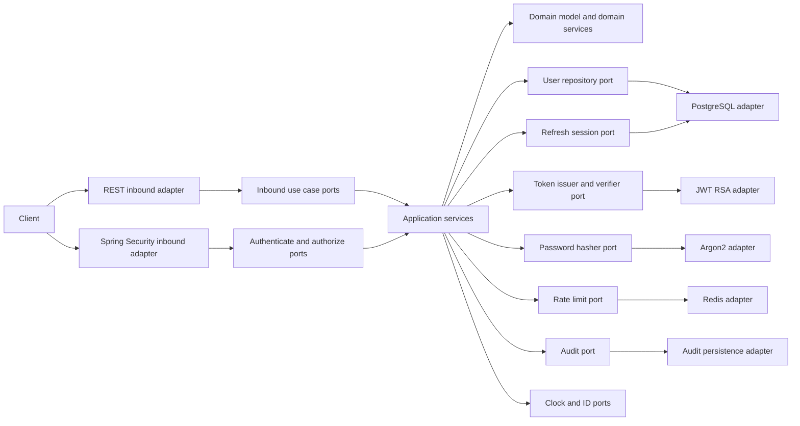
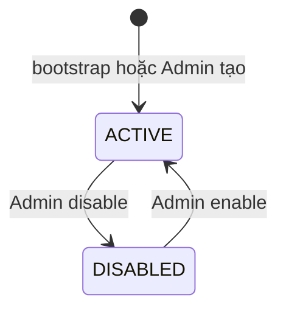
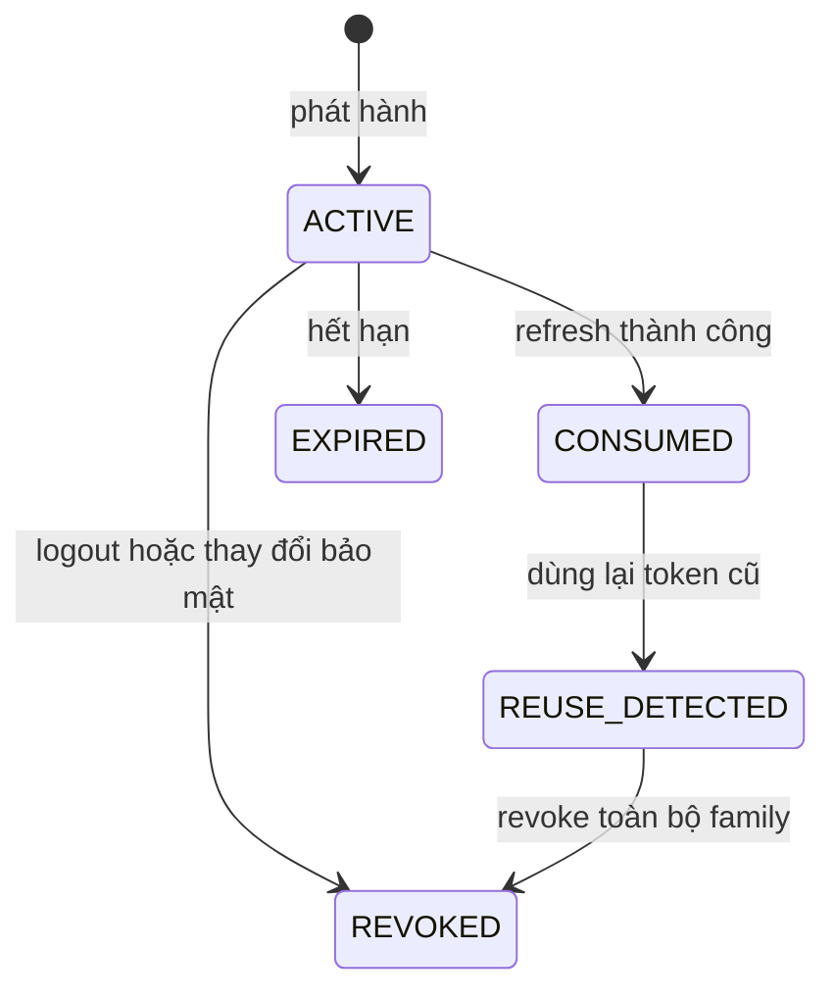
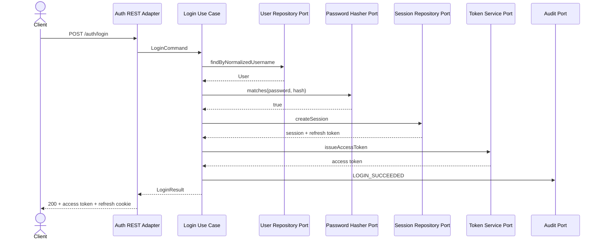
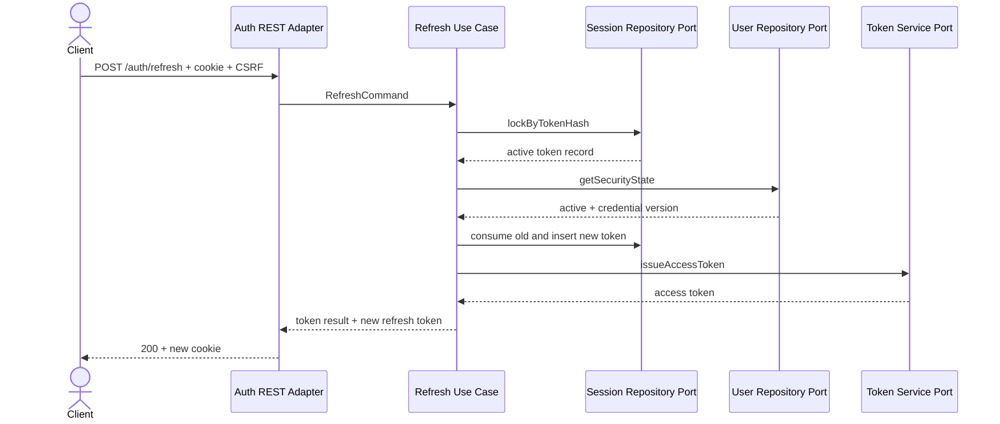
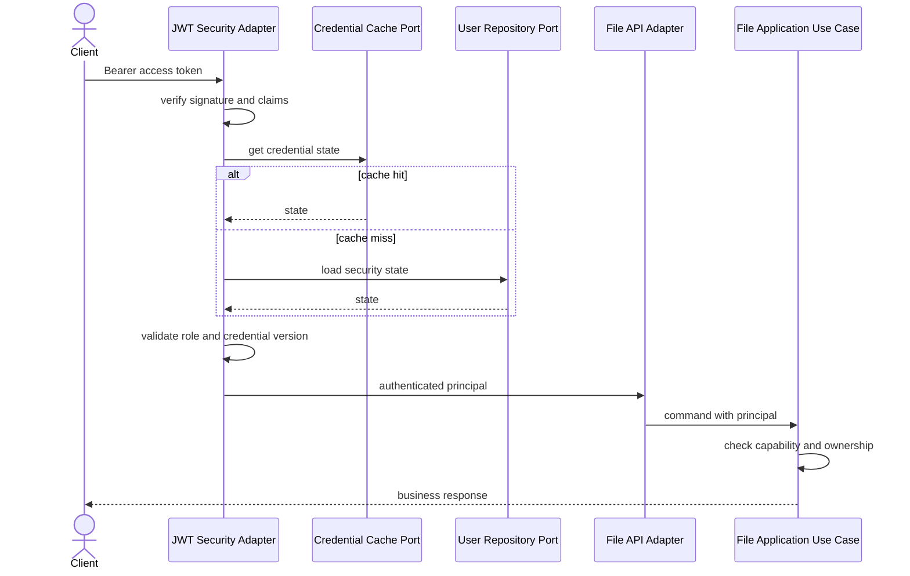

# Đặc tả yêu cầu mô-đun xác thực và phân quyền

Tài liệu này định nghĩa đầy đủ yêu cầu nghiệp vụ, yêu cầu chức năng, kiến trúc
Hexagonal, hợp đồng API, mô hình dữ liệu, yêu cầu bảo mật, use case, tiêu chí
nghiệm thu, và chiến lược kiểm thử cho mô-đun xác thực của Customer CSV File
Processing Service.

Mô-đun được xây dựng bằng Java 21+, Spring Boot 4.x, Spring Security,
PostgreSQL, Redis, và JWT. Mô-đun cung cấp xác thực người dùng, quản lý phiên
đăng nhập, phân quyền theo vai trò, quản lý tài khoản nội bộ, và tích hợp bảo
mật với các API xử lý file.

<!-- prettier-ignore -->
> [!IMPORTANT]
> Mọi API nghiệp vụ của hệ thống phải đi qua mô-đun xác thực và phân quyền.
> Frontend không phải là lớp bảo mật. Backend phải kiểm tra token, vai trò,
> trạng thái tài khoản, và quyền sở hữu tài nguyên trước khi thực hiện use case.

## 1. Thông tin tài liệu

Bảng sau xác định trạng thái và phạm vi áp dụng của tài liệu.

| Thuộc tính      | Giá trị                                                     |
|-----------------|-------------------------------------------------------------|
| Mã tài liệu     | FPS-AUTH-SRS-001                                            |
| Phiên bản       | 1.0                                                         |
| Trạng thái      | Sẵn sàng triển khai                                         |
| Mô-đun          | Authentication and Authorization                            |
| Kiến trúc       | Hexagonal Architecture trong modular monolith               |
| Nền tảng        | Java 21+, Spring Boot 4.x                                   |
| Cơ sở dữ liệu   | PostgreSQL                                                  |
| Bộ nhớ phân tán | Redis                                                       |
| Cơ chế xác thực | JWT access token và rotating refresh token                  |
| Đối tượng đọc   | Backend Developer, QA, Tech Lead, DevOps, Security Reviewer |

## 2. Mục tiêu

Mô-đun xác thực phải cung cấp một ranh giới bảo mật thống nhất cho toàn bộ dịch
vụ, thay vì để từng controller tự kiểm tra token hoặc vai trò theo cách riêng.

Mô-đun phải đạt các mục tiêu sau:

- Xác thực người dùng bằng tên đăng nhập và mật khẩu.
- Phát hành access token dạng JWT có thời hạn ngắn.
- Quản lý refresh token có rotation, thu hồi, và phát hiện tái sử dụng.
- Hỗ trợ đăng xuất một phiên hoặc toàn bộ phiên của người dùng.
- Quản lý tài khoản `OPERATOR` và `ADMIN`.
- Bắt buộc đổi mật khẩu sau khi Admin tạo tài khoản hoặc đặt lại mật khẩu.
- Chặn tài khoản bị vô hiệu hóa hoặc tạm khóa.
- Bảo vệ toàn bộ API nghiệp vụ bằng Spring Security.
- Kiểm tra quyền sở hữu tài nguyên ở tầng application và truy vấn dữ liệu.
- Ghi audit cho các hành động bảo mật quan trọng.
- Không làm lộ mật khẩu, token, khóa ký, hoặc thông tin nhạy cảm trong log.
- Cho phép thay đổi adapter JWT, persistence, cache, hoặc password encoder mà
  không thay đổi domain và use case.

## 3. Quan hệ với tài liệu dự án

Tài liệu này mở rộng yêu cầu JWT và RBAC đã được xác định trong bộ BA/SRS chính.
Khi có xung đột, rule bảo mật cụ thể trong tài liệu này được dùng cho Auth
Module, còn business rule xử lý file tiếp tục lấy từ tài liệu nghiệp vụ chính.

Các tài liệu liên quan gồm:

- [`00-README.md`](./00-README.md).
- [`01-BRD-business-context.md`](./01-BRD-business-context.md).
- [`02-domain-model-and-business-rules.md`](./02-domain-model-and-business-rules.md).
- [`03-functional-specification.md`](./03-functional-specification.md).
- [`04-non-functional-requirements.md`](./04-non-functional-requirements.md).
- [`05-test-and-developer-handover.md`](./05-test-and-developer-handover.md).
- [`AGENTS.md`](./AGENTS.md).

## 4. Phạm vi

Phạm vi phiên bản đầu tập trung vào xác thực nội bộ cho Operator và Admin của
File Processing Service.

### 4.1 Trong phạm vi

Phiên bản đầu phải cung cấp các capability sau:

1. Khởi tạo tài khoản Admin đầu tiên.
2. Đăng nhập bằng username và password.
3. Phát hành access token JWT.
4. Phát hành và xoay vòng refresh token.
5. Làm mới access token.
6. Đăng xuất phiên hiện tại.
7. Đăng xuất toàn bộ phiên.
8. Xem thông tin người dùng hiện tại.
9. Đổi mật khẩu cá nhân.
10. Admin tạo tài khoản.
11. Admin xem danh sách và chi tiết tài khoản.
12. Admin cập nhật thông tin và vai trò.
13. Admin vô hiệu hóa, kích hoạt, và mở khóa tài khoản.
14. Admin đặt lại mật khẩu tạm thời.
15. Xác thực JWT cho mọi request nghiệp vụ.
16. Phân quyền theo vai trò và quyền sở hữu tài nguyên.
17. Rate limit và tạm khóa khi đăng nhập sai nhiều lần.
18. Thu hồi phiên khi mật khẩu, vai trò, hoặc trạng thái tài khoản thay đổi.
19. Audit và metric cho sự kiện xác thực.
20. Hỗ trợ rotation khóa ký JWT.

### 4.2 Ngoài phạm vi

Các chức năng sau không thuộc phiên bản đầu:

- Tự đăng ký tài khoản.
- Đăng nhập bằng Google, Facebook, GitHub, hoặc mạng xã hội khác.
- OAuth2 Authorization Server cho hệ thống bên thứ ba.
- Single Sign-On với LDAP, Active Directory, SAML, hoặc OIDC provider ngoài.
- Xác thực đa yếu tố.
- Passwordless hoặc WebAuthn.
- Quên mật khẩu qua email hoặc SMS.
- Xác minh email.
- API key cho machine-to-machine.
- Service account cho Processing Worker.
- Quản lý permission động bằng giao diện.
- Chính sách phân quyền theo thuộc tính phức tạp.
- Lưu access token vào danh sách phiên trong PostgreSQL.

<!-- prettier-ignore -->
> [!NOTE]
> Processing Worker là actor nội bộ và không đăng nhập bằng JWT của người dùng.
> Quyền truy cập storage và database của worker được quản lý bằng cấu hình dịch
> vụ, không nằm trong phạm vi Auth Module người dùng.

## 5. Thuật ngữ

Các thuật ngữ sau được sử dụng nhất quán trong tài liệu và code.

| Thuật ngữ             | Định nghĩa                                                    |
|-----------------------|---------------------------------------------------------------|
| Access token          | JWT có thời hạn ngắn, dùng để gọi API được bảo vệ             |
| Refresh token         | Chuỗi ngẫu nhiên có entropy cao, dùng để cấp access token mới |
| Token family          | Chuỗi refresh token được sinh ra từ cùng một phiên đăng nhập  |
| Session               | Phiên đăng nhập logic, được định danh bằng `sessionId`        |
| Token rotation        | Dùng refresh token cũ một lần rồi phát hành refresh token mới |
| Token reuse           | Sử dụng lại refresh token đã được consume hoặc revoke         |
| Credential version    | Phiên bản thông tin bảo mật của user để vô hiệu hóa token cũ  |
| Password change token | JWT ngắn hạn chỉ cho phép đổi mật khẩu bắt buộc               |
| Account lock          | Khóa tạm thời sau nhiều lần đăng nhập thất bại                |
| Account disable       | Admin vô hiệu hóa tài khoản cho đến khi kích hoạt lại         |
| Authentication        | Xác minh danh tính của người gọi                              |
| Authorization         | Kiểm tra người gọi có quyền thực hiện hành động hay không     |
| Ownership             | Quan hệ tài nguyên thuộc về user hiện tại                     |
| Security principal    | Danh tính đã xác thực được đưa vào SecurityContext            |

## 6. Actor và vai trò

Mô-đun hỗ trợ hai vai trò nghiệp vụ và một actor vận hành hệ thống.

### 6.1 Người dùng chưa xác thực

Người dùng chưa xác thực chỉ được phép:

- Gọi API đăng nhập.
- Gọi API refresh với refresh token và CSRF token hợp lệ.
- Truy cập endpoint liveness công khai nếu cấu hình cho phép.
- Truy cập tài liệu OpenAPI công khai chỉ trong môi trường được cho phép.

Người dùng chưa xác thực không được truy cập dữ liệu job, file, report,
customer, user, hoặc audit.

### 6.2 Operator

Operator là người dùng nghiệp vụ thực hiện import file.

Operator có các quyền Auth Module sau:

- Đăng nhập và đăng xuất.
- Làm mới access token.
- Xem thông tin tài khoản của chính mình.
- Đổi mật khẩu của chính mình.
- Đăng xuất tất cả phiên của chính mình.

Operator có các quyền nghiệp vụ sau:

- Upload file.
- Xem job thuộc sở hữu của chính mình.
- Tải report thuộc job của chính mình.
- Retry hoặc cancel job của chính mình khi trạng thái cho phép.

### 6.3 Admin

Admin có toàn bộ quyền của Operator và thêm quyền quản trị tài khoản.

Admin được phép:

- Tạo tài khoản Operator hoặc Admin.
- Xem danh sách và chi tiết tất cả tài khoản.
- Cập nhật display name và email.
- Thay đổi vai trò.
- Vô hiệu hóa hoặc kích hoạt tài khoản.
- Mở khóa tài khoản đang bị khóa tạm thời.
- Đặt lại mật khẩu tạm thời.
- Xem audit bảo mật theo quyền được cấp.

Admin không được phép:

- Xem password hash.
- Xem refresh token gốc.
- Xem private key ký JWT.
- Xóa Admin hoạt động cuối cùng.
- Gỡ vai trò `ADMIN` của Admin hoạt động cuối cùng.
- Bỏ qua retry limit hoặc business rule của module xử lý file.

### 6.4 System operator

System operator vận hành deployment và secret, nhưng không phải một role trong
JWT người dùng.

System operator thực hiện các tác vụ sau:

- Cung cấp khóa ký JWT.
- Rotation khóa ký.
- Cấu hình bootstrap Admin đầu tiên.
- Cấu hình thời hạn token, cookie, CORS, và rate limit.
- Xem metric và log đã được làm sạch.

## 7. Ma trận quyền

Ma trận này là nguồn tham chiếu cho cấu hình Spring Security và kiểm thử
authorization.

| Capability               |         Chưa xác thực |         Operator |            Admin |
|--------------------------|----------------------:|-----------------:|-----------------:|
| Login                    |              Cho phép |         Cho phép |         Cho phép |
| Refresh token            |      Có refresh token | Có refresh token | Có refresh token |
| Logout phiên hiện tại    |                 Không |         Cho phép |         Cho phép |
| Logout toàn bộ phiên     |                 Không |       Chính mình |       Chính mình |
| Xem `/me`                |                 Không |       Chính mình |       Chính mình |
| Đổi mật khẩu             | Token hợp lệ giới hạn |       Chính mình |       Chính mình |
| Tạo user                 |                 Không |            Không |         Cho phép |
| List user                |                 Không |            Không |         Cho phép |
| Xem user detail          |                 Không |            Không |         Cho phép |
| Cập nhật user            |                 Không |            Không |         Cho phép |
| Thay đổi role            |                 Không |            Không |         Cho phép |
| Disable hoặc enable user |                 Không |            Không |         Cho phép |
| Unlock user              |                 Không |            Không |         Cho phép |
| Reset password user      |                 Không |            Không |         Cho phép |
| Upload file              |                 Không |         Cho phép |         Cho phép |
| Xem job                  |                 Không | Chỉ job của mình |          Mọi job |
| Xem audit hệ thống       |                 Không |            Không |         Cho phép |

## 8. Yêu cầu nghiệp vụ tổng quát

Các rule trong phần này phải được thực thi trong domain hoặc application use
case, không chỉ ở controller.

### 8.1 Định danh tài khoản

Mỗi tài khoản phải tuân theo các rule sau:

- `userId` là UUID do hệ thống sinh.
- `username` là duy nhất không phân biệt chữ hoa và chữ thường.
- Username được trim và chuyển thành dạng chuẩn trước khi kiểm tra unique.
- Username có từ 3 đến 64 ký tự.
- Username chỉ gồm chữ cái Latin, chữ số, dấu chấm, gạch ngang, và gạch dưới.
- Username không được thay đổi sau khi tài khoản được tạo trong phiên bản đầu.
- Email là bắt buộc, được trim, lowercase, và unique không phân biệt hoa thường.
- Display name có từ 2 đến 150 ký tự sau khi normalize khoảng trắng.
- Mỗi user phải có ít nhất một role.
- Role hợp lệ trong phiên bản đầu là `OPERATOR` và `ADMIN`.

### 8.2 Trạng thái tài khoản

Trạng thái tài khoản được biểu diễn bằng trạng thái chính và các thuộc tính bảo
mật bổ sung.

Trạng thái chính gồm:

- `ACTIVE`: tài khoản được phép xác thực.
- `DISABLED`: tài khoản bị Admin vô hiệu hóa.

Thuộc tính bổ sung gồm:

- `lockedUntil`: thời điểm kết thúc khóa tạm thời.
- `mustChangePassword`: bắt buộc đổi mật khẩu trước khi truy cập nghiệp vụ.
- `credentialVersion`: phiên bản dùng để vô hiệu hóa token đã phát hành.

Các rule trạng thái gồm:

- User `DISABLED` không được login hoặc refresh.
- User có `lockedUntil` trong tương lai không được login.
- Hết `lockedUntil`, user có thể login mà không cần Admin kích hoạt lại.
- User có `mustChangePassword = true` chỉ nhận password change token.
- Disable user phải revoke toàn bộ refresh session.
- Đổi role, reset password, hoặc đổi password phải tăng credential version.
- Kích hoạt lại user không khôi phục session đã revoke.
- Hệ thống luôn phải còn ít nhất một Admin đang `ACTIVE`.

### 8.3 Chính sách mật khẩu

Mật khẩu phải đáp ứng các yêu cầu sau:

- Có độ dài từ 12 đến 128 ký tự Unicode.
- Không được chỉ chứa khoảng trắng.
- Không được trùng username theo so sánh không phân biệt hoa thường.
- Không được trùng mật khẩu hiện tại khi đổi hoặc reset.
- Không tự động hết hạn theo chu kỳ thời gian trong phiên bản đầu.
- Không được lưu plaintext hoặc reversible encryption.
- Password hash phải dùng Argon2id hoặc BCrypt với cost được benchmark.
- Cấu hình mặc định dùng Argon2id.
- Thay đổi tham số hash phải hỗ trợ nâng cấp hash sau login thành công.
- Mật khẩu không được xuất hiện trong log, metric, audit metadata, hoặc error.

### 8.4 Chính sách đăng nhập thất bại

Mô-đun phải hạn chế brute force mà không làm lộ việc username có tồn tại.

Rule mặc định gồm:

- Tối đa 5 lần thất bại liên tiếp cho một tài khoản trong 15 phút.
- Sau ngưỡng trên, tài khoản bị khóa tạm thời 15 phút.
- Rate limit bổ sung theo IP được lưu trong Redis.
- Login thành công xóa failed counter của tài khoản.
- Admin unlock xóa `lockedUntil` và failed counter.
- Username không tồn tại vẫn phải thực hiện dummy password verification để
  giảm timing difference.
- Response login thất bại dùng thông báo chung, không phân biệt sai password,
  user không tồn tại, user disabled, hoặc user locked.
- Khi rate limit theo IP vượt ngưỡng, API trả `429` và `Retry-After`.

### 8.5 Chính sách phiên

Mỗi login thành công tạo một session logic.

Session phải tuân theo các rule sau:

- Mỗi session có `sessionId` và `tokenFamilyId` riêng.
- Access token có thời hạn mặc định 15 phút.
- Refresh session có thời hạn tuyệt đối mặc định 30 ngày.
- Rotation refresh token không kéo dài thời hạn tuyệt đối của session.
- Refresh token chỉ được dùng một lần.
- Token reuse phải revoke toàn bộ token family.
- Logout phiên hiện tại revoke token family của session đó.
- Logout all revoke tất cả session của user.
- Disable, đổi password, reset password, hoặc đổi role revoke tất cả session.
- Raw refresh token không được lưu trong database.
- Access token không được lưu đầy đủ trong database hoặc log.

## 9. Mô hình token

Mô-đun sử dụng access token JWT và refresh token opaque để cân bằng khả năng mở
rộng, hiệu năng, và khả năng thu hồi phiên.

### 9.1 Access token JWT

Access token phải được ký bằng RSA và có header, claim được kiểm soát.

Yêu cầu header gồm:

```json
{
  "alg": "RS256",
  "typ": "JWT",
  "kid": "auth-key-2026-01"
}
```

Claim bắt buộc gồm:

| Claim      | Ý nghĩa                              |
|------------|--------------------------------------|
| `iss`      | Issuer cố định của dịch vụ           |
| `aud`      | Audience của File Processing API     |
| `sub`      | `userId`                             |
| `username` | Username chuẩn hóa                   |
| `roles`    | Danh sách role                       |
| `sid`      | Session ID                           |
| `jti`      | Token ID duy nhất                    |
| `cv`       | Credential version tại lúc phát hành |
| `typ`      | `access`                             |
| `iat`      | Thời điểm phát hành                  |
| `nbf`      | Thời điểm bắt đầu hiệu lực           |
| `exp`      | Thời điểm hết hạn                    |

JWT không được chứa password hash, email nếu không cần thiết, storage key,
MinIO credential, hoặc thông tin customer.

### 9.2 Password change token

Password change token là JWT ngắn hạn chỉ dùng cho flow bắt buộc đổi mật khẩu.

Token phải có các đặc điểm sau:

- `typ = password_change`.
- Thời hạn mặc định 5 phút.
- Không có refresh token đi kèm.
- Chỉ được gọi endpoint đổi mật khẩu và logout an toàn.
- Chứa `sub`, `jti`, `cv`, `iat`, `exp`, `iss`, và `aud`.
- Sau khi đổi mật khẩu, credential version tăng và token cũ mất hiệu lực.

### 9.3 Refresh token

Refresh token là chuỗi ngẫu nhiên tối thiểu 256 bit entropy.

Rule refresh token gồm:

- Token được sinh bằng `SecureRandom` phù hợp.
- Token được encode bằng Base64 URL-safe không padding.
- Database chỉ lưu SHA-256 hash của token.
- Token được truyền bằng cookie `HttpOnly` trong browser profile.
- Cookie phải có `Secure` trong production.
- Cookie dùng `SameSite=Strict` mặc định.
- Cookie chỉ áp dụng cho path Auth API cần thiết.
- Refresh endpoint phải kiểm tra CSRF token.
- Refresh token không được trả trong log hoặc error response.

### 9.4 Xác thực access token

JWT adapter phải kiểm tra toàn bộ điều kiện sau:

1. Header có `alg = RS256`.
2. `kid` tồn tại trong key ring được tin cậy.
3. Chữ ký hợp lệ.
4. `iss` đúng cấu hình.
5. `aud` chứa audience yêu cầu.
6. `typ = access` cho API nghiệp vụ.
7. `exp`, `nbf`, và `iat` hợp lệ với clock skew tối đa 60 giây.
8. `sub`, `sid`, `jti`, `roles`, và `cv` có đúng kiểu dữ liệu.
9. User vẫn `ACTIVE`.
10. Credential version trong token khớp phiên bản hiện tại.
11. Session chưa bị revoke nếu policy endpoint yêu cầu kiểm tra session.

Token có `alg = none`, thuật toán không nằm trong allowlist, hoặc `kid` không
xác định phải bị từ chối.

### 9.5 Credential version

Credential version cung cấp cơ chế vô hiệu hóa access token trước thời điểm hết
hạn.

Rule gồm:

- Mỗi user bắt đầu với `credentialVersion = 1`.
- Claim `cv` được đưa vào access token và password change token.
- Phiên bản hiện tại được cache trong Redis với fallback PostgreSQL.
- Security adapter so sánh claim `cv` với phiên bản hiện tại.
- Đổi password, reset password, disable user, hoặc đổi role phải tăng version.
- Cache phải được invalidate ngay sau transaction commit.
- Nếu Redis unavailable, hệ thống fallback database theo policy fail-closed.
- Không chấp nhận token khi không xác minh được trạng thái bảo mật của user.

## 10. Kiến trúc Hexagonal

Auth Module được tổ chức theo Hexagonal Architecture để domain và use case
không phụ thuộc trực tiếp vào Spring MVC, Spring Security, JPA, Redis, hoặc thư
viện JWT cụ thể.

### 10.1 Nguyên tắc phụ thuộc

Các quy tắc phụ thuộc bắt buộc gồm:

- Domain không import Spring, JPA, Jackson, Servlet, hoặc JWT library.
- Application phụ thuộc domain và định nghĩa inbound, outbound port.
- Inbound adapter gọi inbound port, không gọi repository trực tiếp.
- Outbound adapter triển khai outbound port.
- Adapter có thể phụ thuộc Spring và library hạ tầng.
- Domain không biết HTTP status hoặc JSON response.
- Entity JPA không được dùng làm domain entity hoặc API DTO.
- Controller không chứa business rule.
- Security filter không tự thực hiện user management use case.
- Mapping giữa domain, persistence, và API phải rõ ràng.
- Transaction boundary phải bao quanh một application use case phù hợp.

### 10.2 Sơ đồ kiến trúc

Sơ đồ sau mô tả chiều phụ thuộc của Auth Module.



### 10.3 Cấu trúc package đề xuất

Package structure phải thể hiện ranh giới domain, application, và adapter.

```text
com.example.fileprocessing.auth
├── domain
│   ├── model
│   │   ├── User.java
│   │   ├── Role.java
│   │   ├── AccountStatus.java
│   │   ├── RefreshSession.java
│   │   └── CredentialVersion.java
│   ├── policy
│   │   ├── PasswordPolicy.java
│   │   ├── LastActiveAdminPolicy.java
│   │   └── LoginLockPolicy.java
│   ├── event
│   └── exception
├── application
│   ├── port
│   │   ├── in
│   │   │   ├── LoginUseCase.java
│   │   │   ├── RefreshTokenUseCase.java
│   │   │   ├── LogoutUseCase.java
│   │   │   ├── ChangePasswordUseCase.java
│   │   │   ├── GetCurrentUserUseCase.java
│   │   │   └── ManageUserUseCase.java
│   │   └── out
│   │       ├── UserRepositoryPort.java
│   │       ├── RefreshSessionRepositoryPort.java
│   │       ├── PasswordHasherPort.java
│   │       ├── TokenServicePort.java
│   │       ├── CredentialVersionCachePort.java
│   │       ├── LoginThrottlePort.java
│   │       ├── AuditLogPort.java
│   │       ├── ClockPort.java
│   │       └── IdGeneratorPort.java
│   ├── service
│   ├── command
│   ├── query
│   └── result
├── adapter
│   ├── in
│   │   ├── web
│   │   └── security
│   └── out
│       ├── persistence
│       ├── jwt
│       ├── password
│       ├── redis
│       └── audit
└── configuration
```

Tên package thực tế có thể thay đổi, nhưng chiều phụ thuộc phải giữ nguyên.

### 10.4 Inbound port bắt buộc

Application layer phải cung cấp các inbound port tương ứng với use case.

| Port                       | Trách nhiệm                                  |
|----------------------------|----------------------------------------------|
| `BootstrapAdminUseCase`    | Tạo Admin đầu tiên khi hệ thống chưa có user |
| `LoginUseCase`             | Xác thực username và password                |
| `RefreshTokenUseCase`      | Rotate refresh token và cấp access token mới |
| `LogoutUseCase`            | Revoke một session hoặc toàn bộ session      |
| `GetCurrentUserUseCase`    | Trả thông tin principal hiện tại             |
| `ChangePasswordUseCase`    | Đổi password và revoke session               |
| `CreateUserUseCase`        | Admin tạo user                               |
| `SearchUserUseCase`        | Admin tìm kiếm user                          |
| `GetUserDetailUseCase`     | Admin xem chi tiết user                      |
| `UpdateUserUseCase`        | Admin cập nhật profile và role               |
| `ChangeUserStatusUseCase`  | Disable, enable, hoặc unlock user            |
| `ResetUserPasswordUseCase` | Admin đặt mật khẩu tạm thời                  |
| `ValidatePrincipalUseCase` | Kiểm tra trạng thái và credential version    |

### 10.5 Outbound port bắt buộc

Application layer phải định nghĩa outbound port dựa trên nhu cầu thật của use
case.

| Port                           | Trách nhiệm                                     |
|--------------------------------|-------------------------------------------------|
| `UserRepositoryPort`           | Lưu, truy vấn, và lock user                     |
| `RoleRepositoryPort`           | Truy vấn role được hỗ trợ nếu role lưu trong DB |
| `RefreshSessionRepositoryPort` | Lưu, rotate, revoke refresh session             |
| `PasswordHasherPort`           | Hash, verify, và kiểm tra rehash                |
| `TokenServicePort`             | Phát hành và verify JWT                         |
| `CredentialVersionCachePort`   | Cache trạng thái và credential version          |
| `LoginThrottlePort`            | Rate limit theo IP và username                  |
| `AuditLogPort`                 | Ghi audit event                                 |
| `ClockPort`                    | Cung cấp thời gian có thể test                  |
| `IdGeneratorPort`              | Sinh UUID và token ID                           |
| `SecurityEventPublisherPort`   | Phát sự kiện nội bộ sau commit nếu cần          |

Không tạo interface chỉ để bọc một class không có nhu cầu thay thế hoặc kiểm
thử. Mỗi port phải bảo vệ một ranh giới hạ tầng hoặc use case rõ ràng.

### 10.6 Transaction boundary

Transaction phải được đặt tại application use case, không đặt rải rác trong
controller.

Các use case cần transaction gồm:

- Create user.
- Update user và role.
- Disable hoặc enable user.
- Change password.
- Reset password.
- Rotate refresh token.
- Logout và logout all.
- Bootstrap Admin.

Cache invalidation, audit, và side effect phải chạy sau commit hoặc dùng cơ chế
đảm bảo không công bố trạng thái chưa commit.

## 11. Mô hình domain

Domain model phải thể hiện rule bảo mật thay vì chỉ là tập hợp getter và setter.

### 11.1 Aggregate `User`

`User` là aggregate root quản lý danh tính, trạng thái, role, mật khẩu, và phiên
bản credential.

Thuộc tính logic gồm:

| Thuộc tính           | Ý nghĩa                            |
|----------------------|------------------------------------|
| `id`                 | UUID nội bộ                        |
| `username`           | Tên đăng nhập gốc                  |
| `normalizedUsername` | Giá trị chuẩn hóa để unique lookup |
| `email`              | Email hiển thị                     |
| `normalizedEmail`    | Giá trị chuẩn hóa để unique lookup |
| `displayName`        | Tên hiển thị                       |
| `passwordHash`       | Hash mật khẩu                      |
| `status`             | `ACTIVE` hoặc `DISABLED`           |
| `roles`              | Tập role không rỗng                |
| `mustChangePassword` | Cờ bắt buộc đổi password           |
| `failedLoginCount`   | Số lần thất bại liên tiếp          |
| `lastFailedLoginAt`  | Lần thất bại gần nhất              |
| `lockedUntil`        | Thời điểm hết khóa tạm             |
| `credentialVersion`  | Phiên bản credential               |
| `lastLoginAt`        | Login thành công gần nhất          |
| `passwordChangedAt`  | Lần đổi password gần nhất          |
| `createdBy`          | Admin hoặc bootstrap tạo user      |
| `createdAt`          | Thời điểm tạo                      |
| `updatedAt`          | Thời điểm cập nhật                 |
| `version`            | Optimistic locking                 |

Invariant của `User` gồm:

- Username và normalized username không được null.
- Email và normalized email không được null.
- Password hash không được null.
- Role không được rỗng.
- Credential version phải lớn hơn hoặc bằng 1.
- User disabled không thể xác thực.
- User locked không thể xác thực trước `lockedUntil`.
- Role chỉ được thay đổi qua method domain kiểm tra tập role hợp lệ.
- Disable, đổi role, reset password, và đổi password tăng credential version.
- Password hash không được đưa vào DTO trả client.

### 11.2 Aggregate `RefreshSession`

`RefreshSession` quản lý một token family và trạng thái rotation.

Thuộc tính logic gồm:

| Thuộc tính          | Ý nghĩa                       |
|---------------------|-------------------------------|
| `id`                | Session ID                    |
| `familyId`          | Token family ID               |
| `userId`            | User sở hữu                   |
| `currentTokenId`    | Token hiện tại trong family   |
| `createdAt`         | Thời điểm login               |
| `absoluteExpiresAt` | Thời hạn tuyệt đối            |
| `lastRefreshedAt`   | Lần refresh gần nhất          |
| `revokedAt`         | Thời điểm revoke              |
| `revocationReason`  | Lý do revoke                  |
| `ipAddressHash`     | IP đã hash hoặc mask          |
| `userAgentSummary`  | User-Agent đã giới hạn độ dài |

Mỗi refresh token record trong family phải theo dõi:

- Token ID.
- Token hash.
- Parent token ID.
- Issued time.
- Expiry time.
- Consumed time.
- Revoked time.

Invariant của session gồm:

- Session hết hạn không thể refresh.
- Session revoked không thể refresh.
- Token consumed không thể được dùng hợp lệ lần hai.
- Reuse một token cũ revoke toàn bộ family.
- Rotation phải atomic để hai request đồng thời chỉ có một request thành công.

### 11.3 Value object

Các value object được dùng để giữ validation gần domain.

Các value object tối thiểu gồm:

- `UserId`.
- `Username`.
- `EmailAddress`.
- `DisplayName`.
- `PasswordHash`.
- `CredentialVersion`.
- `SessionId`.
- `TokenId`.
- `TokenFamilyId`.
- `RoleSet`.

## 12. State machine

State transition phải được kiểm soát bằng domain method và optimistic locking.

### 12.1 Trạng thái tài khoản

Sơ đồ sau mô tả trạng thái chính của tài khoản.



Khóa tạm thời không phải trạng thái chính và được xác định bởi
`lockedUntil > now`.

### 12.2 Trạng thái refresh token

Sơ đồ sau mô tả vòng đời của một refresh token.



### 12.3 Transition không hợp lệ

Mô-đun phải từ chối các transition sau:

- Enable một user đang `ACTIVE` theo cách tạo audit trùng lặp không cần thiết.
- Disable Admin hoạt động cuối cùng.
- Xóa role cuối cùng của user.
- Refresh session đã revoke hoặc hết hạn.
- Sử dụng token consumed để tạo session mới.
- Đổi password bằng mật khẩu hiện tại.
- Reset password mà không tăng credential version.
- Cập nhật role mà không revoke session cũ.

## 13. Hợp đồng API tổng quát

Auth API dùng JSON, UTF-8, version trong URI, và error response thống nhất.

Base path đề xuất:

```text
/api/v1/auth
/api/v1/admin/users
```

### 13.1 Header chung

Client phải sử dụng các header sau khi phù hợp:

| Header          | Yêu cầu                                     |
|-----------------|---------------------------------------------|
| `Authorization` | `Bearer <access-token>` cho API được bảo vệ |
| `Content-Type`  | `application/json`                          |
| `Accept`        | `application/json`                          |
| `X-CSRF-Token`  | Bắt buộc cho refresh dùng cookie            |
| `X-Request-Id`  | Tùy chọn; hệ thống tự sinh nếu thiếu        |

### 13.2 Error response

Mọi lỗi Auth API phải theo cấu trúc thống nhất.

```json
{
  "timestamp": "2026-07-17T10:00:00Z",
  "status": 401,
  "code": "AUTHENTICATION_FAILED",
  "message": "Thông tin đăng nhập không hợp lệ",
  "details": {},
  "traceId": "01J2ABCDEF1234567890"
}
```

Error response không được chứa stack trace, password, token, hash, khóa ký, hoặc
thông tin dùng để xác định username có tồn tại.

### 13.3 Pagination

API list user dùng pagination chuẩn.

Rule gồm:

- Page mặc định là 0.
- Size mặc định là 20.
- Size tối đa là 100.
- Sort mặc định là `createdAt,DESC`.
- Response có `content`, `page`, `size`, `totalElements`, và `totalPages`.

## 14. Danh sách use case

Auth Module phải triển khai đầy đủ các use case sau.

| Use case   | Tên                                         |
|------------|---------------------------------------------|
| AUTH-UC-01 | Khởi tạo Admin đầu tiên                     |
| AUTH-UC-02 | Đăng nhập                                   |
| AUTH-UC-03 | Bắt buộc đổi mật khẩu lần đầu               |
| AUTH-UC-04 | Làm mới access token                        |
| AUTH-UC-05 | Đăng xuất phiên hiện tại                    |
| AUTH-UC-06 | Đăng xuất toàn bộ phiên                     |
| AUTH-UC-07 | Xem thông tin người dùng hiện tại           |
| AUTH-UC-08 | Đổi mật khẩu cá nhân                        |
| AUTH-UC-09 | Admin tạo tài khoản                         |
| AUTH-UC-10 | Admin xem danh sách tài khoản               |
| AUTH-UC-11 | Admin xem chi tiết tài khoản                |
| AUTH-UC-12 | Admin cập nhật thông tin và vai trò         |
| AUTH-UC-13 | Admin disable hoặc enable tài khoản         |
| AUTH-UC-14 | Admin mở khóa tài khoản                     |
| AUTH-UC-15 | Admin đặt lại mật khẩu                      |
| AUTH-UC-16 | Xác thực access token cho request nghiệp vụ |
| AUTH-UC-17 | Kiểm tra quyền sở hữu tài nguyên            |
| AUTH-UC-18 | Rotation khóa ký JWT                        |

## 15. AUTH-UC-01 — Khởi tạo Admin đầu tiên

Use case này tạo Admin đầu tiên để hệ thống có thể bắt đầu quản lý tài khoản mà
không cần insert trực tiếp password hash vào database.

### 15.1 Actor

Actor là System operator trong lúc khởi động hoặc chạy lệnh bootstrap được kiểm
soát.

### 15.2 Tiền điều kiện

Các điều kiện trước khi chạy gồm:

- Database khả dụng.
- Chưa tồn tại user nào trong hệ thống.
- Cấu hình bootstrap được cung cấp qua secret hoặc biến môi trường.
- Username, email, display name, và password đáp ứng policy.

### 15.3 Luồng chính

Use case thực hiện các bước sau:

1. Kiểm tra số lượng user hiện tại bằng transaction phù hợp.
2. Từ chối nếu đã tồn tại bất kỳ user nào.
3. Đọc bootstrap secret từ cấu hình an toàn.
4. Validate username, email, display name, và password.
5. Hash password.
6. Tạo user `ACTIVE` với role `ADMIN`.
7. Đặt `mustChangePassword = true`.
8. Đặt `credentialVersion = 1`.
9. Ghi audit `AUTH_ADMIN_BOOTSTRAPPED`.
10. Xóa hoặc vô hiệu hóa bootstrap secret trong quy trình vận hành.

### 15.4 Luồng ngoại lệ

Các trường hợp lỗi gồm:

- Đã có user: bỏ qua bootstrap và không thay đổi dữ liệu.
- Thiếu secret: fail startup trong môi trường yêu cầu bootstrap.
- Dữ liệu không hợp lệ: fail startup với message đã làm sạch.
- Hai instance bootstrap đồng thời: unique constraint và lock phải bảo đảm chỉ
  một Admin được tạo.

### 15.5 Hậu điều kiện

Sau khi thành công, hệ thống có đúng một tài khoản Admin bootstrap và tài khoản
phải đổi mật khẩu ở lần đăng nhập đầu tiên.

### 15.6 Acceptance criteria

- **AUTH-AC-01.1:** Hệ thống trống và cấu hình hợp lệ tạo đúng một Admin.
- **AUTH-AC-01.2:** Hai instance khởi động đồng thời không tạo hai Admin.
- **AUTH-AC-01.3:** Hệ thống đã có user không chạy bootstrap lần nữa.
- **AUTH-AC-01.4:** Password bootstrap không xuất hiện trong log.

## 16. AUTH-UC-02 — Đăng nhập

Use case này xác thực username và password, sau đó phát hành token phù hợp với
trạng thái tài khoản.

### 16.1 Endpoint

```http
POST /api/v1/auth/login
```

### 16.2 Request

```json
{
  "username": "operator01",
  "password": "MatKhauBaoMat123!"
}
```

### 16.3 Tiền điều kiện

Client phải gửi request qua HTTPS trong production và chưa vượt rate limit theo
IP.

### 16.4 Luồng chính

Use case thực hiện các bước sau:

1. Normalize username.
2. Kiểm tra rate limit theo IP và username.
3. Tìm user theo normalized username.
4. Nếu user không tồn tại, thực hiện dummy password verification.
5. Verify password bằng `PasswordHasherPort`.
6. Kiểm tra `status`, `lockedUntil`, và credential state.
7. Xóa failed login counter.
8. Cập nhật `lastLoginAt`.
9. Nếu password hash cần nâng cấp, rehash trong transaction.
10. Nếu `mustChangePassword = true`, phát hành password change token.
11. Nếu không bắt buộc đổi password, tạo refresh session.
12. Phát hành access token JWT.
13. Gửi refresh token bằng cookie bảo mật.
14. Ghi audit `AUTH_LOGIN_SUCCEEDED`.
15. Tăng metric login thành công.

### 16.5 Response thành công bình thường

```json
{
  "tokenType": "Bearer",
  "accessToken": "eyJ...",
  "expiresIn": 900,
  "user": {
    "id": "2b9bf1f2-72d0-4ea0-9ca8-4dc8f1b0a100",
    "username": "operator01",
    "displayName": "Nguyễn Văn A",
    "roles": [
      "OPERATOR"
    ]
  }
}
```

Refresh token không xuất hiện trong JSON khi dùng browser profile.

### 16.6 Response bắt buộc đổi mật khẩu

```json
{
  "status": "PASSWORD_CHANGE_REQUIRED",
  "passwordChangeToken": "eyJ...",
  "expiresIn": 300
}
```

### 16.7 Luồng thất bại

Khi xác thực thất bại, use case phải:

1. Tăng failed counter khi username tồn tại.
2. Áp dụng lock policy khi đạt ngưỡng.
3. Ghi audit đã mask thông tin.
4. Trả response chung `401 AUTHENTICATION_FAILED`.
5. Không chỉ rõ user không tồn tại, sai password, disabled, hoặc locked.

Khi IP vượt rate limit, API trả `429 AUTH_RATE_LIMITED` và header
`Retry-After`.

### 16.8 Acceptance criteria

- **AUTH-AC-02.1:** Credential hợp lệ phát hành access và refresh token.
- **AUTH-AC-02.2:** Sai username và sai password có response tương đương.
- **AUTH-AC-02.3:** Năm lần sai liên tiếp khóa tài khoản theo policy.
- **AUTH-AC-02.4:** Login thành công xóa failed counter.
- **AUTH-AC-02.5:** User disabled không nhận token.
- **AUTH-AC-02.6:** User phải đổi password chỉ nhận password change token.
- **AUTH-AC-02.7:** Password và token không xuất hiện trong log.

## 17. AUTH-UC-03 — Bắt buộc đổi mật khẩu lần đầu

Use case này cho phép user dùng password change token để thay mật khẩu tạm thời
trước khi được cấp quyền truy cập nghiệp vụ.

### 17.1 Endpoint

```http
POST /api/v1/auth/complete-password-change
Authorization: Bearer <password-change-token>
```

### 17.2 Request

```json
{
  "currentPassword": "MatKhauTamThoi123!",
  "newPassword": "MatKhauMoiAnToan456!",
  "confirmPassword": "MatKhauMoiAnToan456!"
}
```

### 17.3 Luồng chính

Use case thực hiện các bước sau:

1. Verify JWT có `typ = password_change`.
2. Load user và kiểm tra credential version.
3. Xác nhận `mustChangePassword = true`.
4. Verify current password.
5. Kiểm tra new password và confirm password.
6. Từ chối nếu new password giống current password.
7. Hash new password.
8. Cập nhật password hash và `passwordChangedAt`.
9. Đặt `mustChangePassword = false`.
10. Tăng credential version.
11. Revoke toàn bộ refresh session nếu có.
12. Ghi audit `AUTH_PASSWORD_CHANGE_COMPLETED`.
13. Trả `204 No Content`.
14. Yêu cầu client đăng nhập lại bằng password mới.

### 17.4 Acceptance criteria

- **AUTH-AC-03.1:** Password change token hợp lệ đổi được password.
- **AUTH-AC-03.2:** Access token thông thường không được dùng thay password
  change token cho endpoint này nếu user đang bắt buộc đổi password.
- **AUTH-AC-03.3:** Token hết hạn hoặc sai credential version bị từ chối.
- **AUTH-AC-03.4:** Sau đổi password, token cũ mất hiệu lực.

## 18. AUTH-UC-04 — Làm mới access token

Use case này rotate refresh token và phát hành access token mới mà không yêu cầu
user nhập lại password.

### 18.1 Endpoint

```http
POST /api/v1/auth/refresh
Cookie: fps_refresh=<refresh-token>
X-CSRF-Token: <csrf-token>
```

### 18.2 Luồng chính

Use case thực hiện các bước sau:

1. Kiểm tra CSRF token.
2. Đọc refresh token từ cookie.
3. Hash token bằng SHA-256.
4. Tìm token record và lock hàng dữ liệu.
5. Kiểm tra session chưa revoke và chưa hết hạn.
6. Kiểm tra token chưa consumed.
7. Load user và kiểm tra user `ACTIVE`.
8. Kiểm tra credential version của session.
9. Mark token hiện tại là consumed.
10. Sinh refresh token mới trong cùng family.
11. Lưu token hash mới.
12. Phát hành access token mới.
13. Cập nhật refresh cookie.
14. Ghi audit `AUTH_TOKEN_REFRESHED`.
15. Commit transaction.

### 18.3 Xử lý token reuse

Nếu token đã consumed hoặc revoked được dùng lại, use case phải:

1. Lock token family.
2. Revoke toàn bộ family.
3. Ghi audit `AUTH_REFRESH_TOKEN_REUSE_DETECTED`.
4. Tăng security metric.
5. Trả `401 REFRESH_TOKEN_REUSED`.
6. Không phát hành token mới.

### 18.4 Xử lý concurrency

Hai request refresh đồng thời với cùng token phải có kết quả:

- Một request rotate thành công.
- Request còn lại bị coi là reuse hoặc conflict bảo mật.
- Không có hai refresh token active cùng sinh từ một parent token.

### 18.5 Acceptance criteria

- **AUTH-AC-04.1:** Refresh token active phát hành token mới và consume token cũ.
- **AUTH-AC-04.2:** Dùng lại token cũ revoke toàn bộ family.
- **AUTH-AC-04.3:** Hai request đồng thời chỉ một request thành công.
- **AUTH-AC-04.4:** User disabled hoặc credential version thay đổi không refresh
  được.
- **AUTH-AC-04.5:** Refresh token hết hạn trả `401 REFRESH_TOKEN_EXPIRED`.

## 19. AUTH-UC-05 — Đăng xuất phiên hiện tại

Use case này thu hồi refresh session đang được access token đại diện.

### 19.1 Endpoint

```http
POST /api/v1/auth/logout
Authorization: Bearer <access-token>
```

### 19.2 Luồng chính

Use case thực hiện các bước sau:

1. Lấy `sub` và `sid` từ principal đã xác thực.
2. Tìm session thuộc đúng user.
3. Revoke token family với reason `USER_LOGOUT`.
4. Xóa refresh cookie ở response.
5. Ghi audit `AUTH_LOGOUT`.
6. Trả `204 No Content`.

### 19.3 Tính idempotent

Gọi logout lại với session đã revoke vẫn trả thành công và không tạo side effect
không cần thiết.

### 19.4 Acceptance criteria

- **AUTH-AC-05.1:** Logout làm refresh token của session không còn dùng được.
- **AUTH-AC-05.2:** Logout lần hai vẫn thành công idempotent.
- **AUTH-AC-05.3:** Session ID của user khác không thể bị revoke bởi Operator.

## 20. AUTH-UC-06 — Đăng xuất toàn bộ phiên

Use case này thu hồi toàn bộ refresh session của người dùng hiện tại.

### 20.1 Endpoint

```http
POST /api/v1/auth/logout-all
Authorization: Bearer <access-token>
```

### 20.2 Luồng chính

Use case thực hiện các bước sau:

1. Lấy user ID từ principal.
2. Revoke tất cả session active của user.
3. Tăng credential version.
4. Invalidate credential cache sau commit.
5. Xóa refresh cookie hiện tại.
6. Ghi audit `AUTH_LOGOUT_ALL`.
7. Trả `204 No Content`.

### 20.3 Acceptance criteria

- **AUTH-AC-06.1:** Sau logout all, mọi refresh token của user bị từ chối.
- **AUTH-AC-06.2:** Access token cũ bị từ chối do credential version thay đổi.
- **AUTH-AC-06.3:** Session của user khác không bị ảnh hưởng.

## 21. AUTH-UC-07 — Xem thông tin người dùng hiện tại

Use case này trả thông tin an toàn của principal để client hiển thị và quyết
định capability.

### 21.1 Endpoint

```http
GET /api/v1/auth/me
Authorization: Bearer <access-token>
```

### 21.2 Response

```json
{
  "id": "2b9bf1f2-72d0-4ea0-9ca8-4dc8f1b0a100",
  "username": "operator01",
  "email": "operator01@example.com",
  "displayName": "Nguyễn Văn A",
  "status": "ACTIVE",
  "roles": [
    "OPERATOR"
  ],
  "mustChangePassword": false,
  "lastLoginAt": "2026-07-17T02:55:00Z",
  "passwordChangedAt": "2026-07-01T08:00:00Z"
}
```

Response không chứa password hash, failed counter nội bộ, refresh token,
credential version, hoặc security key.

### 21.3 Acceptance criteria

- **AUTH-AC-07.1:** Access token hợp lệ trả đúng user hiện tại.
- **AUTH-AC-07.2:** Token của user disabled hoặc version cũ bị từ chối.
- **AUTH-AC-07.3:** Response không chứa trường nhạy cảm.

## 22. AUTH-UC-08 — Đổi mật khẩu cá nhân

Use case này cho phép user đã xác thực đổi mật khẩu chủ động.

### 22.1 Endpoint

```http
POST /api/v1/auth/change-password
Authorization: Bearer <access-token>
```

### 22.2 Request

```json
{
  "currentPassword": "MatKhauHienTai123!",
  "newPassword": "MatKhauMoi456!AnToan",
  "confirmPassword": "MatKhauMoi456!AnToan"
}
```

### 22.3 Luồng chính

Use case thực hiện các bước sau:

1. Load user bằng user ID từ principal.
2. Verify current password.
3. Validate new password và confirm password.
4. Từ chối nếu new password giống current password.
5. Hash new password.
6. Cập nhật password hash và `passwordChangedAt`.
7. Tăng credential version.
8. Revoke toàn bộ refresh session.
9. Invalidate credential cache sau commit.
10. Ghi audit `AUTH_PASSWORD_CHANGED`.
11. Trả `204 No Content`.
12. Client phải đăng nhập lại.

### 22.4 Acceptance criteria

- **AUTH-AC-08.1:** Current password đúng và new password hợp lệ đổi thành công.
- **AUTH-AC-08.2:** Current password sai trả `400 CURRENT_PASSWORD_INVALID`.
- **AUTH-AC-08.3:** Password mới không đạt policy trả `422 PASSWORD_POLICY_VIOLATION`.
- **AUTH-AC-08.4:** Sau đổi password, toàn bộ token cũ bị vô hiệu hóa.

## 23. AUTH-UC-09 — Admin tạo tài khoản

Use case này cho phép Admin tạo tài khoản nội bộ với mật khẩu tạm thời.

### 23.1 Endpoint

```http
POST /api/v1/admin/users
Authorization: Bearer <admin-access-token>
```

### 23.2 Request

```json
{
  "username": "operator02",
  "email": "operator02@example.com",
  "displayName": "Trần Thị B",
  "temporaryPassword": "MatKhauTamThoi789!",
  "roles": [
    "OPERATOR"
  ]
}
```

### 23.3 Luồng chính

Use case thực hiện các bước sau:

1. Kiểm tra principal có role `ADMIN`.
2. Validate username, email, display name, password, và roles.
3. Kiểm tra unique username và email.
4. Hash temporary password.
5. Tạo user `ACTIVE`.
6. Đặt `mustChangePassword = true`.
7. Đặt credential version ban đầu.
8. Ghi `createdBy` từ Admin hiện tại.
9. Ghi audit `AUTH_USER_CREATED`.
10. Trả `201 Created` và user summary.

### 23.4 Luồng concurrency

Unique constraint trên normalized username và email là lớp bảo vệ cuối cùng.
Nếu hai request race, request thua phải trả `409` thay vì `500`.

### 23.5 Acceptance criteria

- **AUTH-AC-09.1:** Admin tạo được Operator hợp lệ.
- **AUTH-AC-09.2:** Username hoặc email trùng trả `409`.
- **AUTH-AC-09.3:** Operator gọi endpoint nhận `403`.
- **AUTH-AC-09.4:** User mới bắt buộc đổi password khi login lần đầu.
- **AUTH-AC-09.5:** Temporary password không xuất hiện trong response hoặc log.

## 24. AUTH-UC-10 — Admin xem danh sách tài khoản

Use case này cung cấp danh sách user có phân trang, filter, và sort để Admin vận
hành hệ thống.

### 24.1 Endpoint

```http
GET /api/v1/admin/users
```

### 24.2 Bộ lọc

API hỗ trợ các filter sau:

- `keyword`: tìm theo username, email, hoặc display name.
- `status`: `ACTIVE` hoặc `DISABLED`.
- `role`: `OPERATOR` hoặc `ADMIN`.
- `locked`: true hoặc false.
- `mustChangePassword`: true hoặc false.
- `createdFrom` và `createdTo`.
- `page`, `size`, và `sort`.

### 24.3 Response item

Mỗi item gồm:

- User ID.
- Username.
- Email.
- Display name.
- Status.
- Roles.
- Locked flag và `lockedUntil` nếu có.
- Must change password flag.
- Last login time.
- Created time.

### 24.4 Acceptance criteria

- **AUTH-AC-10.1:** Admin list user có pagination đúng.
- **AUTH-AC-10.2:** Filter role và status hoạt động kết hợp.
- **AUTH-AC-10.3:** Size lớn hơn 100 bị từ chối hoặc giới hạn theo contract.
- **AUTH-AC-10.4:** Operator không xem được danh sách user.
- **AUTH-AC-10.5:** Response không chứa password hash hoặc token.

## 25. AUTH-UC-11 — Admin xem chi tiết tài khoản

Use case này trả thông tin quản trị cần thiết để Admin hỗ trợ user.

### 25.1 Endpoint

```http
GET /api/v1/admin/users/{userId}
```

### 25.2 Response

Response có thể bao gồm:

- Toàn bộ user summary an toàn.
- Failed login count.
- Last failed login time.
- Locked until.
- Password changed time.
- Credential version number nếu Security Reviewer chấp nhận hiển thị.
- Số session active.
- Created by và updated time.

Response không chứa token hash, raw token, password hash, private key, hoặc IP
đầy đủ nếu không cần thiết.

### 25.3 Acceptance criteria

- **AUTH-AC-11.1:** Admin xem được user tồn tại.
- **AUTH-AC-11.2:** User không tồn tại trả `404 USER_NOT_FOUND`.
- **AUTH-AC-11.3:** Operator gọi endpoint trả `403`.
- **AUTH-AC-11.4:** Response không lộ secret.

## 26. AUTH-UC-12 — Admin cập nhật thông tin và vai trò

Use case này cập nhật profile và role của user, đồng thời xử lý việc vô hiệu hóa
token khi quyền thay đổi.

### 26.1 Endpoint

```http
PATCH /api/v1/admin/users/{userId}
```

### 26.2 Request

```json
{
  "email": "operator02-new@example.com",
  "displayName": "Trần Thị B Updated",
  "roles": [
    "OPERATOR",
    "ADMIN"
  ]
}
```

### 26.3 Luồng chính

Use case thực hiện các bước sau:

1. Load và lock user.
2. Validate email, display name, và role nếu có trong request.
3. Kiểm tra unique email.
4. Xác định role có thay đổi hay không.
5. Kiểm tra last active Admin invariant.
6. Cập nhật profile.
7. Nếu role thay đổi, tăng credential version.
8. Nếu role thay đổi, revoke toàn bộ session.
9. Ghi audit `AUTH_USER_UPDATED`.
10. Ghi audit riêng `AUTH_USER_ROLES_CHANGED` khi role thay đổi.
11. Invalidate cache sau commit.
12. Trả user detail mới.

### 26.4 Acceptance criteria

- **AUTH-AC-12.1:** Admin cập nhật display name và email thành công.
- **AUTH-AC-12.2:** Đổi role revoke token cũ.
- **AUTH-AC-12.3:** Không thể xóa toàn bộ role.
- **AUTH-AC-12.4:** Không thể gỡ role của Admin hoạt động cuối cùng.
- **AUTH-AC-12.5:** Concurrent update được bảo vệ bằng optimistic locking.

## 27. AUTH-UC-13 — Admin disable hoặc enable tài khoản

Use case này quản lý quyền xác thực lâu dài của tài khoản.

### 27.1 Endpoint

```http
POST /api/v1/admin/users/{userId}/disable
POST /api/v1/admin/users/{userId}/enable
```

### 27.2 Disable flow

Disable thực hiện các bước sau:

1. Load và lock user.
2. Kiểm tra user chưa disabled.
3. Kiểm tra last active Admin invariant.
4. Chuyển status sang `DISABLED`.
5. Tăng credential version.
6. Revoke toàn bộ refresh session.
7. Invalidate cache sau commit.
8. Ghi audit `AUTH_USER_DISABLED`.
9. Trả user status mới.

### 27.3 Enable flow

Enable thực hiện các bước sau:

1. Load và lock user.
2. Chuyển status sang `ACTIVE` nếu đang disabled.
3. Không khôi phục session cũ.
4. Ghi audit `AUTH_USER_ENABLED`.
5. Trả user status mới.

### 27.4 Acceptance criteria

- **AUTH-AC-13.1:** Disable user làm token cũ mất hiệu lực.
- **AUTH-AC-13.2:** Disabled user không login hoặc refresh được.
- **AUTH-AC-13.3:** Enable user cho phép login mới nhưng không khôi phục session.
- **AUTH-AC-13.4:** Không thể disable Admin hoạt động cuối cùng.
- **AUTH-AC-13.5:** API idempotent cho trạng thái đã đạt.

## 28. AUTH-UC-14 — Admin mở khóa tài khoản

Use case này xóa khóa tạm thời do đăng nhập sai nhiều lần.

### 28.1 Endpoint

```http
POST /api/v1/admin/users/{userId}/unlock
```

### 28.2 Luồng chính

Use case thực hiện các bước sau:

1. Load và lock user.
2. Đặt failed login count về 0.
3. Xóa last failed login time nếu policy cho phép.
4. Xóa `lockedUntil`.
5. Xóa rate-limit key liên quan trong Redis theo cách an toàn.
6. Ghi audit `AUTH_USER_UNLOCKED`.
7. Trả user status mới.

### 28.3 Acceptance criteria

- **AUTH-AC-14.1:** Admin unlock làm user có thể login lại ngay.
- **AUTH-AC-14.2:** Unlock user không bị khóa vẫn thành công idempotent.
- **AUTH-AC-14.3:** Operator không unlock được tài khoản.

## 29. AUTH-UC-15 — Admin đặt lại mật khẩu

Use case này đặt mật khẩu tạm thời khi user không thể sử dụng mật khẩu hiện tại.

### 29.1 Endpoint

```http
POST /api/v1/admin/users/{userId}/reset-password
```

### 29.2 Request

```json
{
  "temporaryPassword": "MatKhauTamMoi123!"
}
```

### 29.3 Luồng chính

Use case thực hiện các bước sau:

1. Load và lock user.
2. Validate temporary password.
3. Từ chối nếu password mới trùng password hiện tại.
4. Hash password mới.
5. Cập nhật password hash.
6. Đặt `mustChangePassword = true`.
7. Cập nhật password changed time.
8. Tăng credential version.
9. Revoke toàn bộ refresh session.
10. Xóa failed counter và lock tạm nếu policy được chốt như vậy.
11. Invalidate cache sau commit.
12. Ghi audit `AUTH_PASSWORD_RESET_BY_ADMIN`.
13. Trả `204 No Content`.

### 29.4 Acceptance criteria

- **AUTH-AC-15.1:** Admin reset password thành công và user phải đổi ở lần login
  tiếp theo.
- **AUTH-AC-15.2:** Session cũ bị revoke.
- **AUTH-AC-15.3:** Temporary password không xuất hiện trong response, log, hoặc
  audit.
- **AUTH-AC-15.4:** Operator không reset password người khác.

## 30. AUTH-UC-16 — Xác thực access token cho request nghiệp vụ

Use case nội bộ này chuyển Bearer token thành security principal hợp lệ trước
khi controller nghiệp vụ được gọi.

### 30.1 Trigger

Trigger là request gửi đến endpoint yêu cầu authentication.

### 30.2 Luồng chính

Security adapter thực hiện các bước sau:

1. Đọc Bearer token từ Authorization header.
2. Từ chối request có nhiều Authorization header không hợp lệ.
3. Verify JWT signature và claim.
4. Load security state hoặc credential version từ cache.
5. Fallback database nếu cache miss.
6. Kiểm tra user active và credential version.
7. Chuyển role claim thành GrantedAuthority theo allowlist.
8. Tạo immutable principal.
9. Đưa authentication vào SecurityContext của request.
10. Tiếp tục filter chain.

### 30.3 Luồng lỗi

Các lỗi gồm:

- Thiếu token: `401 AUTH_TOKEN_REQUIRED`.
- Token sai format: `401 ACCESS_TOKEN_INVALID`.
- Token hết hạn: `401 ACCESS_TOKEN_EXPIRED`.
- Signature sai: `401 ACCESS_TOKEN_INVALID`.
- Credential version cũ: `401 ACCESS_TOKEN_REVOKED`.
- User disabled: `401 ACCESS_TOKEN_REVOKED`.
- Role không hợp lệ: `401 ACCESS_TOKEN_INVALID`.

Response không được phân biệt chi tiết mật mã có thể giúp attacker.

### 30.4 Acceptance criteria

- **AUTH-AC-16.1:** Token hợp lệ tạo đúng principal và authorities.
- **AUTH-AC-16.2:** Token hết hạn không gọi được controller.
- **AUTH-AC-16.3:** Token bị sửa một byte bị từ chối.
- **AUTH-AC-16.4:** Token role tự thêm ở client bị từ chối do signature sai.
- **AUTH-AC-16.5:** User disabled hoặc version cũ bị từ chối trước business use
  case.

## 31. AUTH-UC-17 — Kiểm tra quyền sở hữu tài nguyên

Use case này áp dụng authorization theo owner cho file, job, report, retry, và
cancel.

### 31.1 Rule chung

Authorization phải kết hợp role và ownership.

Rule gồm:

- Admin có thể truy cập mọi tài nguyên khi capability cho phép.
- Operator chỉ truy cập tài nguyên có `ownerId = principal.userId`.
- Repository query của Operator phải có điều kiện owner.
- Không load tài nguyên của user khác rồi mới che dữ liệu ở controller.
- Khi Operator đoán ID tài nguyên của user khác, API trả `404`.
- Khi Operator gọi endpoint dành riêng cho Admin, API trả `403`.
- Technical error detail chỉ trả cho Admin.

### 31.2 Ví dụ query scope

Application service phải gọi port có scope rõ ràng, chẳng hạn:

```text
findJobByIdForOwner(jobId, currentUserId)
```

Không dùng pattern lấy job theo ID rồi chỉ kiểm tra ở frontend.

### 31.3 Acceptance criteria

- **AUTH-AC-17.1:** Operator A không xem job của Operator B.
- **AUTH-AC-17.2:** Request tài nguyên user khác trả `404`.
- **AUTH-AC-17.3:** Admin xem được mọi job theo capability.
- **AUTH-AC-17.4:** Authorization được kiểm tra ở API boundary và query scope.

## 32. AUTH-UC-18 — Rotation khóa ký JWT

Use case vận hành này thay khóa ký mà không làm gián đoạn access token còn hiệu
lực.

### 32.1 Tiền điều kiện

Key ring phải hỗ trợ một khóa active và một hoặc nhiều public key đang trong
thời gian chuyển tiếp.

### 32.2 Luồng chính

System operator thực hiện các bước sau:

1. Tạo RSA key pair mới tối thiểu 2048 bit.
2. Gán `kid` duy nhất.
3. Cập nhật secret manager hoặc mounted secret.
4. Reload key ring an toàn hoặc rolling restart.
5. Dùng private key mới để ký token mới.
6. Tiếp tục giữ public key cũ để verify token chưa hết hạn.
7. Chờ tối thiểu access token TTL cộng clock skew.
8. Xóa public key cũ khỏi key ring.
9. Ghi operational audit không chứa key material.

### 32.3 Acceptance criteria

- **AUTH-AC-18.1:** Sau rotation, token mới dùng `kid` mới.
- **AUTH-AC-18.2:** Token cũ còn hạn vẫn verify trong transition window.
- **AUTH-AC-18.3:** Xóa key cũ sau window làm token cũ không còn được chấp nhận.
- **AUTH-AC-18.4:** Private key không xuất hiện trong image, source code, hoặc
  log.

## 33. Tích hợp Spring Security

Spring Security là inbound security adapter và không thay thế domain rule hoặc
application authorization.

### 33.1 Security filter chain

Cấu hình phải đáp ứng các rule sau:

- Session creation policy là stateless cho access token.
- Tắt form login và HTTP Basic.
- Tắt anonymous access cho endpoint nghiệp vụ.
- Cho phép public đúng các endpoint login, refresh, và health được phê duyệt.
- Áp dụng JWT authentication trước controller.
- Dùng exception handler thống nhất cho `401` và `403`.
- Không redirect sang trang login HTML.
- CORS dùng allowlist từ cấu hình.
- Không dùng wildcard origin cùng credential cookie.
- Security header được bật phù hợp cho API.
- Method security có thể dùng để bảo vệ capability, nhưng ownership vẫn phải
  kiểm tra ở application query.

### 33.2 Mapping role

Role trong JWT phải được map theo allowlist:

```text
ADMIN -> ROLE_ADMIN
OPERATOR -> ROLE_OPERATOR
```

Không map arbitrary string từ token thành authority không được hệ thống hỗ trợ.

### 33.3 CSRF

Access token trong Authorization header không phụ thuộc cookie, nhưng refresh
token được gửi tự động bằng cookie.

Vì vậy:

- Endpoint refresh phải dùng CSRF token.
- CSRF token có thể dùng double-submit cookie hoặc cơ chế tương đương.
- Login có thể phát hành CSRF cookie không HttpOnly.
- Client gửi giá trị đó trong `X-CSRF-Token` khi refresh.
- Logout dùng Authorization header không bắt buộc CSRF, nhưng phải xóa cookie.
- Không tắt CSRF toàn cục nếu refresh token dùng cookie.

## 34. Mô hình dữ liệu logic

Schema vật lý có thể thay đổi, nhưng phải bảo toàn constraint và audit cần
thiết.

### 34.1 Bảng `auth_users`

Bảng user lưu thông tin tài khoản và security state.

| Cột                    | Constraint                   |
|------------------------|------------------------------|
| `id`                   | UUID, primary key            |
| `username`             | NOT NULL                     |
| `normalized_username`  | NOT NULL, UNIQUE             |
| `email`                | NOT NULL                     |
| `normalized_email`     | NOT NULL, UNIQUE             |
| `display_name`         | NOT NULL                     |
| `password_hash`        | NOT NULL                     |
| `status`               | NOT NULL                     |
| `must_change_password` | NOT NULL, default true       |
| `failed_login_count`   | NOT NULL, default 0          |
| `last_failed_login_at` | nullable                     |
| `locked_until`         | nullable                     |
| `credential_version`   | NOT NULL, default 1          |
| `last_login_at`        | nullable                     |
| `password_changed_at`  | NOT NULL                     |
| `created_by`           | nullable cho bootstrap       |
| `created_at`           | NOT NULL                     |
| `updated_at`           | NOT NULL                     |
| `version`              | NOT NULL, optimistic locking |

Index tối thiểu gồm:

- Unique index trên `normalized_username`.
- Unique index trên `normalized_email`.
- Index trên `(status, created_at)`.
- Index trên `locked_until` nếu có use case vận hành.

### 34.2 Bảng `auth_user_roles`

Bảng này lưu role của user.

| Cột          | Constraint   |
|--------------|--------------|
| `user_id`    | FK, NOT NULL |
| `role`       | NOT NULL     |
| `created_at` | NOT NULL     |

Unique constraint:

```text
(user_id, role)
```

Database check hoặc application validation chỉ cho phép `ADMIN` và `OPERATOR`.

### 34.3 Bảng `auth_refresh_sessions`

Bảng này lưu token family và trạng thái session.

| Cột                   | Constraint                |
|-----------------------|---------------------------|
| `id`                  | UUID, primary key         |
| `family_id`           | UUID, NOT NULL            |
| `user_id`             | FK, NOT NULL              |
| `credential_version`  | NOT NULL                  |
| `created_at`          | NOT NULL                  |
| `absolute_expires_at` | NOT NULL                  |
| `last_refreshed_at`   | nullable                  |
| `revoked_at`          | nullable                  |
| `revocation_reason`   | nullable                  |
| `ip_address_hash`     | nullable                  |
| `user_agent_summary`  | nullable, giới hạn độ dài |
| `version`             | optimistic locking        |

Index tối thiểu gồm:

- `(user_id, revoked_at)`.
- `(family_id)`.
- `(absolute_expires_at)` để cleanup.

### 34.4 Bảng `auth_refresh_tokens`

Bảng này lưu hash từng refresh token để hỗ trợ rotation và reuse detection.

| Cột               | Constraint        |
|-------------------|-------------------|
| `id`              | UUID, primary key |
| `session_id`      | FK, NOT NULL      |
| `parent_token_id` | nullable          |
| `token_hash`      | NOT NULL, UNIQUE  |
| `issued_at`       | NOT NULL          |
| `expires_at`      | NOT NULL          |
| `consumed_at`     | nullable          |
| `revoked_at`      | nullable          |

Raw refresh token không được lưu ở bất kỳ cột nào.

### 34.5 Audit event

Auth Module có thể dùng chung bảng `audit_events` của hệ thống.

Metadata audit được phép chứa:

- Actor ID.
- Target user ID.
- Action.
- Previous và new status.
- Previous và new role set.
- Session ID.
- Trace ID.
- IP đã mask hoặc hash.
- User-Agent summary đã giới hạn.

Metadata không được chứa password, token, token hash, private key, hoặc full
Authorization header.

## 35. Danh mục audit event

Các event sau là bắt buộc để điều tra sự cố bảo mật.

| Event                               | Khi ghi                                  |
|-------------------------------------|------------------------------------------|
| `AUTH_ADMIN_BOOTSTRAPPED`           | Tạo Admin đầu tiên                       |
| `AUTH_LOGIN_SUCCEEDED`              | Login thành công                         |
| `AUTH_LOGIN_FAILED`                 | Login thất bại                           |
| `AUTH_ACCOUNT_TEMP_LOCKED`          | Tài khoản bị khóa tạm                    |
| `AUTH_TOKEN_REFRESHED`              | Refresh thành công                       |
| `AUTH_REFRESH_TOKEN_REUSE_DETECTED` | Phát hiện reuse                          |
| `AUTH_LOGOUT`                       | Logout session                           |
| `AUTH_LOGOUT_ALL`                   | Logout mọi session                       |
| `AUTH_PASSWORD_CHANGED`             | User đổi password                        |
| `AUTH_PASSWORD_CHANGE_COMPLETED`    | Hoàn tất password lần đầu                |
| `AUTH_USER_CREATED`                 | Admin tạo user                           |
| `AUTH_USER_UPDATED`                 | Admin cập nhật profile                   |
| `AUTH_USER_ROLES_CHANGED`           | Admin đổi role                           |
| `AUTH_USER_DISABLED`                | Admin disable user                       |
| `AUTH_USER_ENABLED`                 | Admin enable user                        |
| `AUTH_USER_UNLOCKED`                | Admin unlock user                        |
| `AUTH_PASSWORD_RESET_BY_ADMIN`      | Admin reset password                     |
| `AUTH_ACCESS_DENIED`                | Quyền bị từ chối ở sự kiện đáng quan tâm |

Không ghi audit cho mọi request token hợp lệ vì sẽ tạo dữ liệu quá lớn. Việc gọi
API bình thường được theo dõi bằng access log và tracing.

## 36. Danh mục error code

Error code phải ổn định để frontend và test có thể dựa vào.

### 36.1 Authentication error

| Code                            | HTTP | Ý nghĩa                                              |
|---------------------------------|-----:|------------------------------------------------------|
| `AUTHENTICATION_FAILED`         |  401 | Credential không hợp lệ hoặc account không cho login |
| `AUTH_RATE_LIMITED`             |  429 | Vượt rate limit                                      |
| `AUTH_TOKEN_REQUIRED`           |  401 | Thiếu access token                                   |
| `ACCESS_TOKEN_INVALID`          |  401 | Token không hợp lệ                                   |
| `ACCESS_TOKEN_EXPIRED`          |  401 | Token hết hạn                                        |
| `ACCESS_TOKEN_REVOKED`          |  401 | Token bị vô hiệu hóa                                 |
| `PASSWORD_CHANGE_TOKEN_INVALID` |  401 | Token đổi password không hợp lệ                      |
| `PASSWORD_CHANGE_REQUIRED`      |  403 | Chỉ được hoàn tất đổi password                       |
| `REFRESH_TOKEN_REQUIRED`        |  401 | Thiếu refresh token                                  |
| `REFRESH_TOKEN_INVALID`         |  401 | Refresh token không hợp lệ                           |
| `REFRESH_TOKEN_EXPIRED`         |  401 | Refresh token hết hạn                                |
| `REFRESH_TOKEN_REVOKED`         |  401 | Session đã revoke                                    |
| `REFRESH_TOKEN_REUSED`          |  401 | Token cũ bị tái sử dụng                              |
| `CSRF_TOKEN_INVALID`            |  403 | CSRF token không hợp lệ                              |

### 36.2 Password error

| Code                             | HTTP | Ý nghĩa                              |
|----------------------------------|-----:|--------------------------------------|
| `CURRENT_PASSWORD_INVALID`       |  400 | Password hiện tại sai                |
| `PASSWORD_CONFIRMATION_MISMATCH` |  422 | Xác nhận password không khớp         |
| `PASSWORD_POLICY_VIOLATION`      |  422 | Password không đạt policy            |
| `PASSWORD_REUSE_NOT_ALLOWED`     |  409 | Password mới trùng password hiện tại |

### 36.3 User management error

| Code                         | HTTP | Ý nghĩa                           |
|------------------------------|-----:|-----------------------------------|
| `USER_NOT_FOUND`             |  404 | Không tìm thấy user               |
| `USERNAME_ALREADY_EXISTS`    |  409 | Username đã tồn tại               |
| `EMAIL_ALREADY_EXISTS`       |  409 | Email đã tồn tại                  |
| `INVALID_ROLE`               |  422 | Role không được hỗ trợ            |
| `USER_MUST_HAVE_ROLE`        |  422 | User phải có ít nhất một role     |
| `LAST_ACTIVE_ADMIN_REQUIRED` |  409 | Không thể loại bỏ Admin cuối cùng |
| `USER_ALREADY_DISABLED`      |  200 | Trạng thái idempotent             |
| `USER_ALREADY_ACTIVE`        |  200 | Trạng thái idempotent             |
| `USER_CONCURRENTLY_MODIFIED` |  409 | Optimistic locking conflict       |

### 36.4 Authorization error

| Code                 | HTTP | Ý nghĩa                                   |
|----------------------|-----:|-------------------------------------------|
| `ACCESS_DENIED`      |  403 | Principal thiếu role hoặc capability      |
| `RESOURCE_NOT_FOUND` |  404 | Không tồn tại hoặc không thuộc quyền user |

## 37. Yêu cầu bảo mật

Các yêu cầu trong phần này là bắt buộc và phải được kiểm thử.

### 37.1 Password và credential

Hệ thống phải:

- Dùng Argon2id mặc định hoặc BCrypt được cấu hình an toàn.
- Không lưu plaintext password.
- Không gửi password trong event hoặc queue.
- Không log request body của login, change password, reset password.
- Không expose password hash qua repository projection hoặc API.
- Dùng constant-time comparison khi library hỗ trợ.
- Dùng dummy hash cho username không tồn tại.

### 37.2 JWT key

Hệ thống phải:

- Lấy private key từ environment, mounted secret, hoặc secret manager.
- Không commit private key vào Git.
- Không bake private key vào Docker image.
- Fail startup nếu key thiếu hoặc không hợp lệ.
- Dùng `kid` và allowlist thuật toán.
- Hỗ trợ rotation key.
- Không log PEM, secret, hoặc decoded key.

### 37.3 Token transport và storage

Hệ thống phải:

- Chỉ sử dụng HTTPS trong production.
- Không đặt token trong query string.
- Không lưu access token trong browser localStorage theo kiến trúc frontend đề
  xuất.
- Lưu access token trong memory của client.
- Lưu refresh token trong cookie `HttpOnly`, `Secure`, `SameSite=Strict`.
- Giới hạn cookie path.
- Xóa cookie khi logout.
- Mask Authorization và Cookie header trong access log.

### 37.4 Chống enumeration

Login endpoint phải có response chung và timing gần tương đương cho:

- Username không tồn tại.
- Password sai.
- User disabled.
- User locked.

Admin endpoint được phép trả user status vì đã được bảo vệ bằng role.

### 37.5 CORS và CSRF

CORS phải dùng allowlist cấu hình theo môi trường.

Không được:

- Dùng `Access-Control-Allow-Origin: *` cùng credential cookie.
- Reflect Origin không kiểm soát.
- Tắt CSRF cho refresh endpoint dùng cookie.

### 37.6 Session fixation và reuse

Mỗi login phải tạo session ID mới. Refresh không được đổi family ID nhưng phải
đổi token ID. Token reuse phải revoke family.

### 37.7 Mass assignment

Admin update API chỉ map các field được allowlist. Request không được sửa:

- User ID.
- Username.
- Password hash.
- Credential version.
- Failed counter.
- Created by.
- Created time.

### 37.8 Error handling

Error response không được trả:

- Raw exception.
- SQL error.
- JWT verification detail quá sâu.
- Key ID nội bộ nếu không cần.
- Password rule implementation detail có thể tạo side channel ngoài policy công
  khai.

## 38. Yêu cầu hiệu năng và khả năng mở rộng

Auth Module phải có giới hạn hiệu năng thực tế mà không làm yếu password hash.

Mục tiêu local benchmark gồm:

- Token validation p95 dưới 50 ms khi credential version cache hit.
- Login p95 dưới 800 ms với password hash production-like.
- Refresh p95 dưới 500 ms khi PostgreSQL và Redis hoạt động bình thường.
- `/me` p95 dưới 300 ms.
- List user p95 dưới 500 ms với dữ liệu test hợp lý.
- Không dùng unbounded executor hoặc queue.
- Không cache password hash ngoài repository context cần thiết.
- Credential version cache phải có TTL và invalidation.
- Rate limit key phải có TTL để tránh tăng dữ liệu Redis vô hạn.

Mục tiêu benchmark không phải SLA production chính thức. Báo cáo benchmark phải
ghi CPU, memory, database size, Redis mode, và tham số password encoder.

## 39. Reliability và concurrency

Auth Module phải xử lý đúng các race condition phổ biến.

### 39.1 Concurrent login failure

Tăng failed counter phải atomic hoặc dùng optimistic locking với retry giới hạn.
Không được mất update khiến attacker vượt lock threshold.

### 39.2 Concurrent refresh

Rotation refresh token phải dùng row lock, compare-and-set, hoặc transaction có
đảm bảo tương đương.

Hai refresh cùng token không được cùng thành công.

### 39.3 Concurrent Admin update

Update user phải dùng optimistic locking. Conflict trả `409` và không ghi đè im
lặng.

### 39.4 Last active Admin

Kiểm tra Admin cuối cùng phải chống race. Hai Admin không được đồng thời disable
lẫn nhau khiến hệ thống không còn Admin active.

Giải pháp có thể dùng:

- Transaction isolation phù hợp.
- Advisory lock.
- Lock hàng dữ liệu quản trị.
- Constraint hoặc coordination khác có test chứng minh.

### 39.5 Redis unavailable

Policy khi Redis unavailable gồm:

- Login rate limit fallback về database counter và local bounded protection.
- Credential version validation fallback PostgreSQL.
- Không fail-open khi không xác minh được account status.
- Metric và structured log phải ghi dependency failure.
- Không vô hạn retry request.

## 40. Observability

Log, metric, trace, và audit phải hỗ trợ điều tra mà không lộ credential.

### 40.1 Structured logging

Log Auth Module nên có:

- `traceId`.
- `event`.
- `actorId` khi đã xác thực.
- `targetUserId` cho Admin action.
- `sessionId` khi an toàn.
- `result`.
- `errorCode`.
- IP đã mask hoặc hash.

Không log:

- Password.
- Access token.
- Refresh token.
- Token hash.
- Authorization header.
- Cookie header.
- Private key.

### 40.2 Metric

Counters tối thiểu gồm:

- `auth_login_total{result,reason}`.
- `auth_refresh_total{result}`.
- `auth_logout_total{scope,result}`.
- `auth_token_validation_total{result}`.
- `auth_account_lock_total{reason}`.
- `auth_admin_action_total{action,result}`.
- `auth_refresh_reuse_total`.
- `auth_rate_limit_total{dimension}`.

Timers tối thiểu gồm:

- `auth_login_duration`.
- `auth_refresh_duration`.
- `auth_token_validation_duration`.
- `auth_password_hash_duration`.
- `auth_user_query_duration`.

Gauges tối thiểu gồm:

- Số refresh session active tổng hợp.
- Số account đang locked tổng hợp nếu truy vấn không quá đắt.

Không dùng user ID, username, email, session ID, token ID, IP, hoặc error message
làm metric label.

### 40.3 Health

Liveness không phụ thuộc database, Redis, hoặc JWT public key remote.

Readiness phải kiểm tra:

- PostgreSQL.
- Redis nếu cấu hình bắt buộc.
- Khóa ký JWT đã load hợp lệ.

Health detail nhạy cảm chỉ hiển thị cho môi trường hoặc quyền phù hợp.

## 41. Cấu hình

Tất cả giá trị môi trường phải được externalize và có validation khi startup.

Cấu hình đề xuất gồm:

```yaml
auth:
  jwt:
    issuer: file-processing-service
    audience: file-processing-api
    access-token-ttl: 15m
    password-change-token-ttl: 5m
    clock-skew: 60s
    active-key-id: ${AUTH_JWT_ACTIVE_KEY_ID}
    private-key: ${AUTH_JWT_PRIVATE_KEY}
    public-keys: ${AUTH_JWT_PUBLIC_KEYS}
  refresh-token:
    absolute-ttl: 30d
    cookie-name: fps_refresh
    cookie-secure: true
    cookie-same-site: Strict
    cookie-path: /api/v1/auth
  password:
    encoder: argon2id
    min-length: 12
    max-length: 128
  login:
    max-failures: 5
    failure-window: 15m
    lock-duration: 15m
  csrf:
    header-name: X-CSRF-Token
  cors:
    allowed-origins: [ ]
```

Tên property có thể thay đổi theo convention của repository. Secret không được
đặt trong `application.yml` commit vào Git.

## 42. API capability summary

Bảng sau tóm tắt endpoint bắt buộc.

| Capability               | Method | Path                                      | Quyền          | Success |
|--------------------------|--------|-------------------------------------------|----------------|--------:|
| Login                    | POST   | `/api/v1/auth/login`                      | Public         |     200 |
| Complete password change | POST   | `/api/v1/auth/complete-password-change`   | Password token |     204 |
| Refresh                  | POST   | `/api/v1/auth/refresh`                    | Refresh cookie |     200 |
| Logout                   | POST   | `/api/v1/auth/logout`                     | Authenticated  |     204 |
| Logout all               | POST   | `/api/v1/auth/logout-all`                 | Authenticated  |     204 |
| Current user             | GET    | `/api/v1/auth/me`                         | Authenticated  |     200 |
| Change password          | POST   | `/api/v1/auth/change-password`            | Authenticated  |     204 |
| Create user              | POST   | `/api/v1/admin/users`                     | Admin          |     201 |
| List users               | GET    | `/api/v1/admin/users`                     | Admin          |     200 |
| User detail              | GET    | `/api/v1/admin/users/{id}`                | Admin          |     200 |
| Update user              | PATCH  | `/api/v1/admin/users/{id}`                | Admin          |     200 |
| Disable user             | POST   | `/api/v1/admin/users/{id}/disable`        | Admin          |     200 |
| Enable user              | POST   | `/api/v1/admin/users/{id}/enable`         | Admin          |     200 |
| Unlock user              | POST   | `/api/v1/admin/users/{id}/unlock`         | Admin          |     200 |
| Reset password           | POST   | `/api/v1/admin/users/{id}/reset-password` | Admin          |     204 |

## 43. Sequence diagram

Các sequence diagram sau mô tả các flow bảo mật quan trọng.

### 43.1 Login bình thường

Sơ đồ này mô tả login phát hành access và refresh token.



### 43.2 Refresh rotation

Sơ đồ này mô tả rotation refresh token có transaction.



### 43.3 Request nghiệp vụ

Sơ đồ này mô tả xác thực và authorization trước use case xử lý file.



## 44. Kiểm thử

Test suite phải chứng minh domain rule, security boundary, persistence, Redis,
JWT, và concurrency hoạt động đúng.

### 44.1 Unit test domain

Unit test tối thiểu gồm:

- Normalize và validate username.
- Validate email và display name.
- Password policy.
- User disabled không thể authenticate.
- Lock policy sau nhiều lần thất bại.
- Role set không được rỗng.
- Credential version tăng đúng transition.
- Last active Admin policy.
- Refresh token state transition.
- Token reuse revoke family.

### 44.2 Unit test application

Application service test dùng fake port hoặc mock có kiểm soát.

Test tối thiểu gồm:

- Login success và failure.
- Login must-change-password.
- Refresh success.
- Refresh reuse.
- Logout current và logout all.
- Change password.
- Create user duplicate.
- Update role revoke session.
- Disable Admin cuối cùng bị từ chối.
- Reset password.
- Cache invalidation sau commit.

### 44.3 Integration test

Dùng Testcontainers cho PostgreSQL và Redis.

Integration test tối thiểu gồm:

- Migration tạo đúng constraint.
- Unique username và email.
- Argon2 encode và verify.
- JWT ký và verify bằng RSA.
- JWT sai key, sai issuer, sai audience, và hết hạn.
- Security filter chain trả đúng 401 hoặc 403.
- Refresh rotation atomic.
- Hai refresh đồng thời chỉ một thành công.
- Concurrent failed login không mất counter.
- Concurrent disable Admin không làm mất Admin cuối cùng.
- Credential cache fallback khi Redis unavailable.
- CSRF refresh flow.
- Cookie flags trong production profile.

### 44.4 Authorization test

Security test phải kiểm tra:

- Public endpoint chỉ gồm allowlist.
- Operator không gọi Admin endpoint.
- Operator A không xem resource Operator B.
- Resource user khác trả 404.
- Admin truy cập capability quản trị.
- User disabled không dùng được token cũ.
- Token role giả mạo bị từ chối.
- Password change token không gọi được API nghiệp vụ.

### 44.5 Security test

Security-focused test tối thiểu gồm:

- SQL injection payload không bypass login.
- JWT `alg = none` bị từ chối.
- Algorithm confusion bị từ chối.
- Token thiếu `kid` hoặc `typ` bị từ chối.
- Token reuse được phát hiện.
- Username enumeration response tương đương.
- Password, token, Authorization, và Cookie không xuất hiện trong captured log.
- Mass assignment không sửa credential version hoặc password hash.
- Rate limit có TTL và không tăng Redis key vô hạn.

### 44.6 API contract test

Contract test phải kiểm tra:

- JSON field và status code.
- Error response chuẩn.
- Validation details không chứa secret.
- Pagination.
- Cookie attribute.
- OpenAPI phản ánh đúng security scheme Bearer JWT.

## 45. Traceability matrix

Bảng sau truy vết use case đến loại test chính.

| Requirement | Use case   | Test chính                             |
|-------------|------------|----------------------------------------|
| AUTH-FR-01  | AUTH-UC-01 | Bootstrap concurrency integration      |
| AUTH-FR-02  | AUTH-UC-02 | Login API, hash, rate-limit test       |
| AUTH-FR-03  | AUTH-UC-03 | Password token and revocation test     |
| AUTH-FR-04  | AUTH-UC-04 | Refresh rotation concurrency test      |
| AUTH-FR-05  | AUTH-UC-05 | Idempotent logout test                 |
| AUTH-FR-06  | AUTH-UC-06 | Global revocation test                 |
| AUTH-FR-07  | AUTH-UC-07 | Principal and response security test   |
| AUTH-FR-08  | AUTH-UC-08 | Password change and revocation test    |
| AUTH-FR-09  | AUTH-UC-09 | Create user and unique constraint test |
| AUTH-FR-10  | AUTH-UC-10 | Pagination and filter test             |
| AUTH-FR-11  | AUTH-UC-11 | Admin detail authorization test        |
| AUTH-FR-12  | AUTH-UC-12 | Role change and optimistic lock test   |
| AUTH-FR-13  | AUTH-UC-13 | Disable and last Admin invariant test  |
| AUTH-FR-14  | AUTH-UC-14 | Unlock idempotency test                |
| AUTH-FR-15  | AUTH-UC-15 | Reset password and session revoke test |
| AUTH-FR-16  | AUTH-UC-16 | JWT filter and credential version test |
| AUTH-FR-17  | AUTH-UC-17 | Ownership and 404 security test        |
| AUTH-FR-18  | AUTH-UC-18 | Key rotation integration test          |

## 46. Definition of Ready

Auth Module sẵn sàng implement khi các điều kiện sau đã được Tech Lead chấp
nhận:

- Role chỉ gồm `ADMIN` và `OPERATOR`.
- Không có self-registration.
- Access token dùng RS256 JWT.
- Refresh token dùng opaque token và rotation.
- Browser profile dùng refresh cookie và CSRF.
- TTL mặc định đã được chấp nhận.
- Password policy đã được chấp nhận.
- Lock và rate-limit policy đã được chấp nhận.
- Last active Admin invariant đã được chấp nhận.
- Credential version và cache fallback đã được chấp nhận.
- API path và error contract đã được chấp nhận.

## 47. Definition of Done

Auth Module chỉ được xem là hoàn thành khi đáp ứng toàn bộ điều kiện sau:

1. Tất cả use case và acceptance criteria pass.
2. Domain không phụ thuộc Spring, JPA, JWT library, hoặc web framework.
3. Controller không chứa business logic.
4. Mọi API nghiệp vụ được bảo vệ bằng JWT và RBAC.
5. Ownership được kiểm tra trong application query.
6. Operator truy cập tài nguyên user khác nhận 404.
7. Password được hash và không xuất hiện trong log.
8. Access token được ký RS256 và validate đầy đủ claim.
9. Refresh token được rotate và chỉ lưu hash.
10. Refresh token reuse revoke toàn bộ family.
11. Disable, đổi role, đổi password, và reset password revoke token cũ.
12. Hai refresh đồng thời chỉ một request thành công.
13. Không thể disable hoặc gỡ role Admin cuối cùng.
14. Rate limit và lockout hoạt động đúng.
15. Redis unavailable không làm hệ thống fail-open.
16. Audit event bảo mật được ghi đầy đủ và không chứa secret.
17. Metric không có high-cardinality label.
18. Migration chạy tự động.
19. Integration test dùng PostgreSQL và Redis thực.
20. OpenAPI mô tả Bearer JWT, cookie, request, response, và error code.
21. Docker Compose chạy được Auth Module cùng dependency.
22. Key rotation được kiểm thử.
23. Security review không phát hiện token hoặc password leakage.
24. README mô tả cách bootstrap Admin và cấu hình key.
25. ADR quan trọng được Tech Lead review.

## 48. ADR bắt buộc

Developer phải ghi ADR cho các quyết định bảo mật và kiến trúc sau:

1. Access token JWT và refresh token opaque.
2. RS256, key ring, và key rotation.
3. Refresh rotation và token reuse detection.
4. Credential version và cơ chế revocation access token.
5. Browser refresh cookie và CSRF.
6. Rate limit, account lock, và Redis fallback.
7. Last active Admin concurrency control.
8. Ranh giới Hexagonal giữa Spring Security adapter và application core.

## 49. Thứ tự triển khai đề xuất

Developer nên triển khai Auth Module theo các phase sau để giảm rủi ro.

### 49.1 Phase 1 — Domain và persistence

Phase đầu xây nền tảng đúng trước khi tích hợp security filter.

1. Tạo migration user, role, session, token, và audit.
2. Tạo domain model và policy.
3. Tạo repository port và PostgreSQL adapter.
4. Tạo password hasher adapter.
5. Viết unit và integration test cho domain, unique, và optimistic locking.

### 49.2 Phase 2 — Login và JWT

Phase này cung cấp login tối thiểu có access token.

1. Triển khai bootstrap Admin.
2. Triển khai login use case.
3. Triển khai RS256 token adapter.
4. Tích hợp Spring Security filter chain.
5. Bảo vệ `/me` và một endpoint test.
6. Viết JWT và authorization test.

### 49.3 Phase 3 — Refresh và revocation

Phase này hoàn thiện session lifecycle.

1. Triển khai refresh session.
2. Triển khai token rotation.
3. Triển khai reuse detection.
4. Triển khai logout và logout all.
5. Triển khai credential version cache.
6. Viết concurrency test.

### 49.4 Phase 4 — User management

Phase này cung cấp chức năng quản trị tài khoản.

1. Create user.
2. List và detail.
3. Update profile và role.
4. Disable, enable, và unlock.
5. Reset password.
6. Last active Admin invariant.

### 49.5 Phase 5 — Production readiness

Phase cuối hoàn thiện vận hành và bảo mật.

1. Rate limit theo IP và account.
2. CSRF và cookie profile.
3. Audit, metric, và structured log.
4. Redis failure test.
5. Key rotation.
6. OpenAPI, runbook, và benchmark.
7. Security review.

## 50. Các anti-pattern bị cấm

Coding agent và developer không được sử dụng các cách triển khai sau:

- Hard-code username hoặc password Admin trong source code.
- Lưu plaintext password.
- Dùng MD5, SHA-1, hoặc SHA-256 trực tiếp để hash password.
- Dùng JWT không ký hoặc chấp nhận `alg = none`.
- Chấp nhận thuật toán JWT từ token mà không có allowlist.
- Dùng một secret mặc định commit trong repository.
- Lưu refresh token gốc trong database.
- Cho refresh token dùng nhiều lần.
- Tắt toàn bộ CSRF trong khi refresh token dùng cookie.
- Lưu access token trong localStorage như yêu cầu mặc định.
- Log Authorization, Cookie, password, token, hoặc key.
- Chỉ kiểm tra role ở frontend.
- Chỉ dùng `@PreAuthorize` mà không kiểm tra ownership trong query.
- Trả `403` kèm thông tin tồn tại cho resource của user khác.
- Dùng JPA entity làm domain entity và response DTO.
- Cho controller gọi repository trực tiếp.
- Tạo interface cho mọi class mà không có boundary thật.
- Fail-open khi Redis hoặc database không xác minh được user security state.
- Dùng unbounded cache, executor, hoặc Redis key không có TTL.
- Bỏ qua concurrency test cho refresh và Admin cuối cùng.

## 51. Hướng dẫn cho coding agent

Khi thay đổi Auth Module, coding agent phải thực hiện quy trình sau:

1. Đọc tài liệu này và `AGENTS.md` trước khi lập kế hoạch.
2. Xác định use case và acceptance criteria bị ảnh hưởng.
3. Giữ domain độc lập với framework.
4. Không thêm endpoint hoặc role ngoài scope mà không có change request.
5. Thêm migration cho mọi thay đổi schema.
6. Thêm unit, integration, security, và concurrency test phù hợp.
7. Kiểm tra log không lộ secret.
8. Kiểm tra OpenAPI và error contract.
9. Ghi ADR nếu thay đổi chiến lược token, revocation, hoặc boundary.
10. Nêu rõ mọi giả định hoặc xung đột requirement trong pull request.

## 52. Kết luận

Auth Module là ranh giới tin cậy của File Processing Service. Thiết kế phải ưu
tiên tính đúng, khả năng thu hồi credential, chống race condition, và khả năng
kiểm thử hơn sự tiện lợi ngắn hạn.

Kiến trúc Hexagonal phải giữ domain và use case độc lập với Spring Security,
JWT library, PostgreSQL, và Redis. Spring Boot cung cấp adapter và runtime,
nhưng business rule về user, role, session, password, và authorization phải nằm
trong domain hoặc application layer có thể kiểm thử độc lập.
