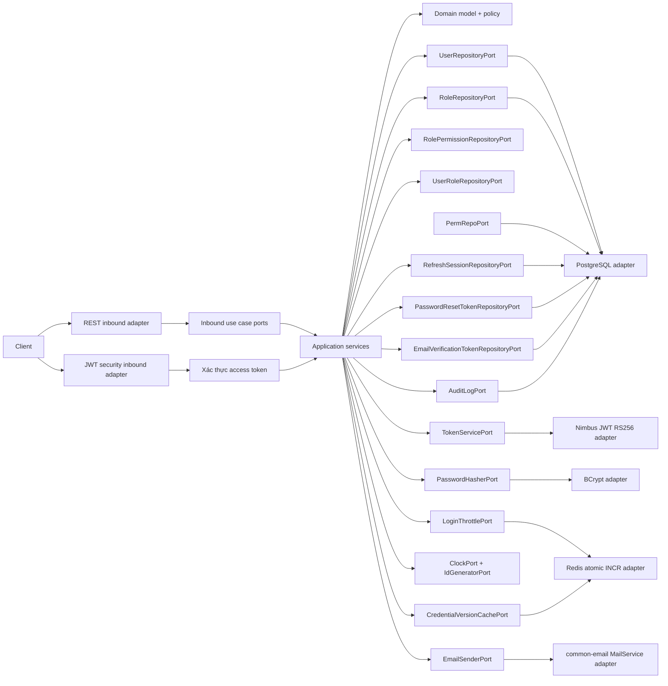
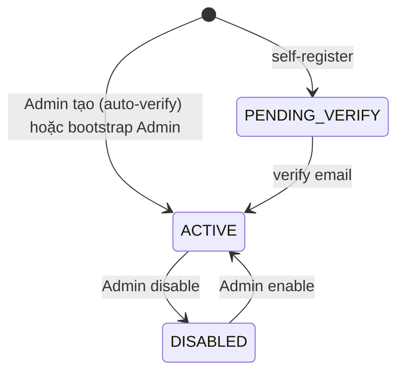
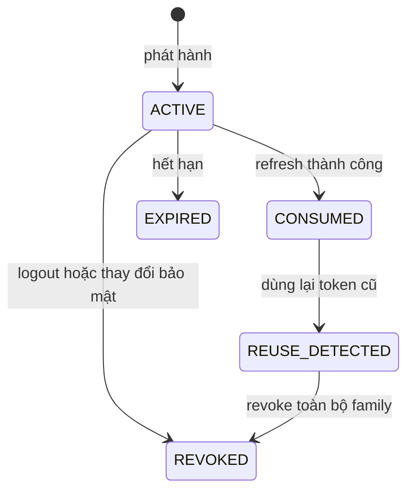
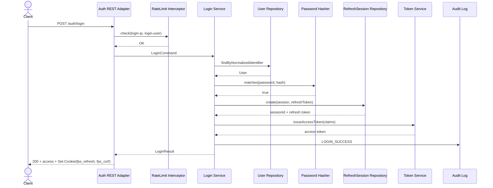
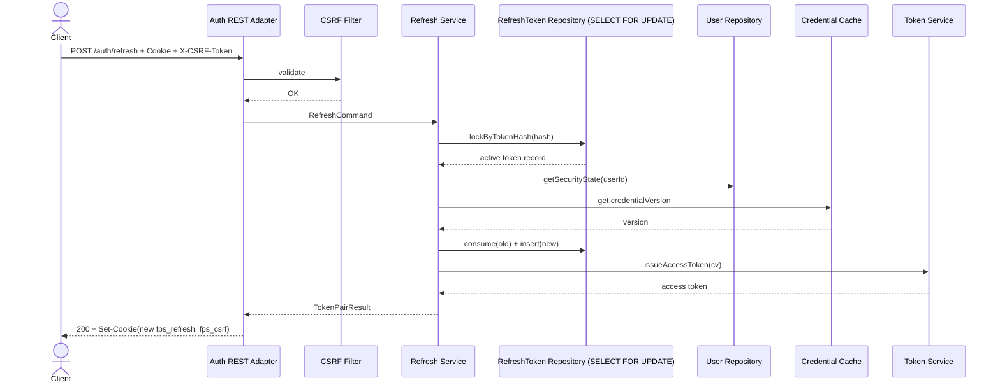
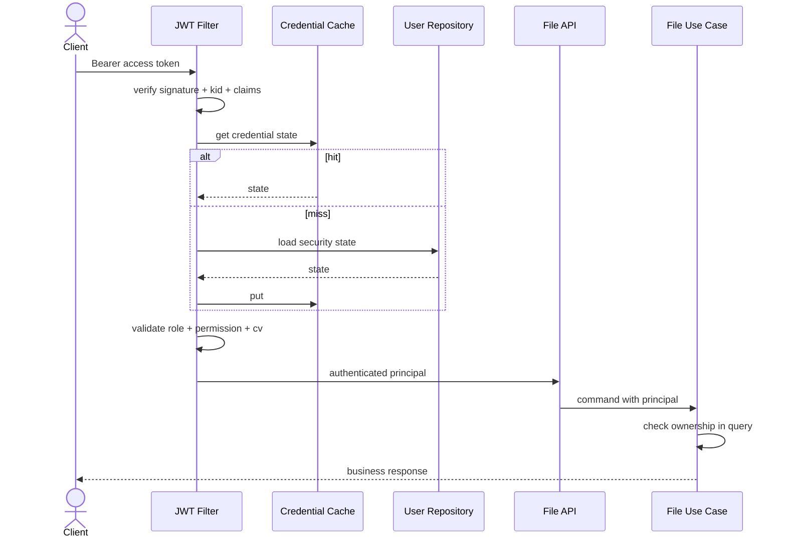

# Đặc tả yêu cầu mô-đun xác thực và phân quyền (V2)

Tài liệu này định nghĩa đầy đủ yêu cầu nghiệp vụ, yêu cầu chức năng, kiến trúc
Hexagonal, hợp đồng API, mô hình dữ liệu, yêu cầu bảo mật, use case, tiêu chí
nghiệm thu, và chiến lược kiểm thử cho mô-đun xác thực của Customer CSV File
Processing Service.

Mô-đun được xây dựng bằng Java 21, Spring Boot 4.1.x, Spring Security 6+ (OAuth2
Resource Server), PostgreSQL, Redis (qua `common-cache`), JWT (Nimbus JOSE + JWT
được kéo bởi `spring-boot-starter-oauth2-resource-server`), Flyway, MapStruct,
và `com.vandunxg.common` 2.0.5+.

Mô-đun cung cấp:

- Xác thực người dùng bằng username hoặc email + mật khẩu.
- Phát hành access token JWT RS256 với JWKS endpoint và hỗ trợ key rotation.
- Refresh session với refresh token opaque, rotation, và phát hiện tái sử dụng.
- Đăng ký tài khoản tự phục vụ (self-registration) kèm xác thực email.
- Quên mật khẩu tự phục vụ (self-service) qua email + reset token.
- Quản lý phiên đăng nhập nhiều thiết bị (liệt kê / revoke).
- RBAC động dựa trên Role và Permission là entity trong PostgreSQL.
- Quản trị tài khoản, vai trò, và quyền bởi Admin.
- Rate limit chống brute-force qua Redis + fallback in-memory.
- Audit event dùng bảng `audit_logs` generic đã có trong domain.
- Bảo vệ toàn bộ API nghiệp vụ bằng Spring Security stateless.
- Kiểm tra quyền sở hữu tài nguyên tại tầng application và truy vấn dữ liệu.

<!-- prettier-ignore -->
> [!IMPORTANT]
> Mọi API nghiệp vụ của hệ thống phải đi qua mô-đun xác thực và phân quyền.
> Frontend không phải là lớp bảo mật. Backend phải kiểm tra token, quyền,
> trạng thái tài khoản, và quyền sở hữu tài nguyên trước khi thực hiện use case.

## 1. Thông tin tài liệu

| Thuộc tính        | Giá trị                                                     |
|-------------------|-------------------------------------------------------------|
| Mã tài liệu       | FPS-AUTH-SRS-002                                            |
| Phiên bản         | 2.0                                                         |
| Trạng thái        | Sẵn sàng triển khai                                         |
| Mô-đun            | Authentication and Authorization                            |
| Kiến trúc         | Hexagonal Architecture trong modular monolith               |
| Nền tảng          | Java 21, Spring Boot 4.1.x                                  |
| Cơ sở dữ liệu     | PostgreSQL 16+                                              |
| Bộ nhớ phân tán   | Redis 7+ (qua `common-cache`)                               |
| Cơ chế xác thực   | JWT RS256 access token + rotating opaque refresh token      |
| Password hasher   | BCrypt cost 12 qua `DelegatingPasswordEncoder`              |
| Email             | `com.vandunxg.common:common-email:2.0.5` (SMTP)             |
| Migrations        | Flyway                                                      |
| Đối tượng đọc     | Backend Developer, QA, Tech Lead, DevOps, Security Reviewer |

## 2. Mục tiêu

Mô-đun xác thực cung cấp một ranh giới bảo mật thống nhất cho toàn bộ dịch vụ
File Processing.

Mô-đun đạt các mục tiêu sau:

- Cho phép người dùng đăng ký, xác thực email, và đăng nhập chủ động.
- Phát hành access token JWT có thời hạn ngắn, ký RS256 với `kid` và JWKS.
- Quản lý refresh token có rotation, thu hồi, và phát hiện tái sử dụng.
- Hỗ trợ đăng xuất một phiên, toàn bộ phiên, và revoke phiên từ danh sách.
- Cho phép user quên mật khẩu tự phục vụ qua email + reset token.
- Quản lý Role và Permission động bởi Admin qua API.
- Ép đổi mật khẩu sau khi Admin tạo hoặc reset.
- Chặn tài khoản bị vô hiệu hóa, tạm khóa, hoặc chưa xác thực email.
- Bảo vệ toàn bộ API nghiệp vụ bằng Spring Security stateless + JWT.
- Kiểm tra quyền sở hữu tài nguyên ở tầng application và truy vấn dữ liệu.
- Ghi audit cho các hành động bảo mật quan trọng.
- Không làm lộ mật khẩu, token, khóa ký, hoặc thông tin nhạy cảm trong log.
- Cho phép thay đổi adapter JWT, persistence, cache, email, hoặc password
  encoder mà không thay đổi domain và use case.

## 3. Quan hệ với tài liệu dự án

Tài liệu này mở rộng và thay thế phiên bản v1 `auth-module-requirements.md`
(v1.0). Bộ business rule của service xử lý file tiếp tục lấy từ [`AGENTS.md`](../../AGENTS.md).

Khi có xung đột, rule bảo mật cụ thể trong tài liệu này được ưu tiên cho Auth
Module. Rule về xử lý file lấy từ `AGENTS.md`.

## 4. Phạm vi

### 4.1 Trong phạm vi V1

Phiên bản đầu cung cấp các capability sau:

1. Bootstrap Admin đầu tiên qua Spring `ApplicationReadyEvent` + biến môi trường.
2. Đăng ký tài khoản tự phục vụ (self-registration).
3. Xác thực email qua token gửi qua email.
4. Gửi lại email xác thực khi token hết hạn.
5. Đăng nhập bằng username hoặc email.
6. Bắt buộc đổi mật khẩu lần đầu (Admin tạo hoặc reset).
7. Phát hành access token JWT RS256.
8. Phát hành refresh token opaque + rotation.
9. Làm mới access token qua cookie refresh + CSRF token.
10. Đăng xuất phiên hiện tại.
11. Đăng xuất toàn bộ phiên.
12. Xem danh sách phiên của mình.
13. Revoke một phiên cụ thể của mình.
14. Xem thông tin người dùng hiện tại (`/me`).
15. Đổi mật khẩu cá nhân.
16. Quên mật khẩu — yêu cầu reset qua email.
17. Đặt lại mật khẩu bằng reset token.
18. Admin tạo tài khoản (email verify hoặc auto-verify).
19. Admin liệt kê, xem chi tiết, cập nhật thông tin và vai trò user.
20. Admin vô hiệu hóa, kích hoạt, và mở khóa tài khoản.
21. Admin đặt lại mật khẩu tạm thời cho user.
22. Admin CRUD Role và gán Permission cho Role.
23. Admin đọc danh mục Permission và audit log.
24. Xác thực JWT cho mọi request nghiệp vụ.
25. Phân quyền theo Role/Permission và quyền sở hữu tài nguyên.
26. Rate limit và tạm khóa khi đăng nhập sai nhiều lần.
27. Thu hồi phiên khi mật khẩu, vai trò, hoặc trạng thái tài khoản thay đổi.
28. Audit và metric cho sự kiện xác thực.
29. Phát hành JWKS endpoint public cho verify token.
30. Hỗ trợ rotation khóa ký JWT.

### 4.2 Ngoài phạm vi V1

Các chức năng sau không thuộc phiên bản đầu:

- Xác thực đa yếu tố (MFA/TOTP/WebAuthn).
- Đăng nhập bằng Google, Facebook, GitHub, mạng xã hội khác, hoặc OIDC ngoài.
- OAuth2 Authorization Server cho hệ thống bên thứ ba.
- Single Sign-On với LDAP, Active Directory, SAML.
- Passwordless.
- Quên mật khẩu qua SMS.
- API key cho machine-to-machine.
- Service account cho Processing Worker.
- Chính sách phân quyền theo thuộc tính phức tạp (ABAC).
- Quản lý quota / billing đa tenant.
- Lưu access token vào danh sách phiên (chỉ dùng credential version + JWT).

<!-- prettier-ignore -->
> [!NOTE]
> Processing Worker là actor nội bộ. Worker không dùng JWT người dùng — Worker
> claim job qua transaction PostgreSQL và không gọi HTTP API bảo vệ bởi Auth.

## 5. Thuật ngữ

| Thuật ngữ                | Định nghĩa                                                        |
|--------------------------|-------------------------------------------------------------------|
| Access token             | JWT RS256 có thời hạn ngắn, dùng để gọi API được bảo vệ           |
| Refresh token            | Chuỗi ngẫu nhiên 256-bit entropy, dùng để cấp access token mới    |
| Token family             | Chuỗi refresh token được sinh ra từ cùng một phiên đăng nhập      |
| Refresh session          | Phiên đăng nhập logic, định danh bằng `sessionId` và `familyId`   |
| Token rotation           | Dùng refresh token cũ một lần rồi phát hành refresh token mới     |
| Token reuse              | Sử dụng lại refresh token đã được consume hoặc revoke             |
| Credential version       | Phiên bản credential dùng để vô hiệu hóa token cũ                 |
| Password change token    | JWT ngắn hạn chỉ cho phép hoàn tất đổi mật khẩu bắt buộc          |
| Password reset token     | Token opaque gửi qua email, dùng cho flow forget-password         |
| Email verification token | Token opaque gửi qua email, dùng cho flow xác thực email          |
| Account lock             | Khóa tạm thời sau nhiều lần đăng nhập thất bại                    |
| Account disable          | Admin vô hiệu hóa tài khoản cho đến khi kích hoạt lại             |
| Role                     | Nhóm quyền có tên (`code`), là entity trong DB                    |
| Permission               | Đơn vị quyền hạn (`code`) gắn vào Role, là entity trong DB        |
| Role hệ thống (const)    | Role không được xoá (`is_const = true`), ví dụ `ADMIN`/`OPERATOR` |
| Owner                    | Người dùng tạo hoặc sở hữu resource                               |
| Rate limit               | Giới hạn số lần gọi API trong một khoảng thời gian                |
| CSRF                     | Cross-Site Request Forgery, chống với double-submit cookie        |

## 6. Actor và vai trò

Mô-đun hỗ trợ mô hình RBAC động. Role và Permission được lưu trong PostgreSQL,
mỗi Role có tập Permission, mỗi User có tập Role. Hai role mặc định `ADMIN` và
`OPERATOR` được seed sẵn với cờ `is_const = true` để không thể xoá.

### 6.1 Người dùng chưa xác thực

Người dùng chưa xác thực có thể gọi các endpoint public:

- Đăng ký tài khoản: `POST /auth/register`.
- Xác thực email: `POST /auth/verify-email`.
- Gửi lại email xác thực: `POST /auth/resend-verification`.
- Đăng nhập: `POST /auth/login`.
- Làm mới access token: `POST /auth/refresh` (với cookie hợp lệ + CSRF).
- Quên mật khẩu: `POST /auth/forgot-password`.
- Reset mật khẩu bằng token: `POST /auth/reset-password`.
- Liveness và readiness health check theo cấu hình cho phép.
- JWKS: `GET /api/certificate/.well-known/jwks.json`.
- OpenAPI công khai chỉ trong môi trường được cho phép.

Người dùng chưa xác thực không được truy cập dữ liệu job, file, report,
customer, user, role, permission, hoặc audit.

### 6.2 User đã đăng ký, chưa xác thực email

User có `status = PENDING_VERIFY` có thể:

- Gọi endpoint xác thực email và gửi lại email xác thực.
- Đăng nhập → nhận thông báo `EMAIL_VERIFICATION_REQUIRED` (không nhận token).
- Gọi quên mật khẩu.

User `PENDING_VERIFY` không được cấp access token cho API nghiệp vụ.

### 6.3 Operator (role mặc định)

Operator là người dùng nghiệp vụ có role `OPERATOR` với permission mặc định
(dạng `(resource_code, action)` pair):

- `(FILE, SELF_CREATE)` — upload file của mình
- `(FILE, SELF_READ)`   — xem file của mình
- `(FILE, SELF_DELETE)` — xoá file của mình
- `(JOB, SELF_READ)`    — xem job của mình
- `(JOB, SELF_UPDATE)`  — retry hoặc cancel job của mình
- `(REPORT, SELF_READ)` — download report của mình
- `(USER, SELF_READ)`   — xem thông tin cá nhân
- `(USER, SELF_UPDATE)` — đổi mật khẩu, quản lý phiên của mình
- `(SESSION, SELF_READ)` — xem phiên của mình
- `(SESSION, SELF_DELETE)` — revoke phiên của mình

Chuỗi permission trong JWT claim và `@PreAuthorize` dùng format
`"{resource_code_lowercase}:{action_lowercase}"` — ví dụ `"file:self_create"`,
`"job:self_read"`.

Operator không có quyền truy cập user khác, role, permission catalog, hoặc
audit log.

### 6.4 Admin (role mặc định)

Admin có role `ADMIN` với permission `(ALL, MANAGE)` — đây là super-permission
wildcard, cho phép mọi hành động trên mọi resource. Chuỗi trong JWT là
`"all:manage"`.

`RegexPermissionEvaluator` của `common-web` xử lý `"all:manage"` như wildcard
super-admin cho mọi `hasPermission(null, '<resource>:<action>')`.

Admin cũng có thể được gán role thứ hai với tập permission cụ thể để hạn chế
hơn (ví dụ `AUDITOR` chỉ có `(AUDIT, READ)` + `(USER, READ)`).

Admin không được:

- Xem password hash.
- Xem refresh token gốc hoặc hash.
- Xem private key ký JWT.
- Xoá Admin hoạt động cuối cùng.
- Gỡ role `ADMIN` khỏi Admin hoạt động cuối cùng.
- Bỏ qua retry limit hoặc business rule của module xử lý file.
- Xoá role built-in.

### 6.5 System operator

System operator vận hành deployment và secret. Không phải role trong JWT.

System operator:

- Cung cấp khoá ký JWT qua env variable.
- Rotation khoá ký.
- Cấu hình bootstrap Admin đầu tiên qua env variable.
- Cấu hình TTL, cookie, CORS, và rate limit.

## 7. Ma trận quyền

Ma trận này là nguồn tham chiếu cho seed permission và test authorization.

| Capability                    | Chưa xác thực         | Chưa verify email | Operator                | Admin (`all:manage`) |
|-------------------------------|-----------------------|-------------------|-------------------------|----------------------|
| Register                      | Cho phép              | –                 | –                       | –                    |
| Verify email                  | Với token hợp lệ      | Với token hợp lệ  | –                       | –                    |
| Login                         | Cho phép              | Từ chối           | Cho phép                | Cho phép             |
| Refresh                       | Với cookie hợp lệ     | –                 | Với cookie hợp lệ       | Có refresh           |
| Forgot / Reset password       | Cho phép              | Cho phép          | Cho phép                | Cho phép             |
| Logout hiện tại               | Không                 | –                 | Cho phép                | Cho phép             |
| Logout all                    | Không                 | –                 | Chính mình              | Chính mình           |
| Session của mình              | Không                 | –                 | `session:self_read`     | wildcard             |
| `/me`                         | Không                 | –                 | `user:self_read`        | wildcard             |
| Đổi mật khẩu                  | Với password change   | Không             | `user:self_update`      | wildcard             |
| Upload file                   | Không                 | Không             | `file:self_create`      | wildcard             |
| Xem job                       | Không                 | Không             | `job:self_read` (own)   | `job:read` / wildcard|
| Tạo user                      | Không                 | Không             | Không                   | `user:create`        |
| Cập nhật user                 | Không                 | Không             | Không                   | `user:update`        |
| CRUD role                     | Không                 | Không             | Không                   | `role:create/update/delete` |
| Đọc permission catalog        | Không                 | Không             | Không                   | `role:read`          |
| Đọc audit                     | Không                 | Không             | Không                   | `audit:read`         |

## 8. Yêu cầu nghiệp vụ tổng quát

### 8.1 Định danh tài khoản

- `userId` là UUID do hệ thống sinh qua `IdUtils.nextId()`.
- `username` là duy nhất không phân biệt chữ hoa/thường (dùng
  `normalized_username`).
- Username được trim và chuẩn hóa `NFKC` + lowercase trước khi kiểm tra unique.
- Username có từ 3 đến 64 ký tự.
- Username chỉ gồm chữ cái Latin, chữ số, dấu chấm, gạch ngang, gạch dưới.
- Username không được thay đổi sau khi tài khoản được tạo.
- Email là bắt buộc, được trim, lowercase, unique không phân biệt hoa/thường.
- Display name có từ 2 đến 150 ký tự sau khi normalize khoảng trắng.
- Mỗi user phải có ít nhất một role.
- Role hợp lệ do bảng `role` quyết định; hai role hệ thống `ADMIN` và
  `OPERATOR` được seed sẵn và không thể xoá.

### 8.2 Trạng thái tài khoản

Trạng thái chính:

| Trạng thái        | Ý nghĩa                                                     |
|-------------------|-------------------------------------------------------------|
| `PENDING_VERIFY`  | User self-registered, chưa xác thực email. Không login được |
| `ACTIVE`          | Tài khoản được phép xác thực và truy cập nghiệp vụ          |
| `DISABLED`        | Admin vô hiệu hóa                                           |

Thuộc tính bảo mật bổ sung:

- `lockedUntil`: thời điểm kết thúc khóa tạm thời (có thể `null`).
- `mustChangePassword`: bắt buộc đổi mật khẩu trước khi truy cập nghiệp vụ.
- `credentialVersion`: phiên bản để vô hiệu hóa token đã phát hành.
- `failedLoginCount`: số lần đăng nhập thất bại liên tiếp.
- `lastFailedLoginAt`: thời điểm thất bại gần nhất.
- `emailVerifiedAt`: thời điểm xác thực email (nullable).

Rule trạng thái:

- User `DISABLED` không login hoặc refresh được.
- User `PENDING_VERIFY` không nhận access token cho API nghiệp vụ; login trả
  `EMAIL_VERIFICATION_REQUIRED`.
- User có `lockedUntil > now` không login được.
- Hết `lockedUntil`, user có thể login mà không cần Admin unlock.
- User có `mustChangePassword = true` chỉ nhận password change token khi login.
- Disable user phải revoke toàn bộ refresh session.
- Đổi role, đổi password, hoặc reset password phải tăng credential version.
- Kích hoạt lại user không khôi phục session đã revoke.
- Hệ thống luôn phải còn ít nhất một Admin đang `ACTIVE` (last-active-admin
  invariant).

### 8.3 Chính sách mật khẩu (NIST 800-63B)

- Độ dài 8 đến 128 ký tự Unicode.
- Không chỉ chứa khoảng trắng.
- Không được trùng username theo so sánh không phân biệt hoa/thường.
- Không được trùng email.
- Không được trùng mật khẩu hiện tại khi đổi hoặc reset.
- Không tự động hết hạn theo chu kỳ thời gian.
- Không lưu plaintext hoặc reversible encryption.
- Password hash phải dùng BCrypt cost 12 qua `DelegatingPasswordEncoder` để hỗ
  trợ upgrade thuật toán trong tương lai (`{bcrypt}$2a$12$...`).
- Rehash sau login thành công nếu encoder cost thay đổi.
- Password không được xuất hiện trong log, metric, audit metadata, hoặc error.

<!-- prettier-ignore -->
> [!NOTE]
> Không bắt buộc user tạo password đủ loại ký tự (chữ hoa, chữ thường, số, ký
> tự đặc biệt) vì làm giảm entropy thực và tạo password dễ đoán. Ưu tiên độ dài
> và không trùng username/email. V2 có thể tích hợp Have I Been Pwned k-anon.

### 8.4 Chính sách đăng nhập thất bại và rate limit

- Tối đa 5 lần thất bại liên tiếp cho một tài khoản trong 15 phút → khóa 15 phút.
- Rate limit theo IP cho endpoint login (5 request / 15 phút / IP).
- Rate limit theo user cho endpoint login (5 request / 15 phút / normalized
  identifier).
- Rate limit theo IP cho endpoint forgot-password (3 / 1 giờ / IP).
- Rate limit theo user cho endpoint forgot-password (3 / 1 giờ / normalized
  identifier).
- Rate limit theo IP cho register (10 / 1 giờ / IP).
- Rate limit theo IP cho refresh (60 / 1 phút / IP).
- Login thành công xoá failed counter của tài khoản.
- Admin unlock xoá `lockedUntil` và failed counter.
- Username/email không tồn tại vẫn phải thực hiện dummy password verification
  để giảm timing difference.
- Response login thất bại dùng thông báo chung, không phân biệt sai password,
  user không tồn tại, user disabled, hoặc user locked.
- Khi rate limit vượt ngưỡng, API trả `429 AUTH_RATE_LIMITED` và header
  `Retry-After`.

### 8.5 Chính sách phiên

- Mỗi login thành công tạo một `RefreshSession` mới với `sessionId` và
  `familyId` riêng.
- Access token có thời hạn mặc định 15 phút.
- Refresh session có thời hạn tuyệt đối mặc định 30 ngày (không kéo dài qua
  rotation).
- Refresh token chỉ được dùng một lần.
- Token reuse phải revoke toàn bộ token family và ghi audit
  `TOKEN_REUSE_DETECTED`.
- Logout phiên hiện tại revoke token family của session đó.
- Logout all revoke tất cả session của user và tăng credential version.
- Disable, đổi password, reset password, hoặc đổi role revoke tất cả session.
- Raw refresh token không được lưu trong database — chỉ lưu SHA-256 hash.
- Access token không được lưu đầy đủ trong database hoặc log.

### 8.6 RBAC động (mô hình be-v2 clone)

Mô hình RBAC clone theo hệ thống `be-v2` (`com.pion.ab.domain.iam`) đã chứng
minh production. Ba entity chính: `Role`, `RolePermission`, `UserRole`.

**Không có bảng permission catalog riêng.** Permission được biểu diễn là
tổ hợp `(resource_code, action)` lưu trực tiếp trong `role_permission`. Danh
mục resource và action được định nghĩa qua **enum** trong code, không phải
bảng DB.

**Enum `ResourceCode`** — nguồn chân lý cho các resource của File Processing
Service:

```java
public enum ResourceCode {
  ALL,        // super wildcard
  USER,       // tài khoản người dùng
  ROLE,       // vai trò
  SESSION,    // phiên đăng nhập
  AUDIT,      // audit log
  FILE,       // import file
  JOB,        // processing job
  REPORT,     // error report
  CUSTOMER    // customer (dữ liệu upsert)
}
```

Thêm resource mới → thêm enum + migration cho seed permission nếu cần.

**Enum `Action`** — tái sử dụng từ
`com.vandunxg.common.models.enums.Action`:

```java
public enum Action {
  MANAGE,       // super — implies READ + CREATE + UPDATE + DELETE + EXPORT
  READ,
  CREATE,
  UPDATE,
  DELETE,
  SELF_READ,    // scope theo owner
  SELF_CREATE,
  SELF_UPDATE,
  SELF_DELETE,
  EXPORT
}
```

`MANAGE` là super action. Permission `(ALL, MANAGE)` là super-admin wildcard.

**Chuỗi permission trong JWT claim và `@PreAuthorize`:**

Format: `"{resource_code_lowercase}:{action_lowercase}"`.

Ví dụ: `"user:read"`, `"file:self_create"`, `"role:update"`, `"all:manage"`.

Được build từ `RolePermission` bằng:
```java
String.format("%s:%s", rp.getResourceCode().toLowerCase(),
              rp.getAction().name().toLowerCase())
```

`AuthorityService` (theo pattern be-v2) build danh sách permission string cho
user, đưa vào JWT claim `permissions` và cache dưới key `user-authority:{userId}`.

**Wildcard `"all:manage"`:** `RegexPermissionEvaluator` của `common-web` coi
`"all:manage"` là super-permission, match mọi `hasPermission(null, '<x>:<y>')`.

**Role inheritance:**

Role có trường tuỳ chọn `role_inherited_id` trỏ tới role cha. Khi role cha
được update:
- Permission của role cha propagate xuống role con (đệ quy).
- Role con giữ nguyên permission riêng nếu có (union).
- Cycle detection: từ chối inheritance tạo vòng lặp.

Role inheritance chỉ dùng cho role không `isConst`. Role built-in
(`is_const = true`) không có inheritance.

**Cờ `is_const` (role hệ thống):**

Role được seed bởi hệ thống (`ROLE_ADMIN`, `ROLE_OPERATOR`, `ROLE_SYSTEM`) có
`is_const = true`. Ràng buộc:
- Không thể `DELETE`.
- Không thể đổi `code`.
- Có thể `UPDATE` name/description nhưng bị các ràng buộc bảo vệ đặc biệt
  (ví dụ `ROLE_ADMIN` phải luôn có `(ALL, MANAGE)`).
- Có thể `INACTIVE` (trừ `ROLE_ADMIN` vì last-active-admin invariant).

**Cờ `status` (ActiveStatus):** `ACTIVE` hoặc `INACTIVE`. Role `INACTIVE`
không cấp permission cho user.

**Soft delete:** Toàn bộ entity dùng cột `deleted_at TIMESTAMPTZ NULL` (giá
trị `NULL` = còn sống, giá trị timestamp = đã xoá lúc đó). **Không dùng
`deleted BOOLEAN`** — đây là convention `RULE.md §12.1` cho toàn dự án. Áp
dụng cho `Role`, `RolePermission`, `UserRole`, `User`, và mọi entity khác.

Khác biệt so với `be-v2` gốc (be-v2 dùng `deleted boolean`): khi clone vào
project này phải chuyển sang `deleted_at Instant?`. Lý do (xem `RULE.md
§12.1`): dễ tạo partial index `WHERE deleted_at IS NULL`, biết thời điểm xoá
để audit/retention, hỗ trợ restore và sort "trash".

**Quan hệ:**
- `Role` 1—N `RolePermission` (theo `role_id`).
- `User` N—N `Role` qua `UserRole` (bảng có id, user_id, role_id, deleted).
- `Role` 0—1 `Role` (`role_inherited_id`) — chain inheritance.

**Invalidation khi role/permission thay đổi:**
- Cache `user-authority:{userId}` bị evict cho toàn bộ user thuộc role.
- Tăng `credentialVersion` của user tương ứng để access token cũ mất hiệu lực.
- Ghi audit `ROLE_PERMISSION_UPDATED`.

**Admin không tạo permission mới runtime.** Danh mục permission = tích Descartes
của `ResourceCode` × `Action`. Admin chỉ gán/gỡ pair vào role.

## 9. Mô hình token

### 9.1 Access token JWT RS256

Header:

```json
{
  "alg": "RS256",
  "typ": "JWT",
  "kid": "auth-key-2026-01"
}
```

Claim bắt buộc:

| Claim         | Ý nghĩa                                             |
|---------------|-----------------------------------------------------|
| `iss`         | Issuer cố định của dịch vụ                          |
| `aud`         | Audience của File Processing API                    |
| `sub`         | `userId` (UUID)                                     |
| `username`    | Username chuẩn hóa                                  |
| `email`       | Email chuẩn hóa                                     |
| `roles`       | Danh sách role code (`["OPERATOR"]`)                |
| `permissions` | Danh sách permission `"resource:action"` (`["file:self_create","all:manage",…]`) |
| `sid`         | Session ID                                          |
| `jti`         | Token ID duy nhất                                   |
| `cv`          | Credential version tại lúc phát hành                |
| `typ`         | `access`                                            |
| `iat`         | Thời điểm phát hành                                 |
| `nbf`         | Thời điểm bắt đầu hiệu lực                          |
| `exp`         | Thời điểm hết hạn                                   |

JWT không chứa: password hash, storage credential, MinIO credential, thông tin
customer, refresh token, private key.

### 9.2 Password change token

- `typ = password_change`.
- Thời hạn mặc định 5 phút.
- Không có refresh token đi kèm.
- Chỉ cho phép endpoint `POST /auth/complete-password-change`.
- Chứa `sub`, `jti`, `cv`, `iat`, `exp`, `iss`, `aud`.
- Sau khi đổi mật khẩu, credential version tăng và token cũ mất hiệu lực.

### 9.3 Refresh token (opaque)

- Chuỗi random 256-bit entropy sinh bằng `SecureRandom`.
- Encode Base64 URL-safe không padding (44 ký tự).
- Database chỉ lưu SHA-256 hash (`token_hash UNIQUE`).
- Truyền qua cookie `HttpOnly`, `Secure` (bật trong production), `SameSite=Strict`.
- Cookie path giới hạn `/api/v1/auth`.
- Refresh endpoint bắt buộc CSRF token (double-submit).
- Không xuất hiện trong log hoặc error response.

Cookie mặc định:

```
Set-Cookie: fps_refresh=<opaque>; HttpOnly; Secure; SameSite=Strict; Path=/api/v1/auth; Max-Age=2592000
Set-Cookie: fps_csrf=<opaque>; Secure; SameSite=Strict; Path=/api/v1/auth; Max-Age=2592000
```

Client gửi lại giá trị `fps_csrf` qua header `X-CSRF-Token` khi refresh.

### 9.4 Password reset token (opaque)

- Chuỗi random 256-bit entropy, Base64 URL-safe.
- Chỉ SHA-256 hash lưu DB (`auth_password_reset_tokens.token_hash UNIQUE`).
- Thời hạn 15 phút.
- Chỉ dùng một lần (`used_at` được set sau khi consume).
- Gửi qua email dưới dạng link
  `https://<host>/reset-password?token=<opaque>`.
- Không xuất hiện trong log, response API, hoặc audit metadata.

### 9.5 Email verification token (opaque)

- Chuỗi random 256-bit entropy, Base64 URL-safe.
- Chỉ SHA-256 hash lưu DB (`auth_email_verification_tokens.token_hash UNIQUE`).
- Thời hạn 24 giờ.
- Chỉ dùng một lần.
- Gửi qua email dưới dạng link
  `https://<host>/verify-email?token=<opaque>`.

### 9.6 Xác thực access token

JWT adapter kiểm tra:

1. Header `alg = RS256`.
2. `kid` tồn tại trong key ring được tin cậy.
3. Chữ ký hợp lệ với public key tương ứng.
4. `iss` khớp cấu hình.
5. `aud` chứa audience yêu cầu.
6. `typ = access`.
7. `exp`, `nbf`, `iat` hợp lệ với clock skew tối đa 60 giây.
8. `sub`, `sid`, `jti`, `roles`, `permissions`, `cv` có đúng kiểu dữ liệu.
9. User `ACTIVE` (cache credential version, fallback DB).
10. Credential version trong token khớp phiên bản hiện tại.
11. Session chưa bị revoke (nếu endpoint policy yêu cầu — mặc định không kiểm
    tra để tránh chi phí DB mỗi request; credential version + short TTL access
    token là đủ).

Token có `alg = none`, thuật toán ngoài allowlist, hoặc `kid` không xác định
phải bị từ chối.

### 9.7 Credential version

- Mỗi user bắt đầu với `credentialVersion = 1`.
- Claim `cv` được đưa vào access token và password change token.
- Phiên bản hiện tại cache Redis với TTL 5 phút, fallback PostgreSQL.
- Đổi password, reset password, disable user, đổi role, hoặc thay đổi tập
  Permission của Role người dùng thuộc → tăng version.
- Cache invalidate ngay sau khi transaction commit.
- Redis unavailable → fallback DB theo policy fail-closed.
- Không chấp nhận token khi không xác minh được trạng thái bảo mật của user.

## 10. Kiến trúc Hexagonal

### 10.1 Nguyên tắc phụ thuộc

- Domain không import Spring, JPA, Jackson, Servlet, hoặc JWT library.
- Application phụ thuộc domain và định nghĩa inbound/outbound port.
- Inbound adapter (web/security) gọi inbound port.
- Outbound adapter triển khai outbound port.
- Adapter có thể phụ thuộc Spring và library hạ tầng.
- Entity JPA khác class với domain model; mapping qua MapStruct.
- Controller không chứa business rule.
- Security filter không thực hiện user management use case.
- Transaction boundary bao quanh một application use case phù hợp.

### 10.2 Sơ đồ kiến trúc



### 10.3 Cấu trúc package

```text
com.vandunxg.file_processing.auth
├── domain
│   ├── model                 User, Role, RolePermission, UserRole,
│   │                         UserStatus, ActiveStatus,
│   │                         ResourceCode, RoleCategory (enum seed),
│   │                         RefreshSession, RefreshToken,
│   │                         PasswordResetToken, EmailVerificationToken,
│   │                         AuditLog, AuditLogDomain, OperationType
│   ├── policy                PasswordPolicy, LoginLockPolicy,
│   │                         LastActiveAdminPolicy, PermissionExpression
│   │                         (helper build "resource:action" string)
│   ├── event                 (domain events sau commit; V1 có thể bỏ trống)
│   └── exception             AuthErrorCode, AuthDomainException
├── application
│   ├── port
│   │   ├── in                LoginUseCase, RefreshTokenUseCase, LogoutUseCase,
│   │   │                     RegisterUseCase, VerifyEmailUseCase, …
│   │   └── out               UserRepositoryPort, RoleRepositoryPort, …
│   ├── service               LoginService, RefreshTokenService, …
│   ├── command               LoginCommand, RegisterCommand, …
│   ├── query                 UserSearchQuery (đã có), RoleSearchQuery,
│   │                         SessionSearchQuery, AuditLogSearchQuery
│   └── result                LoginResult, TokenPairResult, UserSummaryResult
├── adapter
│   ├── in
│   │   ├── web               AuthController, AdminUserController,
│   │   │                     AdminRoleController, AdminPermissionController,
│   │   │                     AdminAuditLogController, MeSessionController
│   │   │   ├── request       *Request DTO
│   │   │   ├── response      *Response DTO
│   │   │   └── mapper        *WebMapper (MapStruct)
│   │   └── security          JwtAuthenticationConverter,
│   │                         CustomAuthenticationEntryPoint,
│   │                         RateLimitInterceptor,
│   │                         CredentialVersionValidator
│   └── out
│       ├── persistence
│       │   ├── entity        *Entity, Jpa*Repository
│       │   ├── mapper        *PersistenceMapper (MapStruct)
│       │   └── *PersistenceAdapter
│       ├── jwt               NimbusRsaTokenService, JwkKeyRing,
│       │                     JwksEndpoint (RestController public)
│       ├── redis             RedisCredentialVersionCache,
│       │                     RedisLoginThrottle
│       ├── email             CommonEmailSenderAdapter (dùng MailService),
│       │                     template resources/templates/email/*.html
│       └── audit             AuditLogPersistenceAdapter
└── configuration             AuthProperties (typed @ConfigurationProperties),
                              AuthSecurityConfiguration (bổ sung SecurityFilter),
                              BootstrapAdminListener (@EventListener),
                              JwkKeyRingConfiguration, RateLimitConfiguration
```

### 10.4 Inbound port bắt buộc

| Port                                | Trách nhiệm                                                            |
|-------------------------------------|------------------------------------------------------------------------|
| `BootstrapAdminUseCase`             | Tạo Admin đầu tiên khi hệ thống trống                                  |
| `RegisterUseCase`                   | Đăng ký tài khoản tự phục vụ + gửi email verify                        |
| `VerifyEmailUseCase`                | Xác thực email bằng token                                              |
| `ResendVerificationEmailUseCase`    | Gửi lại email xác thực                                                 |
| `LoginUseCase`                      | Đăng nhập bằng username hoặc email                                     |
| `CompletePasswordChangeUseCase`     | Hoàn tất đổi mật khẩu lần đầu                                          |
| `RefreshTokenUseCase`               | Rotation refresh token + cấp access token mới                          |
| `LogoutUseCase`                     | Revoke một session hoặc toàn bộ session                                |
| `GetCurrentUserUseCase`             | Trả thông tin principal `/me`                                          |
| `ChangePasswordUseCase`             | Đổi mật khẩu chủ động                                                  |
| `RequestPasswordResetUseCase`       | Yêu cầu reset password (gửi email)                                     |
| `ResetPasswordUseCase`              | Đặt lại password bằng token                                            |
| `ListMySessionsUseCase`             | Xem danh sách phiên của mình                                           |
| `RevokeMySessionUseCase`            | Revoke một phiên của mình                                              |
| `CreateUserUseCase`                 | Admin tạo user                                                         |
| `SearchUserUseCase`                 | Admin tìm kiếm user                                                    |
| `GetUserDetailUseCase`              | Admin xem chi tiết user                                                |
| `UpdateUserUseCase`                 | Admin cập nhật profile + role                                          |
| `ChangeUserStatusUseCase`           | Admin disable/enable/unlock                                            |
| `ResetUserPasswordUseCase`          | Admin đặt password tạm thời                                            |
| `CreateRoleUseCase`                 | Admin tạo role mới (non-const)                                         |
| `SearchRoleUseCase`                 | Admin tìm kiếm role                                                    |
| `AutocompleteRoleUseCase`           | Admin autocomplete role                                                |
| `UpdateRoleUseCase`                 | Admin cập nhật role + permission + propagate xuống role con            |
| `SetRoleInheritanceUseCase`         | Admin set/gỡ `roleInheritedId` (cycle detection)                       |
| `ActivateRoleUseCase`               | Admin chuyển role sang ACTIVE                                          |
| `InactivateRoleUseCase`             | Admin chuyển role sang INACTIVE                                        |
| `DeleteRoleUseCase`                 | Admin xoá role non-const và không có user                              |
| `BulkDeleteRoleUseCase`             | Admin xoá nhiều role                                                   |
| `GetPermissionCatalogUseCase`       | Trả `ResourcePermissionResponse[]` từ enum                             |
| `GetResourceCatalogUseCase`         | Trả danh sách `ResourceCode` với i18n                                  |
| `GetRoleAuditLogUseCase`            | Đọc audit của một role                                                 |
| `SearchAuditLogUseCase`             | Admin đọc audit log                                                    |
| `ValidatePrincipalUseCase`          | Xác thực credential version (nội bộ security filter)                   |

### 10.5 Outbound port bắt buộc

| Port                                | Trách nhiệm                                                            |
|-------------------------------------|------------------------------------------------------------------------|
| `UserRepositoryPort`                | Lưu, truy vấn, và lock user                                            |
| `RoleRepositoryPort`                | CRUD role, gán/gỡ permission                                           |
| `RolePermissionRepositoryPort`      | CRUD `role_permission` (không phải catalog table)                      |
| `UserRoleRepositoryPort`            | CRUD `user_role`                                                       |
| `RefreshSessionRepositoryPort`      | Tạo, rotate, revoke session và token                                   |
| `PasswordResetTokenRepositoryPort`  | Tạo, consume, dọn dẹp reset token                                      |
| `EmailVerificationTokenRepositoryPort` | Tạo, consume, dọn dẹp verification token                            |
| `PasswordHasherPort`                | Hash, verify, kiểm tra rehash                                          |
| `TokenServicePort`                  | Phát hành và verify JWT (access, password change)                      |
| `CredentialVersionCachePort`        | Cache credential version                                               |
| `LoginThrottlePort`                 | Rate limit theo IP và username                                         |
| `EmailSenderPort`                   | Gửi email (verify, reset password)                                     |
| `AuditLogPort`                      | Ghi audit event                                                        |
| `ClockPort`                         | Thời gian có thể test                                                  |
| `IdGeneratorPort`                   | Sinh UUID và token ID                                                  |

Không tạo interface chỉ để bọc một class không có nhu cầu thay thế. Mỗi port
bảo vệ một ranh giới hạ tầng hoặc use case rõ ràng.

### 10.6 Transaction boundary

Transaction đặt tại application service:

- Register user → 1 transaction (user + email verify token) + gửi email sau
  commit qua `TransactionSynchronization.afterCommit`.
- Verify email → 1 transaction (consume token + set `emailVerifiedAt` + đổi
  status `ACTIVE`).
- Login → 1 transaction (increment/reset failed counter, tạo session + token,
  cập nhật `lastLoginAt`).
- Refresh → 1 transaction (lock token record, consume, tạo token mới).
- Logout → 1 transaction (revoke session).
- Change password → 1 transaction (verify old, hash new, tăng credential
  version, revoke session).
- Request password reset → 1 transaction (tạo reset token) + gửi email
  afterCommit.
- Reset password → 1 transaction (consume token, hash new password, tăng
  credential version, revoke session).
- Create/update/disable/enable/unlock/reset-password user, CRUD role → 1
  transaction mỗi use case.
- Bootstrap Admin → 1 transaction có `SELECT ... FOR UPDATE` trên bảng lock
  (advisory lock hoặc unique constraint).

Cache invalidation, audit, và email side effect chạy sau commit hoặc dùng cơ
chế `afterCommit` để không phát tán trạng thái chưa commit.

## 11. Mô hình domain

### 11.1 Aggregate `User`

Thuộc tính logic:

| Thuộc tính           | Kiểu           | Ghi chú                                    |
|----------------------|----------------|--------------------------------------------|
| `id`                 | UUID           | PK                                         |
| `username`           | String         | Original                                   |
| `normalizedUsername` | String         | UNIQUE lookup, NFKC + lowercase            |
| `email`              | String         | Display                                    |
| `normalizedEmail`    | String         | UNIQUE lookup, trim + lowercase            |
| `displayName`        | String         | 2-150 chars sau normalize                  |
| `passwordHash`       | String         | BCrypt {bcrypt}$2a$12$...                  |
| `status`             | `UserStatus`   | `PENDING_VERIFY`, `ACTIVE`, `DISABLED`     |
| `roles`              | `Set<Role>`    | Non-empty                                  |
| `mustChangePassword` | boolean        | Default `false` cho self-register; `true` cho Admin tạo/reset |
| `failedLoginCount`   | int            | Default 0                                  |
| `lastFailedLoginAt`  | Instant?       |                                            |
| `lockedUntil`        | Instant?       |                                            |
| `credentialVersion`  | int            | ≥ 1                                        |
| `lastLoginAt`        | Instant?       |                                            |
| `passwordChangedAt`  | Instant        |                                            |
| `emailVerifiedAt`    | Instant?       | null khi `PENDING_VERIFY`                  |
| `deletedAt`          | Instant?       | Soft delete                                |
| `version`            | Long           | Optimistic locking                         |
| (audit fields)       | –              | Kế thừa `AuditableDomain`                  |

Invariants:

- `username`, `normalizedUsername`, `email`, `normalizedEmail`, `passwordHash`,
  `status`, `passwordChangedAt` không null.
- `roles` không rỗng.
- `credentialVersion ≥ 1`.
- User `DISABLED` không thể authenticate.
- User `PENDING_VERIFY` không nhận access token.
- User có `lockedUntil > now` không authenticate.
- Đổi role, đổi password, reset password, hoặc thay đổi permission của role
  tăng `credentialVersion`.
- Password hash không bao giờ được ánh xạ vào DTO trả client.

Domain method chính:

- `applyLoginSuccess(now, clockSkew)`
- `applyLoginFailure(now, policy)`
- `changePassword(newHash, now)`
- `resetPasswordByAdmin(newHash, now)` — set `mustChangePassword = true`.
- `verifyEmail(now)` — chuyển `PENDING_VERIFY` → `ACTIVE`.
- `disable(actor)`, `enable(actor)`, `unlock(actor)`.
- `assignRoles(Set<Role>, actor)`, `revokeRole(Role, actor)`.

### 11.2 Aggregate `Role`

Clone theo `com.pion.ab.domain.iam.Role` của be-v2.

| Thuộc tính            | Kiểu                    | Ghi chú                                       |
|-----------------------|-------------------------|-----------------------------------------------|
| `id`                  | UUID                    | PK                                            |
| `code`                | String                  | UNIQUE, uppercase snake, ví dụ `ADMIN`, `OPERATOR` |
| `name`                | String                  | Human name                                    |
| `description`         | String?                 |                                               |
| `roleInheritedId`     | UUID?                   | Role cha (kế thừa permission)                 |
| `status`              | `ActiveStatus`          | `ACTIVE` hoặc `INACTIVE`                      |
| `isConst`             | boolean                 | true = role hệ thống, không xoá được          |
| `permissions`         | `List<RolePermission>`  | Bên trong aggregate                           |
| `userRoles`           | `List<UserRole>`        | Enrich khi cần                                |
| `deletedAt`           | Instant?                | Soft delete: `null` = active, timestamp = xoá lúc đó |
| `version`             | Long                    | Optimistic locking                            |
| `roleInheritedName`   | String?                 | Enrich display (transient)                    |
| `roleInheritedCode`   | String?                 | Enrich display (transient)                    |
| (audit fields)        | –                       | Kế thừa `AuditableDomain`                     |

Invariants:

- `code` không rỗng, UNIQUE toàn hệ thống.
- Role `isConst = true` không thể `DELETE`, không thể đổi `code`.
- Role `ADMIN` (mặc định) bắt buộc chứa permission `(ALL, MANAGE)`.
- Role `INACTIVE` không cấp permission cho user (được filter trong
  `AuthorityService`).
- Không thể xoá role còn user thuộc role → `ROLE_STILL_ASSIGNED`.
- Không thể xoá role đang `ACTIVE` — phải `INACTIVE` trước.
- Cycle detection cho `roleInheritedId`: không được tạo vòng lặp qua chain.

Domain method (theo be-v2 `Role.java`):

- `Role(String code, String name, Map<ResourceCode, List<Action>> permissions)`
  — constructor cho seed default role (`isConst = true`).
- `Role(RoleCreateOrUpdateCmd cmd)` — constructor cho role Admin tạo runtime
  (`isConst = false`).
- `update(String name, Map<ResourceCode, List<Action>> permissions)` — chỉ
  update non-const, không xoá permission cũ (union).
- `update(RoleCreateOrUpdateCmd cmd, List<Role> roleInheritances)` —
  replace toàn bộ permission theo cmd, đồng bộ đệ quy xuống role con.
- `deleted()` — chỉ khi `INACTIVE` và không có `userRoles`.
- `active()`, `inactive()` — chuyển `status`.
- `enrichPermissions(List<RolePermission>)`, `enrichUserRoles(List<UserRole>)`,
  `enrichRoleInherited(name, code)` — hydrate cho display.
- `updatePermissionsFromParent(Map<String, List<Action>>)` — private, dùng
  trong đệ quy inheritance.

### 11.3 Entity `RolePermission`

Clone theo `com.pion.ab.domain.iam.RolePermission` của be-v2.

| Thuộc tính        | Kiểu           | Ghi chú                                    |
|-------------------|----------------|--------------------------------------------|
| `id`              | UUID           | PK (JSON ignore trong API response)        |
| `roleId`          | UUID           | FK role                                    |
| `resourceCode`    | String         | Từ enum `ResourceCode.name()`              |
| `action`          | `Action`       | Từ common-models                           |
| `resourceGroup`   | String?        | Tuỳ chọn — nhóm resource (ví dụ `FILE_MGMT`) |
| `deletedAt`       | Instant?       | Soft delete: `null` = active                |
| (audit)           | –              |                                            |

Rule:

- Không có UNIQUE constraint tự nhiên trên `(role_id, resource_code, action)`
  (theo be-v2). Duplicate được filter tại tầng domain trong
  `Role.handlePermissions` bằng `Optional<RolePermission>.findFirst()` +
  `delete(now)`/`restore()`.
- Có partial index active: `WHERE deleted_at IS NULL` trên
  `(role_id, resource_code, action)`.
- Domain method: `void delete(Instant now)`, `void restore()`,
  `boolean isDeleted()`.

### 11.4 Entity `UserRole`

Clone theo `com.pion.ab.domain.iam.UserRole` của be-v2.

| Thuộc tính     | Kiểu           | Ghi chú                                    |
|----------------|----------------|--------------------------------------------|
| `id`           | UUID           | PK                                         |
| `userId`       | UUID           | FK user                                    |
| `roleId`       | UUID           | FK role                                    |
| `deletedAt`    | Instant?       | Soft delete: `null` = active               |
| (audit)        | –              |                                            |

Index: `user_id`, `role_id`, partial `WHERE deleted_at IS NULL`. Không có
unique constraint tự nhiên (theo be-v2), duplicate filter tại tầng domain.

Domain method: `UserRole(UUID userId, UUID roleId)`, `void delete(Instant now)`,
`void restore()`, `boolean isDeleted()`.

### 11.5 Aggregate `RefreshSession`

| Thuộc tính            | Kiểu       | Ghi chú                                    |
|-----------------------|------------|--------------------------------------------|
| `id`                  | UUID       | PK                                         |
| `familyId`            | UUID       | Token family                               |
| `userId`              | UUID       | FK user                                    |
| `credentialVersion`   | int        | Snapshot lúc tạo                           |
| `deviceName`          | String?    | Do client gửi (giới hạn 100)               |
| `userAgentSummary`    | String?    | Đã cắt gọn (giới hạn 200)                  |
| `ipAddressHash`       | String?    | SHA-256(ip + salt) 32 ký tự đầu            |
| `createdAt`           | Instant    |                                            |
| `absoluteExpiresAt`   | Instant    |                                            |
| `lastRefreshedAt`     | Instant?   |                                            |
| `revokedAt`           | Instant?   |                                            |
| `revocationReason`    | Enum?      | `USER_LOGOUT`, `LOGOUT_ALL`, `USER_REVOKED`, `PASSWORD_CHANGED`, `PASSWORD_RESET`, `ROLE_CHANGED`, `PERMISSION_CHANGED`, `DISABLED`, `TOKEN_REUSE_DETECTED`, `ADMIN_REVOKED`, `EXPIRED` |
| `version`             | Long       | Optimistic locking                         |

### 11.6 Entity `RefreshToken` (con của session)

| Thuộc tính         | Kiểu       | Ghi chú                                    |
|--------------------|------------|--------------------------------------------|
| `id`               | UUID       | PK, = `jti` khi cần                        |
| `sessionId`        | UUID       | FK session                                 |
| `parentTokenId`    | UUID?      | Token trước trong chain                    |
| `tokenHash`        | String     | UNIQUE, SHA-256 hex 64 chars               |
| `issuedAt`         | Instant    |                                            |
| `expiresAt`        | Instant    |                                            |
| `consumedAt`       | Instant?   |                                            |
| `revokedAt`        | Instant?   |                                            |

Invariants:

- `tokenHash` UNIQUE toàn bảng.
- Token đã `consumedAt` không dùng hợp lệ lần hai.
- Reuse token cũ → revoke toàn bộ family.
- Rotation atomic: hai request đồng thời chỉ một request thành công.

### 11.7 Entity `PasswordResetToken`, `EmailVerificationToken`

Cùng shape:

| Thuộc tính     | Kiểu       | Ghi chú                                    |
|----------------|------------|--------------------------------------------|
| `id`           | UUID       | PK                                         |
| `userId`       | UUID       | FK user                                    |
| `tokenHash`    | String     | UNIQUE, SHA-256 hex                        |
| `issuedAt`     | Instant    |                                            |
| `expiresAt`    | Instant    |                                            |
| `usedAt`       | Instant?   | Một lần dùng                               |
| `ipAddressHash`| String?    | IP request                                 |

### 11.8 Value object và enum tham chiếu

- `UserId(UUID)`, `SessionId(UUID)`, `TokenId(UUID)`, `TokenFamilyId(UUID)`,
  `RoleId(UUID)`, `RolePermissionId(UUID)`, `UserRoleId(UUID)`.
- `Username(String)`, `EmailAddress(String)`, `DisplayName(String)`,
  `PasswordHash(String)`, `CredentialVersion(int)`.
- `RoleCode(String)` — dạng uppercase snake, UNIQUE.
- `IpAddressHash(String)`, `UserAgentSummary(String)`.

**Enum tham chiếu (không phải bảng DB):**

- `com.vandunxg.file_processing.auth.domain.model.ResourceCode` — danh mục
  resource (xem §8.6).
- `com.vandunxg.common.models.enums.Action` — action verb (đã có trong common
  library).
- `com.vandunxg.common.models.enums.ActiveStatus` — `ACTIVE`, `INACTIVE`
  (dùng cho `Role.status`).
- `com.vandunxg.file_processing.auth.domain.model.RoleCategory` — enum seed
  default role kèm `Map<ResourceCode, List<Action>>` mặc định (xem §8.6).

### 11.9 Mở rộng `AuditLog` (dùng chung)

Bảng `audit_logs` đã có model `AuditLog` với các trường:

| Trường       | Kiểu                | Ghi chú                                         |
|--------------|---------------------|-------------------------------------------------|
| `id`         | UUID                | PK                                              |
| `domain`     | `AuditLogDomain`    | `AUTH`, `USER`, `ROLE`, `PERMISSION`, `SESSION` |
| `objectId`   | UUID                | Target resource                                 |
| `operation`  | `OperationType`     | (xem 11.9)                                      |
| `changedBy`  | UUID?               | Actor (null cho SYSTEM)                         |
| `changedAt`  | Instant             |                                                 |
| `data`       | Map<String,Object>  | Metadata sanitized (JSON)                       |
| `ipAddress`  | String?             | IP đã hash hoặc mask                            |
| `browser`    | String?             | Từ UA                                           |
| `userAgent`  | String?             | UA summary (≤200 chars)                         |
| `deletedAt`  | Instant?            | Không dùng (audit append-only)                  |

`AuditLog` là append-only từ góc độ nghiệp vụ. Không update, không xoá.

### 11.10 Enum `AuditLogDomain` (populate)

```java
public enum AuditLogDomain {
  AUTH,
  USER,
  ROLE,
  PERMISSION,
  SESSION
}
```

### 11.11 Enum `OperationType` (mở rộng)

```java
public enum OperationType {
  CREATE, UPDATE, DELETE, ACTIVATED, DEACTIVATED,
  LOGIN_SUCCESS, LOGIN_FAILED,
  LOGOUT, LOGOUT_ALL,
  TOKEN_REFRESHED, TOKEN_REUSE_DETECTED,
  PASSWORD_CHANGED, PASSWORD_RESET_REQUESTED, PASSWORD_RESET_COMPLETED,
  ACCOUNT_LOCKED, ACCOUNT_UNLOCKED, ACCOUNT_DISABLED, ACCOUNT_ENABLED,
  ROLE_ASSIGNED, ROLE_REVOKED,
  ROLE_PERMISSION_UPDATED,
  EMAIL_VERIFICATION_REQUESTED, EMAIL_VERIFIED,
  USER_REGISTERED,
  ADMIN_BOOTSTRAPPED
}
```

### 11.12 Enum `UserStatus`

```java
public enum UserStatus {
  PENDING_VERIFY,
  ACTIVE,
  DISABLED
}
```

## 12. State machine

### 12.1 Trạng thái tài khoản



Khóa tạm thời không phải trạng thái chính; xác định bởi `lockedUntil > now`.

### 12.2 Trạng thái refresh token



### 12.3 Transition không hợp lệ

- Disable Admin hoạt động cuối cùng.
- Xoá role `is_const = true`.
- Gỡ role cuối cùng của user.
- Gỡ permission `(ALL, MANAGE)` khỏi role `ADMIN`.
- Set `role_inherited_id` tạo vòng lặp trong chain inheritance.
- Delete role đang `ACTIVE` hoặc còn `userRoles`.
- Refresh session đã revoke hoặc hết hạn.
- Sử dụng token consumed để tạo session mới.
- Đổi password bằng mật khẩu hiện tại.
- Reset password mà không tăng credential version.
- Cập nhật role mà không revoke session cũ.
- Verify email khi user không ở trạng thái `PENDING_VERIFY`.
- Login khi `PENDING_VERIFY` (cấp password change token cũng không được).

## 13. Hợp đồng API tổng quát

Auth API dùng JSON, UTF-8, version trong URI. Base path đề xuất:

```
/api/v1/auth          — public + authenticated auth flows
/api/v1/me            — self-service (session mgmt)
/api/v1/users         — User mgmt (Admin) — kết hợp permission-based
/api/v1/roles         — Role mgmt (Admin) + permission catalog read
/api/v1/roles/permissions, /api/v1/roles/resources — Permission catalog
/api/v1/admin/audit-logs  — Admin audit read
/api/v1/certificate/.well-known/jwks.json — JWKS public
```

### 13.1 Header chung

| Header          | Yêu cầu                                          |
|-----------------|--------------------------------------------------|
| `Authorization` | `Bearer <access-token>` cho API được bảo vệ      |
| `Content-Type`  | `application/json`                               |
| `Accept`        | `application/json`                               |
| `X-CSRF-Token`  | Bắt buộc cho `POST /auth/refresh` khi dùng cookie|
| `X-Request-Id`  | Tùy chọn; hệ thống tự sinh nếu thiếu             |

### 13.2 Error response

Chuẩn theo `ErrorResponse` của `common-models`:

```json
{
  "success": false,
  "status": "FAIL",
  "code": 40101,
  "message": "Thông tin đăng nhập không hợp lệ",
  "error": "INVALID_CREDENTIALS",
  "data": null,
  "timestamp": 1721213456789
}
```

Không chứa stack trace, password, token, hash, khoá ký, hoặc thông tin phân
biệt username tồn tại hay không.

### 13.3 Pagination

- `page` (0-based) hoặc `pageIndex` (1-based tuỳ base class `PagingQuery`).
- `size` mặc định 20, tối đa 100.
- `sort` mặc định `createdAt,DESC`.
- Response: `content`, `page`, `size`, `totalElements`, `totalPages` (theo
  `PagingResponse<T>` của common-models).

## 14. Danh sách use case

| Use case    | Tên                                                          |
|-------------|--------------------------------------------------------------|
| AUTH-UC-01  | Bootstrap Admin đầu tiên                                     |
| AUTH-UC-02  | Đăng ký tài khoản tự phục vụ                                 |
| AUTH-UC-03  | Xác thực email                                               |
| AUTH-UC-04  | Gửi lại email xác thực                                       |
| AUTH-UC-05  | Đăng nhập                                                    |
| AUTH-UC-06  | Bắt buộc đổi mật khẩu lần đầu                                |
| AUTH-UC-07  | Làm mới access token                                         |
| AUTH-UC-08  | Đăng xuất phiên hiện tại                                     |
| AUTH-UC-09  | Đăng xuất toàn bộ phiên                                      |
| AUTH-UC-10  | Xem thông tin người dùng hiện tại                            |
| AUTH-UC-11  | Đổi mật khẩu cá nhân                                         |
| AUTH-UC-12  | Yêu cầu quên mật khẩu                                        |
| AUTH-UC-13  | Đặt lại mật khẩu bằng token                                  |
| AUTH-UC-14  | Liệt kê phiên của mình                                       |
| AUTH-UC-15  | Revoke một phiên của mình                                    |
| AUTH-UC-16  | Admin tạo tài khoản                                          |
| AUTH-UC-17  | Admin liệt kê tài khoản                                      |
| AUTH-UC-18  | Admin xem chi tiết tài khoản                                 |
| AUTH-UC-19  | Admin cập nhật thông tin và vai trò                          |
| AUTH-UC-20  | Admin disable / enable / unlock                              |
| AUTH-UC-21  | Admin đặt lại mật khẩu tạm thời                              |
| AUTH-UC-22  | Admin CRUD Role                                              |
| AUTH-UC-23  | Admin đọc Permission và audit                                |
| AUTH-UC-24  | Xác thực access token cho request nghiệp vụ                  |
| AUTH-UC-25  | Kiểm tra quyền sở hữu tài nguyên                             |
| AUTH-UC-26  | Rotation khóa ký JWT                                         |
| AUTH-UC-27  | Xuất bản JWKS                                                |

## 15. AUTH-UC-01 — Bootstrap Admin đầu tiên

**Actor:** System operator (qua Spring `ApplicationReadyEvent`).

**Tiền điều kiện:**
- Chưa có user nào trong hệ thống.
- Cấu hình `app.auth.bootstrap.admin.username`, `email`, `password` được cung
  cấp qua env variable.

**Luồng chính:**
1. `BootstrapAdminListener` chạy khi `ApplicationReadyEvent`.
2. Kiểm tra `count(user) == 0` trong transaction có advisory lock.
3. Nếu đã có user → skip (idempotent, log info).
4. Validate username, email, display name, password theo policy.
5. Hash password (BCrypt cost 12).
6. Tạo user với `status = ACTIVE`, `emailVerifiedAt = now`,
   `mustChangePassword = true`, `credentialVersion = 1`.
7. Gán role `ADMIN`.
8. Ghi audit `ADMIN_BOOTSTRAPPED` với `actor = null`.

**Acceptance criteria:**
- AUTH-AC-01.1: Hệ thống trống + config hợp lệ tạo đúng một Admin.
- AUTH-AC-01.2: Hai instance khởi động đồng thời không tạo hai Admin (advisory
  lock hoặc unique constraint).
- AUTH-AC-01.3: Hệ thống đã có user không chạy bootstrap.
- AUTH-AC-01.4: Password bootstrap không xuất hiện trong log.

## 16. AUTH-UC-02 — Đăng ký tài khoản tự phục vụ

**Endpoint:** `POST /api/v1/auth/register`

**Request:**
```json
{
  "username": "operator01",
  "email": "operator01@example.com",
  "displayName": "Nguyễn Văn A",
  "password": "MatKhauAnToan123"
}
```

**Rate limit:** 10 request / 1 giờ / IP.

**Luồng chính:**
1. Rate limit theo IP.
2. Validate username (3-64 chars, allowed chars), email, display name, password
   theo policy.
3. Normalize username và email.
4. Kiểm tra unique `normalized_username` và `normalized_email` (DB constraint
   là boundary cuối cùng).
5. Hash password.
6. Tạo user `status = PENDING_VERIFY`, `mustChangePassword = false`,
   `credentialVersion = 1`, gán role mặc định `OPERATOR`.
7. Tạo `EmailVerificationToken` (opaque + hash, TTL 24h).
8. `afterCommit`: gửi email verify chứa link
   `https://<host>/verify-email?token=<opaque>`.
9. Ghi audit `USER_REGISTERED`.
10. Trả `201 Created` với `userId` và thông báo yêu cầu verify email.

**Response:**
```json
{
  "success": true,
  "code": 201,
  "message": "Đăng ký thành công. Vui lòng kiểm tra email để xác thực.",
  "data": {
    "userId": "…",
    "email": "operator01@example.com",
    "status": "PENDING_VERIFY"
  }
}
```

**Luồng ngoại lệ:**
- Username hoặc email trùng → `409 USERNAME_ALREADY_EXISTS` /
  `EMAIL_ALREADY_EXISTS`. Response không phân biệt cho anonymous rate-limit.
- Password không đạt policy → `422 PASSWORD_POLICY_VIOLATION`.
- Rate limit → `429 AUTH_RATE_LIMITED`.

**Acceptance criteria:**
- AUTH-AC-02.1: Đăng ký hợp lệ tạo user `PENDING_VERIFY` và gửi email.
- AUTH-AC-02.2: Email trùng trả `409`.
- AUTH-AC-02.3: Password không đạt policy trả `422`.
- AUTH-AC-02.4: User `PENDING_VERIFY` không login được.
- AUTH-AC-02.5: Password không xuất hiện trong log, audit, hoặc response.

## 17. AUTH-UC-03 — Xác thực email

**Endpoint:** `POST /api/v1/auth/verify-email`

**Request:**
```json
{ "token": "<opaque>" }
```

**Luồng chính:**
1. Hash token bằng SHA-256.
2. Lock record trong `auth_email_verification_tokens` bằng
   `SELECT … FOR UPDATE`.
3. Kiểm tra `usedAt IS NULL` và `expiresAt > now`.
4. Load user, phải `PENDING_VERIFY`.
5. Set `usedAt = now`.
6. Cập nhật user: `status = ACTIVE`, `emailVerifiedAt = now`.
7. Ghi audit `EMAIL_VERIFIED`.
8. Trả `204 No Content`.

**Luồng ngoại lệ:**
- Token không tồn tại, hết hạn, hoặc đã dùng → `410
  EMAIL_VERIFICATION_TOKEN_INVALID`.
- User không `PENDING_VERIFY` → `409 USER_ALREADY_VERIFIED`.

**Acceptance criteria:**
- AUTH-AC-03.1: Token hợp lệ chuyển user sang `ACTIVE`.
- AUTH-AC-03.2: Token dùng lần hai bị từ chối.
- AUTH-AC-03.3: Token hết hạn bị từ chối.
- AUTH-AC-03.4: Verify không hiển thị token gốc trong log.

## 18. AUTH-UC-04 — Gửi lại email xác thực

**Endpoint:** `POST /api/v1/auth/resend-verification`

**Request:**
```json
{ "identifier": "operator01" }
```

**Rate limit:** 3 request / 1 giờ / identifier + IP.

**Luồng chính:**
1. Rate limit.
2. Tìm user theo normalized identifier.
3. Nếu không tồn tại hoặc không `PENDING_VERIFY` → trả `204` mà không tiết lộ
   (chống enumeration).
4. Vô hiệu hóa toàn bộ verification token cũ của user (set `usedAt`).
5. Tạo verification token mới.
6. `afterCommit`: gửi email.
7. Ghi audit `EMAIL_VERIFICATION_REQUESTED`.
8. Trả `204`.

**Acceptance criteria:**
- AUTH-AC-04.1: User `PENDING_VERIFY` nhận được email mới.
- AUTH-AC-04.2: User không tồn tại hoặc `ACTIVE` vẫn nhận `204` chung.
- AUTH-AC-04.3: Rate limit trả `429`.

## 19. AUTH-UC-05 — Đăng nhập

**Endpoint:** `POST /api/v1/auth/login`

**Request:**
```json
{
  "identifier": "operator01",
  "password": "MatKhauAnToan123",
  "deviceName": "Chrome trên Windows"
}
```

`identifier` là username hoặc email (auto-detect ký tự `@`).

**Rate limit:** 5 / 15 phút / IP và 5 / 15 phút / normalized identifier.

**Luồng chính:**
1. Rate limit IP và identifier.
2. Detect identifier là email nếu chứa `@`, ngược lại username.
3. Normalize identifier.
4. Load user; nếu không tồn tại → dummy password verify + return generic fail.
5. Kiểm tra `lockedUntil` và `status`. Không phân biệt lỗi cho response.
6. Verify password qua `PasswordHasherPort`.
7. Nếu fail: tăng `failedLoginCount`, cập nhật `lastFailedLoginAt`, áp dụng
   lock policy khi đạt ngưỡng, ghi audit `LOGIN_FAILED`, trả generic fail.
8. Nếu password hash cần rehash → rehash và cập nhật.
9. Nếu user `PENDING_VERIFY` → trả `403 EMAIL_VERIFICATION_REQUIRED`.
10. Nếu `mustChangePassword = true` → phát hành password change token, không
    tạo refresh session, trả `200` với `passwordChangeToken`.
11. Ngược lại:
    - Xoá failed counter.
    - Cập nhật `lastLoginAt`.
    - Tạo `RefreshSession` + refresh token đầu tiên (device / UA / IP hash).
    - Phát hành access token JWT.
    - Set cookie `fps_refresh` (HttpOnly + Secure + SameSite=Strict) và
      `fps_csrf`.
12. Ghi audit `LOGIN_SUCCESS`.
13. Trả `200`.

**Response thành công:**
```json
{
  "success": true,
  "code": 200,
  "data": {
    "tokenType": "Bearer",
    "accessToken": "eyJ…",
    "expiresIn": 900,
    "user": {
      "id": "…",
      "username": "operator01",
      "email": "o***@example.com",
      "displayName": "Nguyễn Văn A",
      "roles": ["OPERATOR"],
      "permissions": ["file:self_create", "job:self_read", "…"]
    }
  }
}
```

**Response bắt buộc đổi mật khẩu:**
```json
{
  "success": true,
  "code": 200,
  "data": {
    "status": "PASSWORD_CHANGE_REQUIRED",
    "passwordChangeToken": "eyJ…",
    "expiresIn": 300
  }
}
```

**Response chưa verify email:**
```json
{
  "success": false,
  "code": 40301,
  "error": "EMAIL_VERIFICATION_REQUIRED",
  "message": "Vui lòng xác thực email trước khi đăng nhập."
}
```

**Acceptance criteria:**
- AUTH-AC-05.1: Credential hợp lệ phát hành access và refresh token.
- AUTH-AC-05.2: Sai identifier và sai password có response tương đương.
- AUTH-AC-05.3: Năm lần sai liên tiếp khóa tài khoản 15 phút.
- AUTH-AC-05.4: Login thành công xoá failed counter.
- AUTH-AC-05.5: User `DISABLED` nhận generic fail.
- AUTH-AC-05.6: User `PENDING_VERIFY` nhận `EMAIL_VERIFICATION_REQUIRED`.
- AUTH-AC-05.7: User `mustChangePassword` chỉ nhận password change token.
- AUTH-AC-05.8: Rate limit theo IP trả `429`.
- AUTH-AC-05.9: Password và token không xuất hiện trong log hoặc audit.
- AUTH-AC-05.10: Session lưu `deviceName`, `userAgentSummary`, `ipAddressHash`.

## 20. AUTH-UC-06 — Hoàn tất đổi mật khẩu lần đầu

**Endpoint:** `POST /api/v1/auth/complete-password-change`

**Authorization:** password change token (`Authorization: Bearer <token>`).

**Request:**
```json
{
  "currentPassword": "MatKhauTamThoi",
  "newPassword": "MatKhauMoi123",
  "confirmPassword": "MatKhauMoi123"
}
```

**Luồng chính:**
1. Verify JWT `typ = password_change`, `cv` khớp.
2. Load user; kiểm tra `mustChangePassword = true`.
3. Verify current password.
4. Validate new password (policy, khác username/email/current).
5. Kiểm tra confirmation match.
6. Hash new password.
7. Cập nhật `passwordHash`, `passwordChangedAt = now`,
   `mustChangePassword = false`.
8. Tăng `credentialVersion`.
9. Revoke toàn bộ refresh session (nếu có).
10. Invalidate credential cache sau commit.
11. Ghi audit `PASSWORD_CHANGED` với reason `MUST_CHANGE_INITIAL`.
12. Trả `204 No Content`. Client login lại.

**Acceptance criteria:**
- AUTH-AC-06.1: Token hợp lệ đổi được password.
- AUTH-AC-06.2: Token hết hạn hoặc sai `cv` bị từ chối.
- AUTH-AC-06.3: Sau đổi password, token cũ mất hiệu lực.
- AUTH-AC-06.4: New password trùng current bị từ chối.

## 21. AUTH-UC-07 — Làm mới access token

**Endpoint:** `POST /api/v1/auth/refresh`

**Header/Cookie:**
- Cookie: `fps_refresh=<opaque>`
- Header: `X-CSRF-Token: <csrf-cookie-value>`

**Rate limit:** 60 / 1 phút / IP.

**Luồng chính:**
1. Kiểm tra CSRF (so sánh cookie `fps_csrf` với header `X-CSRF-Token`).
2. Đọc refresh token từ cookie.
3. Hash SHA-256.
4. `SELECT … FOR UPDATE` trên `auth_refresh_tokens` theo `tokenHash`.
5. Kiểm tra token chưa `consumedAt` và session chưa `revokedAt`, chưa hết hạn.
6. Load user; kiểm tra `ACTIVE` và `credentialVersion` khớp với snapshot session.
7. Set `consumedAt = now` cho token cũ.
8. Sinh refresh token mới trong cùng family, `parentTokenId = old.id`.
9. Lưu token hash mới.
10. Phát hành access token JWT mới (kèm claim `cv` hiện tại).
11. Cập nhật cookie `fps_refresh` và `fps_csrf`.
12. Ghi audit `TOKEN_REFRESHED`.
13. Commit.

**Xử lý token reuse:**
- Nếu token đã `consumedAt` hoặc `revokedAt`:
  1. Lock token family.
  2. Revoke toàn bộ family (`revocationReason = TOKEN_REUSE_DETECTED`).
  3. Ghi audit `TOKEN_REUSE_DETECTED`.
  4. Tăng metric `auth_refresh_reuse_total`.
  5. Trả `401 REFRESH_TOKEN_REUSED`.
  6. Không phát hành token mới.

**Xử lý concurrency:**
- `SELECT … FOR UPDATE` bảo đảm hai request đồng thời tuần tự.
- Chỉ một request set `consumedAt`, request còn lại thấy token đã consumed →
  áp dụng reuse detection.

**Acceptance criteria:**
- AUTH-AC-07.1: Refresh token active phát hành token mới và consume token cũ.
- AUTH-AC-07.2: Dùng lại token cũ revoke toàn bộ family.
- AUTH-AC-07.3: Hai request đồng thời chỉ một request thành công.
- AUTH-AC-07.4: User `DISABLED` hoặc `cv` không khớp không refresh được.
- AUTH-AC-07.5: Refresh token hết hạn trả `401 REFRESH_TOKEN_EXPIRED`.
- AUTH-AC-07.6: CSRF sai trả `403 CSRF_TOKEN_INVALID`.

## 22. AUTH-UC-08 — Đăng xuất phiên hiện tại

**Endpoint:** `POST /api/v1/auth/logout`

**Authorization:** `Bearer <access-token>`.

**Luồng chính:**
1. Lấy `sub` và `sid` từ principal.
2. Load session của đúng `userId`.
3. Revoke toàn bộ token family (`revocationReason = USER_LOGOUT`).
4. Xóa cookie `fps_refresh` và `fps_csrf`.
5. Ghi audit `LOGOUT`.
6. Trả `204 No Content`.

**Idempotent:** gọi lại với session đã revoke vẫn trả `204`.

**Acceptance criteria:**
- AUTH-AC-08.1: Logout làm refresh token không còn dùng được.
- AUTH-AC-08.2: Logout lần hai vẫn `204` idempotent.
- AUTH-AC-08.3: Session ID của user khác không revoke được.

## 23. AUTH-UC-09 — Đăng xuất toàn bộ phiên

**Endpoint:** `POST /api/v1/auth/logout-all`

**Luồng chính:**
1. Lấy `userId` từ principal.
2. Revoke toàn bộ session active của user (`revocationReason = LOGOUT_ALL`).
3. Tăng `credentialVersion` để vô hiệu hóa access token cũ.
4. Invalidate credential cache sau commit.
5. Xóa cookie `fps_refresh` và `fps_csrf` hiện tại.
6. Ghi audit `LOGOUT_ALL`.
7. Trả `204`.

**Acceptance criteria:**
- AUTH-AC-09.1: Sau logout all, mọi refresh token của user bị từ chối.
- AUTH-AC-09.2: Access token cũ bị từ chối do `cv` thay đổi.
- AUTH-AC-09.3: Session của user khác không bị ảnh hưởng.

## 24. AUTH-UC-10 — Xem thông tin người dùng hiện tại

**Endpoint:** `GET /api/v1/auth/me`

**Response:**
```json
{
  "id": "…",
  "username": "operator01",
  "email": "o***@example.com",
  "displayName": "Nguyễn Văn A",
  "status": "ACTIVE",
  "roles": ["OPERATOR"],
  "permissions": ["file:self_create", "job:self_read"],
  "mustChangePassword": false,
  "emailVerifiedAt": "2026-07-01T08:00:00Z",
  "lastLoginAt": "2026-07-17T02:55:00Z",
  "passwordChangedAt": "2026-07-01T08:05:00Z"
}
```

Không chứa password hash, failed counter, refresh token, credential version,
hoặc security key.

**Acceptance criteria:**
- AUTH-AC-10.1: Access token hợp lệ trả đúng user hiện tại.
- AUTH-AC-10.2: Token của user `DISABLED` hoặc `cv` cũ bị từ chối.
- AUTH-AC-10.3: Response không chứa trường nhạy cảm.

## 25. AUTH-UC-11 — Đổi mật khẩu cá nhân

**Endpoint:** `POST /api/v1/auth/change-password`

**Request:**
```json
{
  "currentPassword": "MatKhauHienTai",
  "newPassword": "MatKhauMoi",
  "confirmPassword": "MatKhauMoi"
}
```

**Luồng chính:** giống AUTH-UC-06 nhưng không cần `mustChangePassword` và trigger từ access token thường.

**Acceptance criteria:**
- AUTH-AC-11.1: Current password đúng + new hợp lệ đổi thành công.
- AUTH-AC-11.2: Current password sai trả `400 CURRENT_PASSWORD_INVALID`.
- AUTH-AC-11.3: Password mới không đạt policy trả `422`.
- AUTH-AC-11.4: Sau đổi password, toàn bộ token cũ bị vô hiệu hóa.

## 26. AUTH-UC-12 — Yêu cầu quên mật khẩu

**Endpoint:** `POST /api/v1/auth/forgot-password`

**Request:**
```json
{ "identifier": "operator01@example.com" }
```

**Rate limit:** 3 / 1 giờ / IP và 3 / 1 giờ / identifier.

**Luồng chính:**
1. Rate limit.
2. Normalize identifier (username hoặc email).
3. Tìm user; nếu không tồn tại hoặc `DISABLED` → trả `204` chung (chống
   enumeration).
4. Vô hiệu hóa toàn bộ reset token cũ của user (`usedAt = now`).
5. Tạo `PasswordResetToken` (opaque + hash, TTL 15 phút).
6. `afterCommit`: gửi email chứa link
   `https://<host>/reset-password?token=<opaque>`.
7. Ghi audit `PASSWORD_RESET_REQUESTED`.
8. Trả `204`.

**Acceptance criteria:**
- AUTH-AC-12.1: User hợp lệ nhận email reset.
- AUTH-AC-12.2: User không tồn tại nhận `204` chung.
- AUTH-AC-12.3: Rate limit trả `429`.
- AUTH-AC-12.4: Token không xuất hiện trong log hoặc audit.

## 27. AUTH-UC-13 — Đặt lại mật khẩu bằng token

**Endpoint:** `POST /api/v1/auth/reset-password`

**Request:**
```json
{
  "token": "<opaque>",
  "newPassword": "MatKhauMoi",
  "confirmPassword": "MatKhauMoi"
}
```

**Luồng chính:**
1. Hash token SHA-256.
2. `SELECT … FOR UPDATE` trên `auth_password_reset_tokens`.
3. Kiểm tra `usedAt IS NULL`, `expiresAt > now`.
4. Load user; kiểm tra `status IN (ACTIVE, PENDING_VERIFY)`.
5. Validate new password policy (khác username, email, current password).
6. Set `usedAt = now`.
7. Hash new password.
8. Cập nhật user: `passwordHash`, `passwordChangedAt`, tăng
   `credentialVersion`. Nếu user `PENDING_VERIFY` → chuyển `ACTIVE` +
   `emailVerifiedAt = now` (reset qua email đã chứng minh sở hữu email).
9. Xoá failed counter và `lockedUntil` (Admin có thể phải làm điều này riêng
   nếu policy yêu cầu — mặc định reset password xoá cả hai).
10. Revoke toàn bộ refresh session.
11. Invalidate credential cache.
12. Ghi audit `PASSWORD_RESET_COMPLETED`.
13. Trả `204`.

**Acceptance criteria:**
- AUTH-AC-13.1: Token hợp lệ đặt được password mới.
- AUTH-AC-13.2: Token hết hạn hoặc đã dùng trả `410
  PASSWORD_RESET_TOKEN_INVALID`.
- AUTH-AC-13.3: Password mới không đạt policy trả `422`.
- AUTH-AC-13.4: Sau reset, toàn bộ session cũ bị revoke.
- AUTH-AC-13.5: Token cũ không dùng lại được.

## 28. AUTH-UC-14 — Liệt kê phiên của mình

**Endpoint:** `GET /api/v1/me/sessions`

**Response:**
```json
{
  "content": [
    {
      "sessionId": "…",
      "deviceName": "Chrome trên Windows",
      "userAgentSummary": "Mozilla/5.0 (Windows NT 10.0…)",
      "ipAddressHash": "a1b2c3…",
      "createdAt": "2026-07-15T10:00:00Z",
      "lastRefreshedAt": "2026-07-17T02:00:00Z",
      "isCurrent": true
    }
  ]
}
```

Không trả token hash hoặc IP đầy đủ.

**Acceptance criteria:**
- AUTH-AC-14.1: Chỉ trả session active của user hiện tại.
- AUTH-AC-14.2: Session hiện tại được đánh dấu `isCurrent = true`.
- AUTH-AC-14.3: Không lộ session của user khác.

## 29. AUTH-UC-15 — Revoke một phiên của mình

**Endpoint:** `DELETE /api/v1/me/sessions/{sessionId}`

**Luồng chính:**
1. Load session của đúng `userId` và `sessionId`. Không tồn tại → `404`.
2. Revoke session (`revocationReason = USER_REVOKED`).
3. Ghi audit `LOGOUT` với `sessionId` là target.
4. Trả `204`.

**Lưu ý:** revoke session hiện tại không ép user logout ngay — access token
vẫn còn hiệu lực trong TTL. Muốn revoke access token, dùng `logout-all` để
tăng credential version.

**Acceptance criteria:**
- AUTH-AC-15.1: Session của mình revoke được.
- AUTH-AC-15.2: Session của user khác không revoke được (trả `404`).

## 30. AUTH-UC-16 — Admin tạo tài khoản

**Endpoint:** `POST /api/v1/users`

**Authorization:** permission `user:create` (Admin có `all:manage` wildcard).

**Request:**
```json
{
  "username": "operator02",
  "email": "operator02@example.com",
  "displayName": "Trần Thị B",
  "temporaryPassword": "MatKhauTamThoi",
  "roleIds": ["<uuid-of-OPERATOR-role>"],
  "autoVerifyEmail": true
}
```

Client resolve `roleIds` bằng cách gọi `GET /api/v1/roles` hoặc
`/roles/autocomplete` trước. Có thể chấp nhận cả `roleCodes` như alternative
(server resolve theo `code`).

**Luồng chính:**
1. Kiểm tra principal có permission `user:create`.
2. Validate input.
3. Kiểm tra unique.
4. Hash temporary password.
5. Tạo user; nếu `autoVerifyEmail = true` → `status = ACTIVE`,
   `emailVerifiedAt = now`; ngược lại `status = PENDING_VERIFY` và gửi email
   verify.
6. Set `mustChangePassword = true`.
7. Ghi `createdBy = principal.userId`.
8. Ghi audit `USER_REGISTERED` với reason `ADMIN_CREATED`.
9. Trả `201`.

**Acceptance criteria:**
- AUTH-AC-16.1: Admin tạo được Operator.
- AUTH-AC-16.2: Username hoặc email trùng trả `409`.
- AUTH-AC-16.3: Operator gọi endpoint nhận `403`.
- AUTH-AC-16.4: User mới bắt buộc đổi password khi login lần đầu.
- AUTH-AC-16.5: Temporary password không xuất hiện trong response hoặc log.

## 31. AUTH-UC-17..21 — Admin quản lý user

Các endpoint và luồng theo bảng sau (chi tiết mỗi luồng có sequence tương tự
V1 spec).

| UC   | Endpoint (permission)                                          | Ghi chú                                    |
|------|----------------------------------------------------------------|--------------------------------------------|
| 17   | `GET /api/v1/users` (`user:read`)                              | List có filter/sort/pagination             |
| 18   | `GET /api/v1/users/{id}` (`user:read`)                         | Detail admin view                          |
| 19   | `POST /api/v1/users/{id}/update` (`user:update`)               | Cập nhật email/displayName/roleIds         |
| 20a  | `POST /api/v1/users/{id}/disable` (`user:update`)              | Revoke session + tăng `cv`                 |
| 20b  | `POST /api/v1/users/{id}/enable` (`user:update`)               | Không khôi phục session cũ                 |
| 20c  | `POST /api/v1/users/{id}/unlock` (`user:update`)               | Xoá `lockedUntil` và failed counter        |
| 21   | `POST /api/v1/users/{id}/reset-password` (`user:update`)       | Set temp password + `mustChangePassword`   |

Rule chung:
- Optimistic locking (`version`) cho update.
- Last-active-admin invariant: kiểm tra bên trong transaction, không cho phép
  disable Admin cuối hoặc gỡ role `ADMIN` của Admin cuối.
- Đổi role hoặc thay đổi tập permission của role → tăng `credentialVersion`
  cho tất cả user thuộc role đó (batch update trong transaction).
- Revoke session sau các thay đổi bảo mật.
- Ghi audit tương ứng.

## 32. AUTH-UC-22 — Admin CRUD Role

Clone pattern endpoint từ `RoleResource` của be-v2. Sử dụng `POST` cho các
action operator (delete, active, inactive, update) thay vì `PATCH/DELETE` để
consistent với be-v2 (tuỳ chọn — có thể chuyển sang RESTful đúng chuẩn nếu
Tech Lead thích).

**Endpoints:**

| Method | Path                                        | Permission                    |
|--------|---------------------------------------------|-------------------------------|
| GET    | `/api/v1/roles`                             | `role:read` hoặc `user:read`  |
| GET    | `/api/v1/roles/autocomplete`                | `role:read` hoặc `user:read`  |
| GET    | `/api/v1/roles/find-by-ids?ids=…`           | `role:read` hoặc `user:read`  |
| GET    | `/api/v1/roles/{id}`                        | `role:read`                   |
| POST   | `/api/v1/roles`                             | `role:create`                 |
| POST   | `/api/v1/roles/{id}/update`                 | `role:update`                 |
| POST   | `/api/v1/roles/inheritance`                 | `role:update`                 |
| POST   | `/api/v1/roles/{id}/active`                 | `role:update`                 |
| POST   | `/api/v1/roles/{id}/inactive`               | `role:update`                 |
| POST   | `/api/v1/roles/{id}/delete`                 | `role:delete`                 |
| POST   | `/api/v1/roles/delete-by-ids`               | `role:delete`                 |
| GET    | `/api/v1/roles/permissions`                 | `role:read`                   |
| GET    | `/api/v1/roles/resources`                   | `role:read`                   |
| GET    | `/api/v1/roles/{id}/audit-logs`             | `role:read`                   |

`hasPermission(null, 'role:update')` — expression cho `@PreAuthorize` sử dụng
`RegexPermissionEvaluator` của `common-web`.

**Request `RoleCreateOrUpdateRequest`** (theo be-v2):

```json
{
  "code": "AUDITOR",
  "name": "Auditor",
  "description": "Chỉ đọc audit và user",
  "permissions": [
    {
      "resourceCode": "AUDIT",
      "actions": ["READ"]
    },
    {
      "resourceCode": "USER",
      "actions": ["READ"]
    }
  ]
}
```

Constraint validation:
- `code`: `@Pattern("^[A-Za-z0-9_]+$")`, `@Size(max = 50)`, `@NotBlank`.
- `name`: `@NotBlank`, `@Size(max = 100)`.
- `description`: `@Size(max = 1000)`.
- `permissions[].resourceCode`: hợp lệ với enum `ResourceCode`.
- `permissions[].actions[]`: hợp lệ với enum `Action`.

**Request `RoleInheritanceRequest`:**

```json
{
  "roleId": "<child-role-id>",
  "roleInheritedId": "<parent-role-id>"
}
```

Set `role_inherited_id` cho role con. `null` để gỡ inheritance.

**Rule:**
- Role `is_const = true` không thể `delete` hoặc `update code`.
- `create` chỉ khi `code` chưa tồn tại → `409 ROLE_CODE_ALREADY_EXISTS`.
- `update` với cmd đầy đủ (bao gồm permissions) → replace toàn bộ permission
  cũ + propagate xuống role con (đệ quy qua `roleInheritedId`). Trong be-v2:
  `role.update(cmd, listOfInheritedRoles)`.
- `delete` chỉ khi role `INACTIVE` và không có `userRoles` → nếu không, trả
  `409 ROLE_STILL_ASSIGNED` hoặc `ROLE_IS_ACTIVATED`.
- `active`/`inactive` idempotent với message rõ (`ROLE_IS_ACTIVATED` /
  `ROLE_IS_INACTIVATED`).
- `inheritance` phải chống cycle: từ chối nếu `roleInheritedId` là con cháu
  của `roleId` trong chain hiện tại → `409 ROLE_INHERITANCE_CYCLE`.
- Cập nhật permission hoặc role của user → tăng `credentialVersion` toàn bộ
  user thuộc role đó, evict cache `user-authority`.
- Ghi audit `ROLE_PERMISSION_UPDATED`, `ROLE_INHERITANCE_UPDATED`.

**Acceptance criteria:**
- AUTH-AC-22.1: Admin tạo role mới với danh sách permission hợp lệ.
- AUTH-AC-22.2: Trùng `code` trả `409`.
- AUTH-AC-22.3: Update role `is_const = true` với `code` mới bị từ chối.
- AUTH-AC-22.4: Delete role đang `ACTIVE` bị từ chối.
- AUTH-AC-22.5: Inheritance tạo cycle bị từ chối.
- AUTH-AC-22.6: Update permission propagate xuống role con.
- AUTH-AC-22.7: Update permission tăng `credentialVersion` user thuộc role.

## 33. AUTH-UC-23 — Admin đọc Permission catalog và audit

Permission catalog **không có bảng DB** — được sinh từ enum `ResourceCode` ×
`Action` trong code. API trả về danh mục cho UI Admin hiển thị.

**Endpoints:**

| Method | Path                                        | Permission     | Ghi chú                                    |
|--------|---------------------------------------------|----------------|--------------------------------------------|
| GET    | `/api/v1/roles/resources`                   | `role:read`    | Trả danh sách `ResourceCode` + metadata    |
| GET    | `/api/v1/roles/permissions`                 | `role:read`    | Trả `ResourcePermissionResponse[]` (grouped) |
| GET    | `/api/v1/admin/audit-logs`                  | `audit:read`   | Đọc audit log toàn hệ thống                |

**Response `ResourcePermissionResponse`** (theo be-v2):

```json
[
  {
    "resourceCode": "FILE",
    "resourceName": "File Import",
    "resourceGroup": "FILE_PROCESSING",
    "resourceGroupName": "File Processing",
    "permissions": [
      { "action": "MANAGE",       "actionName": "Toàn quyền" },
      { "action": "READ",         "actionName": "Xem" },
      { "action": "CREATE",       "actionName": "Tạo" },
      { "action": "UPDATE",       "actionName": "Sửa" },
      { "action": "DELETE",       "actionName": "Xoá" },
      { "action": "SELF_READ",    "actionName": "Xem của mình" },
      { "action": "SELF_CREATE",  "actionName": "Tạo của mình" },
      { "action": "SELF_UPDATE",  "actionName": "Sửa của mình" },
      { "action": "SELF_DELETE",  "actionName": "Xoá của mình" },
      { "action": "EXPORT",       "actionName": "Xuất" }
    ]
  },
  ...
]
```

Mapping `resourceName`, `actionName`, `resourceGroupName` load qua i18n
(`messages.properties` / `messages_vi.properties`).

**Filter audit log:**
- `domain` (AuditLogDomain).
- `operation` (OperationType).
- `changedBy` (UUID actor).
- `objectId` (UUID resource).
- `changedFrom` / `changedTo` (timestamp range).
- Pagination + sort.

**Acceptance criteria:**
- AUTH-AC-23.1: `GET /roles/resources` trả toàn bộ `ResourceCode` với tên i18n.
- AUTH-AC-23.2: `GET /roles/permissions` trả `Resource × Action` grouped.
- AUTH-AC-23.3: Operator gọi endpoint nhận `403 ACCESS_DENIED`.
- AUTH-AC-23.4: Audit log filter hoạt động đúng.

## 34. AUTH-UC-24 — Xác thực access token cho request nghiệp vụ

Use case nội bộ trong security filter chain.

**Luồng:**
1. Đọc Bearer token từ Authorization header.
2. Từ chối request có nhiều Authorization header hoặc format không hợp lệ.
3. `JwtDecoder` verify signature + claim cơ bản.
4. `JwtAuthenticationConverter` tạo `UserAuthentication` với roles và
   permissions từ claim.
5. `CredentialVersionValidator` (custom filter/converter) kiểm tra
   `credentialVersion` từ cache/DB.
6. Nếu user `DISABLED` hoặc `cv` không khớp → 401 `ACCESS_TOKEN_REVOKED`.
7. Đưa authentication vào `SecurityContext` của request.

**Lỗi:**
| Case                                | Response                          |
|-------------------------------------|-----------------------------------|
| Thiếu token                         | `401 AUTH_TOKEN_REQUIRED`         |
| Token sai format / signature        | `401 ACCESS_TOKEN_INVALID`        |
| Token hết hạn                       | `401 ACCESS_TOKEN_EXPIRED`        |
| Credential version cũ hoặc revoked  | `401 ACCESS_TOKEN_REVOKED`        |
| User disabled                       | `401 ACCESS_TOKEN_REVOKED`        |
| Role/permission không hợp lệ        | `401 ACCESS_TOKEN_INVALID`        |

**Acceptance criteria:**
- AUTH-AC-24.1: Token hợp lệ tạo `UserAuthentication` với đủ roles + permissions.
- AUTH-AC-24.2: Token hết hạn không gọi được controller.
- AUTH-AC-24.3: Token bị sửa 1 byte bị từ chối.
- AUTH-AC-24.4: Token role/permission tự thêm client bị từ chối do signature.
- AUTH-AC-24.5: User `DISABLED` hoặc `cv` cũ bị từ chối trước business use case.

## 35. AUTH-UC-25 — Kiểm tra quyền sở hữu tài nguyên

**Rule:**
- Admin (có permission `<module>.*` tương ứng) truy cập mọi tài nguyên.
- Operator chỉ truy cập tài nguyên có `ownerId = principal.userId`.
- Repository query của Operator phải có điều kiện owner trong SQL.
- Không load tài nguyên user khác rồi che ở controller.
- Operator đoán ID tài nguyên user khác → `404 RESOURCE_NOT_FOUND`.
- Operator gọi endpoint Admin → `403 ACCESS_DENIED`.

**Ví dụ:** `findJobByIdForOwner(jobId, currentUserId)` thay vì
`findJobById(jobId)`.

**Acceptance criteria:**
- AUTH-AC-25.1: Operator A không xem job của Operator B.
- AUTH-AC-25.2: Request tài nguyên user khác trả `404`.
- AUTH-AC-25.3: Admin xem được mọi job theo permission.
- AUTH-AC-25.4: Authorization kiểm tra ở API boundary VÀ query scope.

## 36. AUTH-UC-26 — Rotation khóa ký JWT

**Cấu hình key ring:**
```yaml
app.auth.jwt.active-kid: "auth-key-2026-01"
app.auth.jwt.private-key-pem-base64: ${AUTH_JWT_PRIVATE_KEY_PEM}
app.auth.jwt.public-keys:
  - kid: "auth-key-2026-01"
    pem-base64: ${AUTH_JWT_PUBLIC_KEY_2026_01}
  - kid: "auth-key-2025-07"    # đang transition, chỉ verify
    pem-base64: ${AUTH_JWT_PUBLIC_KEY_2025_07}
```

**Luồng rotation:**
1. Tạo RSA key pair mới (≥2048 bit).
2. Gán `kid` duy nhất theo convention `auth-key-YYYY-MM`.
3. Cập nhật secret manager: thêm public key mới vào `public-keys`, đổi
   `active-kid` sang key mới.
4. Rolling restart hoặc reload key ring an toàn.
5. Token mới ký bằng key mới; token cũ còn hạn verify bằng public key cũ.
6. Chờ tối thiểu `access-token-ttl + clock-skew` (15m + 60s).
7. Loại bỏ public key cũ khỏi `public-keys`.
8. Ghi operational audit không chứa key material.

**Acceptance criteria:**
- AUTH-AC-26.1: Token mới dùng `kid` mới.
- AUTH-AC-26.2: Token cũ còn hạn vẫn verify trong transition.
- AUTH-AC-26.3: Xoá key cũ sau window → token cũ không còn được chấp nhận.
- AUTH-AC-26.4: Private key không xuất hiện trong image, source, hoặc log.

## 37. AUTH-UC-27 — Xuất bản JWKS

**Endpoint:** `GET /api/v1/certificate/.well-known/jwks.json` (public).

**Response:**
```json
{
  "keys": [
    {
      "kty": "RSA",
      "use": "sig",
      "alg": "RS256",
      "kid": "auth-key-2026-01",
      "n": "…",
      "e": "AQAB"
    }
  ]
}
```

- Public, không auth.
- Cache header `Cache-Control: public, max-age=300` cho phép CDN cache.
- Không chứa private key.

## 38. Tích hợp Spring Security

### 38.1 Filter chain

`SecurityFilterChain`:

```java
http
    .sessionManagement(s -> s.sessionCreationPolicy(SessionCreationPolicy.STATELESS))
    .csrf(csrf -> csrf
        .ignoringRequestMatchers(paths -> !paths.getRequestURI().equals("/api/v1/auth/refresh"))
        .csrfTokenRepository(new DoubleSubmitCookieCsrfTokenRepository()))
    .cors(cors -> cors.configurationSource(corsSource))
    .authorizeHttpRequests(auth -> auth
        .requestMatchers(HttpMethod.OPTIONS, "/**").permitAll()
        .requestMatchers(PUBLIC_URLS).permitAll()
        .anyRequest().authenticated())
    .oauth2ResourceServer(oauth2 -> oauth2
        .jwt(jwt -> jwt
            .decoder(rsaJwtDecoder)
            .jwtAuthenticationConverter(jwtAuthenticationConverter)))
    .exceptionHandling(ex -> ex
        .authenticationEntryPoint(restAuthenticationEntryPoint)
        .accessDeniedHandler(restAccessDeniedHandler));
```

`PUBLIC_URLS`:
- `/api/v1/auth/register`
- `/api/v1/auth/verify-email`
- `/api/v1/auth/resend-verification`
- `/api/v1/auth/login`
- `/api/v1/auth/refresh`
- `/api/v1/auth/forgot-password`
- `/api/v1/auth/reset-password`
- `/api/v1/certificate/.well-known/jwks.json`
- `/actuator/health/liveness`
- `/v3/api-docs/**`
- `/swagger-ui/**`

### 38.2 JwtAuthenticationConverter

Custom converter tạo `UserAuthentication` (common-models):

```java
UserAuthentication auth = new UserAuthentication(
    userId, username, token,
    Stream.concat(
        roleClaims.stream().map(r -> new SimpleGrantedAuthority("ROLE_" + r)),
        permClaims.stream().map(SimpleGrantedAuthority::new)
    ).toList()
);
```

`SecurityUtils.getCurrentUserLoginId()` (common-web) sẽ hoạt động.

### 38.3 CredentialVersionValidator

Chạy sau converter (hoặc trong converter):
- Load credential version từ `CredentialVersionCachePort` (Redis TTL 5 phút,
  fallback DB).
- Compare với claim `cv`.
- Không khớp → `AuthenticationException` (`ACCESS_TOKEN_REVOKED`).
- User `DISABLED` → cùng exception.

### 38.4 Method security

`@EnableMethodSecurity` với `RegexPermissionEvaluator` (common-web) đã đăng ký
qua `MethodSecurityExpressionHandler`.

Chuỗi permission trong JWT claim `permissions` là danh sách
`"{resource_code_lowercase}:{action_lowercase}"`. `JwtAuthenticationConverter`
map thành `SimpleGrantedAuthority` chứa cả `ROLE_<CODE>` (từ claim `roles`) và
`"<resource>:<action>"` (từ claim `permissions`).

Ví dụ (clone theo be-v2 `RoleResource`):

```java
@PreAuthorize("hasPermission(null, 'file:self_create')")
public Response<UploadResponse> upload(...) { … }

@PreAuthorize("hasPermission(null, 'user:read') or hasPermission(null, 'role:read')")
public PagingResponse<RoleResponse> search(...) { … }

@PreAuthorize("hasPermission(null, 'role:create')")
public Response<Role> create(...) { … }

@PreAuthorize("hasRole('ADMIN')")
public Response<...> superOnly(...) { … }
```

`RegexPermissionEvaluator` behavior:
- Required permission (arg 2): literal string như `"file:self_create"`.
- Granted permission: mỗi authority của principal — có thể là regex, được so
  qua `Pattern.matches(granted, required)`.
- **`"all:manage"` là wildcard super-permission** — luôn match mọi required
  (hard-coded trong `RegexPermissionEvaluator`).

Không map arbitrary string từ token thành authority không được hệ thống hỗ
trợ — `JwtAuthenticationConverter` phải kiểm tra permission string format
`"[a-z_]+:[a-z_]+"` trước khi thêm.

Ownership + capability check kết hợp:
- Method-level: `@PreAuthorize("hasPermission(null, 'file:self_read')")` cho
  Operator, hoặc `hasPermission(null, 'file:read')` cho Admin.
- Query-level: nếu authority là `SELF_*` → thêm `WHERE owner_id =
  :currentUserId` trong repository. Nếu là action non-self (`READ`, `MANAGE`)
  thì bỏ điều kiện owner. Application service quyết định dựa trên tập
  permission của principal.

### 38.5 CORS

- Allowlist origin từ cấu hình `app.auth.cors.allowed-origins`.
- Không dùng `*` cùng credentialCookie.
- Cho phép method GET/POST/PATCH/DELETE/OPTIONS.
- Header `Authorization`, `X-CSRF-Token`, `X-Request-Id`, `Content-Type`.

### 38.6 Security header

- `X-Content-Type-Options: nosniff`.
- `X-Frame-Options: DENY`.
- `Referrer-Policy: strict-origin-when-cross-origin`.
- `Cache-Control: no-store` cho endpoint auth.

## 39. Rate limit interceptor

### 39.1 Thiết kế

`RateLimitInterceptor implements HandlerInterceptor` đăng ký qua
`WebMvcConfigurer`.

- Trước filter Spring Security cho endpoint public (implement như filter chuẩn
  `OncePerRequestFilter` cao thứ tự hơn Security).
- Sau filter cho endpoint authenticated (interceptor sau
  `AuthorizationFilter`).

### 39.2 Redis key

Format: `rl:{type}:{key}`.

| Type                       | Key value                          | Limit | Window |
|----------------------------|------------------------------------|-------|--------|
| `login-ip`                 | Remote IP                          | 5     | 15m    |
| `login-user`               | Normalized identifier              | 5     | 15m    |
| `forgot-password-ip`       | Remote IP                          | 3     | 1h     |
| `forgot-password-user`     | Normalized identifier              | 3     | 1h     |
| `resend-verification-ip`   | Remote IP                          | 3     | 1h     |
| `resend-verification-user` | Normalized identifier              | 3     | 1h     |
| `register-ip`              | Remote IP                          | 10    | 1h     |
| `refresh-ip`               | Remote IP                          | 60    | 1m     |

### 39.3 Thuật toán

Redis Lua script atomic:
```lua
local current = redis.call("INCR", KEYS[1])
if current == 1 then redis.call("EXPIRE", KEYS[1], ARGV[1]) end
return current
```

Nếu `current > limit` → trả 429 với `Retry-After = TTL(key)`.

### 39.4 Fallback

Redis unavailable:
- Fallback in-memory Caffeine bucket per-instance (không đồng bộ giữa instances).
- Bucket per (type, key), TTL matching window, capacity = limit.
- Log warning và tăng metric `auth_rate_limit_fallback_total`.
- Không fail-open: nếu tất cả cơ chế hỏng, trả 503 `SERVICE_UNAVAILABLE`.

### 39.5 Reset

- Login thành công xoá `login-ip:<ip>` và `login-user:<identifier>`.
- Admin unlock xoá `login-user:<identifier>`.

## 40. Mô hình dữ liệu logic

Schema vật lý qua Flyway. Migration prefix `V202607170`... Tất cả migration
append-only.

### 40.1 `auth_users`

| Cột                    | Kiểu             | Constraint                              |
|------------------------|------------------|-----------------------------------------|
| `id`                   | uuid             | PK                                      |
| `username`             | varchar(64)      | NOT NULL                                |
| `normalized_username`  | varchar(64)      | NOT NULL, UNIQUE                        |
| `email`                | varchar(254)     | NOT NULL                                |
| `normalized_email`     | varchar(254)     | NOT NULL, UNIQUE                        |
| `display_name`         | varchar(150)     | NOT NULL                                |
| `password_hash`        | varchar(255)     | NOT NULL                                |
| `status`               | varchar(20)      | NOT NULL, CHECK IN (PENDING_VERIFY, ACTIVE, DISABLED) |
| `must_change_password` | boolean          | NOT NULL, default false                 |
| `failed_login_count`   | int              | NOT NULL, default 0                     |
| `last_failed_login_at` | timestamptz      | nullable                                |
| `locked_until`         | timestamptz      | nullable                                |
| `credential_version`   | int              | NOT NULL, default 1                     |
| `last_login_at`        | timestamptz      | nullable                                |
| `password_changed_at`  | timestamptz      | NOT NULL                                |
| `email_verified_at`    | timestamptz      | nullable                                |
| `deleted_at`           | timestamptz      | nullable (soft delete)                  |
| `created_by`           | varchar(100)     | nullable                                |
| `created_at`           | timestamptz      | NOT NULL                                |
| `last_modified_by`     | varchar(100)     | nullable                                |
| `last_modified_at`     | timestamptz      | NOT NULL                                |
| `version`              | bigint           | NOT NULL, default 0 (optimistic)        |

Index:
- UNIQUE `normalized_username`
- UNIQUE `normalized_email`
- `(status, created_at DESC)`
- `locked_until` partial `WHERE locked_until IS NOT NULL`

### 40.2 `role`

Clone schema từ `RoleEntity` của be-v2. Tên bảng `role` (không prefix `auth_`)
để consistent với be-v2 pattern.

| Cột                | Kiểu           | Constraint                              |
|--------------------|----------------|-----------------------------------------|
| `id`               | uuid           | PK                                      |
| `role_inherited_id`| uuid           | nullable, FK `role.id` (self)           |
| `code`             | varchar(50)    | NOT NULL, UNIQUE                        |
| `name`             | varchar(100)   | NOT NULL                                |
| `description`      | varchar(1000)  | nullable                                |
| `deleted_at`       | timestamptz    | nullable — soft delete (RULE.md §12.1)  |
| `is_const`         | boolean        | nullable, default false                 |
| `status`           | varchar(20)    | NOT NULL, default `ACTIVE`, CHECK IN (`ACTIVE`, `INACTIVE`) |
| `version`          | bigint         | NOT NULL, default 0 (optimistic)        |
| `created_by`       | varchar(100)   | nullable                                |
| `created_at`       | timestamptz    | NOT NULL                                |
| `last_modified_by` | varchar(100)   | nullable                                |
| `last_modified_at` | timestamptz    | NOT NULL                                |

Index:
- UNIQUE `role_code_key` trên `code`.
- Partial `role_active_code_idx` trên `code` WHERE `deleted_at IS NULL`.
- `role_deleted_at_idx` trên `deleted_at` WHERE `deleted_at IS NOT NULL`
  (phục vụ retention cleanup, restore UI).

### 40.3 `role_permission`

Clone schema từ `RolePermissionEntity` của be-v2. Đây là **entity không phải
junction table** — mỗi row là một `(role, resource, action)` pair có
metadata riêng.

| Cột                | Kiểu           | Constraint                              |
|--------------------|----------------|-----------------------------------------|
| `id`               | uuid           | PK                                      |
| `role_id`          | uuid           | NOT NULL, FK `role.id`                  |
| `resource_code`    | varchar(50)    | NOT NULL, giá trị từ enum `ResourceCode` |
| `action`           | varchar(20)    | NOT NULL, giá trị từ enum `Action`      |
| `resource_group`   | varchar(255)   | nullable                                |
| `deleted_at`       | timestamptz    | nullable — soft delete (RULE.md §12.1)  |
| `created_by`       | varchar(100)   | nullable                                |
| `created_at`       | timestamptz    | NOT NULL                                |
| `last_modified_by` | varchar(100)   | nullable                                |
| `last_modified_at` | timestamptz    | NOT NULL                                |

Index:
- `role_permission_role_id_idx` trên `role_id`
- Partial `role_permission_active_idx` trên
  `(role_id, resource_code, action)` WHERE `deleted_at IS NULL` (index chính
  cho lookup permission của một role).
- `role_permission_resource_code_idx` trên `resource_code`
  WHERE `deleted_at IS NULL` (phục vụ query "role nào có permission này").
- `role_permission_deleted_at_idx` trên `deleted_at`
  WHERE `deleted_at IS NOT NULL` (retention).

**Không có UNIQUE constraint tự nhiên** trên `(role_id, resource_code, action)`
— domain filter duplicate qua `Role.handlePermissions()`.

### 40.4 `user_role`

Clone schema từ `UserRoleEntity` của be-v2.

| Cột                | Kiểu           | Constraint                              |
|--------------------|----------------|-----------------------------------------|
| `id`               | uuid           | PK                                      |
| `user_id`          | uuid           | NOT NULL, FK `auth_users.id`            |
| `role_id`          | uuid           | NOT NULL, FK `role.id`                  |
| `deleted_at`       | timestamptz    | nullable — soft delete (RULE.md §12.1)  |
| `created_by`       | varchar(100)   | nullable                                |
| `created_at`       | timestamptz    | NOT NULL                                |
| `last_modified_by` | varchar(100)   | nullable                                |
| `last_modified_at` | timestamptz    | NOT NULL                                |

Index:
- Partial `user_role_active_user_idx` trên `(user_id)`
  WHERE `deleted_at IS NULL` (query "role của user X").
- Partial `user_role_active_role_idx` trên `(role_id)`
  WHERE `deleted_at IS NULL` (query "user thuộc role Y" — phục vụ propagation
  invalidate `credentialVersion` khi role permission thay đổi).
- `user_role_deleted_at_idx` trên `deleted_at`
  WHERE `deleted_at IS NOT NULL`.

**Không có UNIQUE constraint tự nhiên** trên `(user_id, role_id)` — domain
filter duplicate qua application service.

### 40.5 `auth_refresh_sessions`

| Cột                    | Kiểu           | Constraint                              |
|------------------------|----------------|-----------------------------------------|
| `id`                   | uuid           | PK                                      |
| `family_id`            | uuid           | NOT NULL                                |
| `user_id`              | uuid           | FK auth_users, NOT NULL                 |
| `credential_version`   | int            | NOT NULL                                |
| `device_name`          | varchar(100)   | nullable                                |
| `user_agent_summary`   | varchar(200)   | nullable                                |
| `ip_address_hash`      | varchar(64)    | nullable                                |
| `created_at`           | timestamptz    | NOT NULL                                |
| `absolute_expires_at`  | timestamptz    | NOT NULL                                |
| `last_refreshed_at`    | timestamptz    | nullable                                |
| `revoked_at`           | timestamptz    | nullable                                |
| `revocation_reason`    | varchar(50)    | nullable (xem §11.5 enum values)        |
| `version`              | bigint         | NOT NULL, default 0                     |

Index:
- `(user_id, revoked_at)`
- `family_id`
- `absolute_expires_at` (cleanup)

### 40.6 `auth_refresh_tokens`

| Cột               | Kiểu           | Constraint                              |
|-------------------|----------------|-----------------------------------------|
| `id`              | uuid           | PK                                      |
| `session_id`      | uuid           | FK auth_refresh_sessions, NOT NULL      |
| `parent_token_id` | uuid           | nullable                                |
| `token_hash`      | char(64)       | NOT NULL, UNIQUE                        |
| `issued_at`       | timestamptz    | NOT NULL                                |
| `expires_at`      | timestamptz    | NOT NULL                                |
| `consumed_at`     | timestamptz    | nullable                                |
| `revoked_at`      | timestamptz    | nullable                                |

Index: `session_id`, `expires_at`.

### 40.7 `auth_password_reset_tokens`

Cột: `id`, `user_id`, `token_hash` UNIQUE char(64), `issued_at`,
`expires_at`, `used_at`, `ip_address_hash`.

### 40.8 `auth_email_verification_tokens`

Cùng shape với `auth_password_reset_tokens`.

### 40.9 `audit_logs`

Chung cho toàn hệ thống (đã có `AuditLog` domain).

| Cột              | Kiểu           | Constraint                              |
|------------------|----------------|-----------------------------------------|
| `id`             | uuid           | PK                                      |
| `domain`         | varchar(50)    | NOT NULL                                |
| `object_id`      | uuid           | nullable                                |
| `operation`      | varchar(50)    | NOT NULL                                |
| `changed_by`     | uuid           | nullable                                |
| `changed_at`     | timestamptz    | NOT NULL                                |
| `data`           | jsonb          | nullable                                |
| `ip_address`     | varchar(64)    | nullable (hashed hoặc masked)           |
| `browser`        | varchar(64)    | nullable                                |
| `user_agent`     | varchar(200)   | nullable                                |
| `deleted_at`     | timestamptz    | nullable                                |
| (audit)          | –              |                                         |

Index:
- `(domain, operation, changed_at DESC)`
- `(changed_by, changed_at DESC)`
- `(object_id, changed_at DESC)`

### 40.10 Seed migrations

Migration seed hai role built-in (`is_const = true`) theo mô hình
`RoleCategory` của be-v2. Mỗi seed insert `role` + N rows `role_permission`.

**Role `ADMIN`** — super admin:

| resource_code | action  |
|---------------|---------|
| `ALL`         | `MANAGE` |

Row `(ALL, MANAGE)` là super wildcard — `AuthorityService` build ra string
`"all:manage"` cho JWT claim, và `RegexPermissionEvaluator` coi đó là super
permission.

**Role `OPERATOR`** — người dùng nghiệp vụ:

| resource_code | action       |
|---------------|--------------|
| `FILE`        | `SELF_CREATE`|
| `FILE`        | `SELF_READ`  |
| `FILE`        | `SELF_DELETE`|
| `JOB`         | `SELF_READ`  |
| `JOB`         | `SELF_UPDATE`|
| `REPORT`      | `SELF_READ`  |
| `USER`        | `SELF_READ`  |
| `USER`        | `SELF_UPDATE`|
| `SESSION`     | `SELF_READ`  |
| `SESSION`     | `SELF_DELETE`|

Chuỗi permission tương ứng đưa vào JWT claim `permissions`: `"file:self_create"`,
`"file:self_read"`, `"file:self_delete"`, `"job:self_read"`,
`"job:self_update"`, `"report:self_read"`, `"user:self_read"`,
`"user:self_update"`, `"session:self_read"`, `"session:self_delete"`.

**Enum `ResourceCode` seed values:**

```
ALL, USER, ROLE, SESSION, AUDIT, FILE, JOB, REPORT, CUSTOMER
```

**Enum `Action` seed values (từ common-models):**

```
MANAGE, READ, CREATE, UPDATE, DELETE,
SELF_READ, SELF_CREATE, SELF_UPDATE, SELF_DELETE,
EXPORT
```

Không seed permission catalog table (không có bảng này). Domain và enum là
nguồn chân lý.

## 41. Danh mục audit event

| Event                             | Domain      | Operation                     | Ghi khi                          |
|-----------------------------------|-------------|-------------------------------|----------------------------------|
| Admin bootstrap                   | `AUTH`      | `ADMIN_BOOTSTRAPPED`          | Tạo Admin đầu tiên               |
| Register                          | `USER`      | `USER_REGISTERED`             | Self-register hoặc Admin tạo     |
| Email verify request              | `AUTH`      | `EMAIL_VERIFICATION_REQUESTED`| Gửi email verify                 |
| Email verified                    | `AUTH`      | `EMAIL_VERIFIED`              | Verify email thành công          |
| Login success                     | `AUTH`      | `LOGIN_SUCCESS`               | Login thành công                 |
| Login failed                      | `AUTH`      | `LOGIN_FAILED`                | Login sai                        |
| Account temp locked               | `AUTH`      | `ACCOUNT_LOCKED`              | Vượt ngưỡng thất bại             |
| Token refreshed                   | `AUTH`      | `TOKEN_REFRESHED`             | Rotation thành công              |
| Token reuse detected              | `AUTH`      | `TOKEN_REUSE_DETECTED`        | Phát hiện reuse                  |
| Logout                            | `AUTH`      | `LOGOUT`                      | Logout session                   |
| Logout all                        | `AUTH`      | `LOGOUT_ALL`                  | Logout mọi session               |
| Password change                   | `AUTH`      | `PASSWORD_CHANGED`            | User đổi password                |
| Password reset request            | `AUTH`      | `PASSWORD_RESET_REQUESTED`    | Forgot password                  |
| Password reset completed          | `AUTH`      | `PASSWORD_RESET_COMPLETED`    | Reset xong                       |
| Account disabled                  | `USER`      | `ACCOUNT_DISABLED`            | Admin disable                    |
| Account enabled                   | `USER`      | `ACCOUNT_ENABLED`             | Admin enable                     |
| Account unlocked                  | `USER`      | `ACCOUNT_UNLOCKED`            | Admin unlock                     |
| Role assigned                     | `USER`      | `ROLE_ASSIGNED`               | Admin gán role                   |
| Role revoked                      | `USER`      | `ROLE_REVOKED`                | Admin gỡ role                    |
| Role updated                      | `ROLE`      | `UPDATE`                      | Admin cập nhật role              |
| Role permission updated           | `ROLE`      | `ROLE_PERMISSION_UPDATED`     | Đổi tập permission               |
| Role created                      | `ROLE`      | `CREATE`                      | Tạo role                         |
| Role deleted                      | `ROLE`      | `DELETE`                      | Xoá role không built-in          |
| Session revoked by user           | `SESSION`   | `DELETE`                      | User revoke session cụ thể       |

Metadata `data` sanitized: `actorId`, `targetUserId`, `sessionId`, `reason`,
`ipHash`, `uaSummary`, `traceId`, `identifierMasked`.

Không log: token gốc, hash, password, private key, Authorization header,
Cookie header.

## 42. Danh mục error code

Convention: `{httpStatus}{2-digit-module=01}{2-digit-seq}`.

### 42.1 Authentication

| Code                             | HTTP | Ý nghĩa                                              |
|----------------------------------|-----:|------------------------------------------------------|
| `INVALID_CREDENTIALS`            |  401 | Credential không hợp lệ hoặc account không cho login |
| `EMAIL_VERIFICATION_REQUIRED`    |  403 | Cần verify email trước khi login                     |
| `AUTH_RATE_LIMITED`              |  429 | Vượt rate limit                                      |
| `AUTH_TOKEN_REQUIRED`            |  401 | Thiếu access token                                   |
| `ACCESS_TOKEN_INVALID`           |  401 | Token không hợp lệ                                   |
| `ACCESS_TOKEN_EXPIRED`           |  401 | Token hết hạn                                        |
| `ACCESS_TOKEN_REVOKED`           |  401 | Token bị vô hiệu hóa                                 |
| `PASSWORD_CHANGE_TOKEN_INVALID`  |  401 | Token đổi password không hợp lệ                      |
| `PASSWORD_CHANGE_REQUIRED`       |  403 | Chỉ được hoàn tất đổi password                       |
| `REFRESH_TOKEN_REQUIRED`         |  401 | Thiếu refresh token                                  |
| `REFRESH_TOKEN_INVALID`          |  401 | Refresh token không hợp lệ                           |
| `REFRESH_TOKEN_EXPIRED`          |  401 | Refresh token hết hạn                                |
| `REFRESH_TOKEN_REVOKED`          |  401 | Session đã revoke                                    |
| `REFRESH_TOKEN_REUSED`           |  401 | Token cũ bị tái sử dụng                              |
| `CSRF_TOKEN_INVALID`             |  403 | CSRF token không hợp lệ                              |

### 42.2 Password

| Code                              | HTTP | Ý nghĩa                              |
|-----------------------------------|-----:|--------------------------------------|
| `CURRENT_PASSWORD_INVALID`        |  400 | Password hiện tại sai                |
| `PASSWORD_CONFIRMATION_MISMATCH`  |  422 | Xác nhận password không khớp         |
| `PASSWORD_POLICY_VIOLATION`       |  422 | Password không đạt policy            |
| `PASSWORD_REUSE_NOT_ALLOWED`      |  409 | Password mới trùng password hiện tại |
| `PASSWORD_RESET_TOKEN_INVALID`    |  410 | Reset token hết hạn hoặc đã dùng     |
| `EMAIL_VERIFICATION_TOKEN_INVALID`|  410 | Verify token hết hạn hoặc đã dùng    |

### 42.3 User management

| Code                            | HTTP | Ý nghĩa                                     |
|---------------------------------|-----:|---------------------------------------------|
| `USER_NOT_FOUND`                |  404 | Không tìm thấy user                         |
| `USERNAME_ALREADY_EXISTS`       |  409 | Username đã tồn tại                         |
| `EMAIL_ALREADY_EXISTS`          |  409 | Email đã tồn tại                            |
| `USER_ALREADY_VERIFIED`         |  409 | User đã verify email                        |
| `INVALID_ROLE`                  |  422 | Role không hỗ trợ (không tồn tại)           |
| `USER_MUST_HAVE_ROLE`           |  422 | User phải có ít nhất một role               |
| `LAST_ACTIVE_ADMIN_REQUIRED`    |  409 | Không thể loại bỏ Admin cuối cùng           |
| `USER_ALREADY_DISABLED`         |  200 | Trạng thái idempotent                       |
| `USER_ALREADY_ACTIVE`           |  200 | Trạng thái idempotent                       |
| `USER_CONCURRENTLY_MODIFIED`    |  409 | Optimistic locking conflict                 |

### 42.4 Role management

| Code                                | HTTP | Ý nghĩa                                     |
|-------------------------------------|-----:|---------------------------------------------|
| `ROLE_NOT_FOUND`                    |  404 | Không tìm thấy role                         |
| `ROLE_CODE_ALREADY_EXISTS`          |  409 | Role code trùng                             |
| `ROLE_IS_CONST_CANNOT_DELETE`       |  409 | Không thể xoá role hệ thống (`is_const`)    |
| `ROLE_IS_CONST_CANNOT_MODIFY_CODE`  |  409 | Không thể đổi code của role hệ thống        |
| `ROLE_DELETE_INVALID`               |  409 | Role đang ACTIVE hoặc còn user, không xoá được |
| `ROLE_STILL_ASSIGNED`               |  409 | Còn user thuộc role                         |
| `ROLE_IS_ACTIVATED`                 |  409 | Role đã ACTIVE — idempotent với message rõ  |
| `ROLE_IS_INACTIVATED`               |  409 | Role đã INACTIVE — idempotent với message rõ|
| `ROLE_MISSING_REQUIRED_PERMISSION`  |  409 | Role ADMIN thiếu `(ALL, MANAGE)`            |
| `ROLE_INHERITANCE_CYCLE`            |  409 | Chain kế thừa tạo vòng lặp                  |
| `ROLE_INHERITED_NOT_FOUND`          |  404 | Role cha (roleInheritedId) không tồn tại    |
| `INVALID_RESOURCE_CODE`             |  422 | Resource code không có trong enum           |
| `INVALID_ACTION`                    |  422 | Action không có trong enum                  |

### 42.5 Authorization

| Code                 | HTTP | Ý nghĩa                                   |
|----------------------|-----:|-------------------------------------------|
| `ACCESS_DENIED`      |  403 | Principal thiếu role hoặc permission      |
| `RESOURCE_NOT_FOUND` |  404 | Không tồn tại hoặc không thuộc quyền user |

## 43. Yêu cầu bảo mật

### 43.1 Password và credential

- BCrypt cost 12 qua `DelegatingPasswordEncoder`.
- Không lưu plaintext password.
- Không gửi password trong event hoặc queue.
- Không log request body của login, change password, reset password, register.
- Không expose password hash qua repository projection hoặc API.
- Constant-time comparison qua BCrypt.
- Dummy hash cho username không tồn tại (BCrypt verify với hash cố định).

### 43.2 JWT key

- Lấy private key từ env variable (PEM PKCS#8 base64).
- Không commit private key vào Git.
- Không bake private key vào Docker image.
- Fail startup nếu key thiếu hoặc không hợp lệ.
- Dùng `kid` và allowlist thuật toán `RS256`.
- Hỗ trợ rotation key qua `previous-public-keys`.
- Không log PEM, secret, hoặc decoded key.

### 43.3 Token transport

- Chỉ HTTPS trong production.
- Không đặt token trong query string.
- Không lưu access token trong browser localStorage (khuyến nghị memory).
- Refresh token trong cookie HttpOnly + Secure + SameSite=Strict + path
  `/api/v1/auth`.
- CSRF token trong cookie non-HttpOnly + Secure.
- Xoá cookie khi logout.
- Mask Authorization và Cookie header trong access log.
- Reset password và email verify link chỉ HTTPS.

### 43.4 Chống enumeration

Login, register, forgot-password, resend-verification phải có response chung
và timing gần tương đương cho các case:
- Username/email không tồn tại.
- Password sai.
- User disabled.
- User locked.
- User đã verified (cho resend).

Admin endpoint được phép trả trạng thái vì đã bảo vệ bằng permission.

### 43.5 CORS và CSRF

- CORS allowlist theo môi trường.
- Không `Access-Control-Allow-Origin: *` cùng credential cookie.
- CSRF bật cho `/auth/refresh` (double-submit cookie).
- CSRF không bắt buộc cho endpoint dùng Bearer trong Authorization header.

### 43.6 Session fixation

- Mỗi login tạo `sessionId` và `familyId` mới.
- Refresh không đổi `familyId` nhưng đổi `tokenId`.
- Token reuse revoke family.

### 43.7 Mass assignment

Admin update chỉ map allowlist:
- Không cho phép sửa `userId`, `username`, `normalizedUsername`, `passwordHash`,
  `credentialVersion`, `failedLoginCount`, `lockedUntil`, `createdBy`,
  `createdAt`, `emailVerifiedAt` (trừ khi chính flow verify).

### 43.8 Error handling

Error response không trả:
- Raw exception.
- SQL error.
- JWT verification detail sâu.
- Key ID nội bộ nếu không cần.
- Password rule implementation detail có thể tạo side channel.

### 43.9 Sanitize input

- Username / email / display name trim + normalize NFKC.
- Kiểm tra ký tự control để chống header/log injection.
- Không interpolate identifier vào raw SQL.

## 44. Yêu cầu hiệu năng

Mục tiêu local benchmark:

- Token validation (JWT + credential cache hit) p95 < 50 ms.
- Login p95 < 800 ms với BCrypt cost 12.
- Refresh p95 < 500 ms.
- `/me` p95 < 300 ms.
- List user p95 < 500 ms với dữ liệu test hợp lý.
- Không dùng unbounded executor hoặc queue.
- Không cache password hash ngoài repository context.
- Credential version cache TTL 5 phút và invalidate sau commit.
- Rate limit key có TTL để tránh tăng Redis vô hạn.

Báo cáo benchmark ghi CPU, memory, DB size, Redis mode, BCrypt cost.

## 45. Reliability và concurrency

### 45.1 Concurrent login failure

Tăng failed counter dùng optimistic locking + retry giới hạn hoặc atomic
`UPDATE ... SET failed_login_count = failed_login_count + 1 WHERE id = ?`.

### 45.2 Concurrent refresh

`SELECT ... FOR UPDATE` trên `auth_refresh_tokens.token_hash`. Hai request
cùng token → chỉ một thành công, request kia bị reuse detection.

### 45.3 Concurrent Admin update

Optimistic locking (`version`) trên user và role. Conflict → `409`.

### 45.4 Last active Admin

Kiểm tra trong transaction có repeatable read hoặc advisory lock:
```sql
SELECT count(*) FROM auth_users u
JOIN user_role ur ON ur.user_id = u.id AND ur.deleted_at IS NULL
JOIN role r ON r.id = ur.role_id AND r.deleted_at IS NULL
WHERE r.code = 'ADMIN' AND r.status = 'ACTIVE'
  AND u.status = 'ACTIVE' AND u.deleted_at IS NULL
FOR UPDATE;
```

Nếu số Admin `ACTIVE` sẽ ≤ 0 sau thao tác → từ chối.

### 45.5 Redis unavailable

- Login rate limit fallback in-memory Caffeine.
- Credential version cache fallback DB.
- Không fail-open khi không xác minh được account.
- Metric và log ghi dependency failure.
- Không vô hạn retry.

## 46. Observability

### 46.1 Structured log

Log Auth Module bao gồm:
- `traceId`
- `event`
- `actorId` khi xác thực
- `targetUserId` cho Admin action
- `sessionId` khi an toàn
- `result`
- `errorCode`
- `ipHash` (không log IP raw)
- `identifierMasked` (username hoặc email masked qua `StrUtils.emailFormat`)

Không log: password, access token, refresh token, token hash, Authorization,
Cookie, private key.

### 46.2 Metric

Counter:
- `auth_login_total{result,reason}`
- `auth_refresh_total{result}`
- `auth_logout_total{scope,result}`
- `auth_token_validation_total{result}`
- `auth_account_lock_total{reason}`
- `auth_admin_action_total{action,result}`
- `auth_refresh_reuse_total`
- `auth_rate_limit_total{dimension}`
- `auth_rate_limit_fallback_total`
- `auth_email_send_total{type,result}`
- `auth_password_reset_total{result}`
- `auth_email_verification_total{result}`

Timer:
- `auth_login_duration`
- `auth_refresh_duration`
- `auth_token_validation_duration`
- `auth_password_hash_duration`
- `auth_user_query_duration`
- `auth_email_send_duration`

Gauge:
- Session active tổng.
- Account đang lock tổng nếu query rẻ.

Không dùng userId, username, email, sessionId, tokenId, IP, error message làm
metric label.

### 46.3 Health

- Liveness: process sống, không depend DB/Redis/MinIO.
- Readiness: DB + Redis (nếu cấu hình bắt buộc) + JWT key ring loaded.

## 47. Cấu hình

Namespace `app.auth.*` qua typed `@ConfigurationProperties(prefix = "app.auth")`.

```yaml
app:
  auth:
    jwt:
      issuer: file-processing-service
      audience: file-processing-api
      access-token-ttl: PT15M
      password-change-token-ttl: PT5M
      clock-skew: PT60S
      active-kid: ${AUTH_JWT_ACTIVE_KID}
      private-key-pem-base64: ${AUTH_JWT_PRIVATE_KEY_PEM}
      public-keys:
        - kid: ${AUTH_JWT_ACTIVE_KID}
          pem-base64: ${AUTH_JWT_ACTIVE_PUBLIC_KEY_PEM}
    refresh-token:
      absolute-ttl: P30D
      cookie-name: fps_refresh
      cookie-secure: true
      cookie-same-site: Strict
      cookie-path: /api/v1/auth
      csrf-cookie-name: fps_csrf
      csrf-header-name: X-CSRF-Token
    password:
      encoder: bcrypt
      bcrypt-cost: 12
      min-length: 8
      max-length: 128
    login:
      max-failures: 5
      failure-window: PT15M
      lock-duration: PT15M
    rate-limit:
      login-ip: { limit: 5, window: PT15M }
      login-user: { limit: 5, window: PT15M }
      forgot-password-ip: { limit: 3, window: PT1H }
      forgot-password-user: { limit: 3, window: PT1H }
      resend-verification-ip: { limit: 3, window: PT1H }
      register-ip: { limit: 10, window: PT1H }
      refresh-ip: { limit: 60, window: PT1M }
    email-verification:
      token-ttl: PT24H
      base-url: ${AUTH_EMAIL_VERIFICATION_BASE_URL:https://example.com/verify-email}
    password-reset:
      token-ttl: PT15M
      base-url: ${AUTH_PASSWORD_RESET_BASE_URL:https://example.com/reset-password}
    bootstrap:
      admin:
        enabled: ${AUTH_BOOTSTRAP_ENABLED:true}
        username: ${AUTH_BOOTSTRAP_ADMIN_USERNAME}
        email: ${AUTH_BOOTSTRAP_ADMIN_EMAIL}
        password: ${AUTH_BOOTSTRAP_ADMIN_PASSWORD}
        display-name: ${AUTH_BOOTSTRAP_ADMIN_DISPLAY_NAME:System Administrator}
    cors:
      allowed-origins: []
      allowed-methods: [GET, POST, PATCH, DELETE, OPTIONS]
      allowed-headers: [Authorization, Content-Type, X-CSRF-Token, X-Request-Id, Accept-Language]
      allow-credentials: true
```

Secret không đặt trong `application.yml` commit vào Git.

## 48. API capability summary

| Capability                       | Method | Path                                     | Quyền                      | Success |
|----------------------------------|--------|------------------------------------------|----------------------------|--------:|
| Register                         | POST   | `/api/v1/auth/register`                  | Public                     | 201     |
| Verify email                     | POST   | `/api/v1/auth/verify-email`              | Public + token             | 204     |
| Resend verification              | POST   | `/api/v1/auth/resend-verification`       | Public                     | 204     |
| Login                            | POST   | `/api/v1/auth/login`                     | Public                     | 200     |
| Complete password change         | POST   | `/api/v1/auth/complete-password-change`  | Password change token      | 204     |
| Refresh                          | POST   | `/api/v1/auth/refresh`                   | Refresh cookie + CSRF      | 200     |
| Logout                           | POST   | `/api/v1/auth/logout`                    | Authenticated              | 204     |
| Logout all                       | POST   | `/api/v1/auth/logout-all`                | Authenticated              | 204     |
| Current user                     | GET    | `/api/v1/auth/me`                        | Authenticated              | 200     |
| Change password                  | POST   | `/api/v1/auth/change-password`           | Authenticated              | 204     |
| Forgot password                  | POST   | `/api/v1/auth/forgot-password`           | Public                     | 204     |
| Reset password                   | POST   | `/api/v1/auth/reset-password`            | Public + token             | 204     |
| List my sessions                 | GET    | `/api/v1/me/sessions`                    | Authenticated              | 200     |
| Revoke my session                | DELETE | `/api/v1/me/sessions/{id}`               | Authenticated              | 204     |
| Create user                      | POST   | `/api/v1/users`                          | `user:create`              | 201     |
| List users                       | GET    | `/api/v1/users`                          | `user:read`                | 200     |
| User detail                      | GET    | `/api/v1/users/{id}`                     | `user:read`                | 200     |
| Update user                      | POST   | `/api/v1/users/{id}/update`              | `user:update`              | 200     |
| Disable user                     | POST   | `/api/v1/users/{id}/disable`             | `user:update`              | 200     |
| Enable user                      | POST   | `/api/v1/users/{id}/enable`              | `user:update`              | 200     |
| Unlock user                      | POST   | `/api/v1/users/{id}/unlock`              | `user:update`              | 200     |
| Reset user password              | POST   | `/api/v1/users/{id}/reset-password`      | `user:update`              | 204     |
| Search roles                     | GET    | `/api/v1/roles`                          | `role:read` / `user:read`  | 200     |
| Role autocomplete                | GET    | `/api/v1/roles/autocomplete`             | `role:read` / `user:read`  | 200     |
| Find roles by ids                | GET    | `/api/v1/roles/find-by-ids`              | `role:read` / `user:read`  | 200     |
| Role detail                      | GET    | `/api/v1/roles/{id}`                     | `role:read`                | 200     |
| Create role                      | POST   | `/api/v1/roles`                          | `role:create`              | 200     |
| Update role                      | POST   | `/api/v1/roles/{id}/update`              | `role:update`              | 200     |
| Set role inheritance             | POST   | `/api/v1/roles/inheritance`              | `role:update`              | 200     |
| Active role                      | POST   | `/api/v1/roles/{id}/active`              | `role:update`              | 200     |
| Inactive role                    | POST   | `/api/v1/roles/{id}/inactive`            | `role:update`              | 200     |
| Delete role                      | POST   | `/api/v1/roles/{id}/delete`              | `role:delete`              | 200     |
| Bulk delete role                 | POST   | `/api/v1/roles/delete-by-ids`            | `role:delete`              | 204     |
| Permission catalog (grouped)     | GET    | `/api/v1/roles/permissions`              | `role:read`                | 200     |
| Resource list                    | GET    | `/api/v1/roles/resources`                | `role:read`                | 200     |
| Role audit logs                  | GET    | `/api/v1/roles/{id}/audit-logs`          | `role:read`                | 200     |
| List audit logs (system)         | GET    | `/api/v1/admin/audit-logs`               | `audit:read`               | 200     |
| JWKS                             | GET    | `/api/v1/certificate/.well-known/jwks.json` | Public                  | 200     |

## 49. Sequence diagram

### 49.1 Login



### 49.2 Refresh rotation



### 49.3 Business request



## 50. Kiểm thử

### 50.1 Unit test domain

- Normalize username, email.
- Password policy.
- User `DISABLED`, `PENDING_VERIFY`, locked không authenticate.
- Lock policy sau nhiều lần thất bại.
- Role set không rỗng.
- Credential version tăng đúng transition.
- Last-active-admin policy.
- Refresh token state transition.
- Token reuse revoke family.
- Role built-in không xoá được.
- Permission bắt buộc của role `is_const` (ví dụ ADMIN phải có `(ALL, MANAGE)`).
- Role inheritance propagation đệ quy và cycle detection.

### 50.2 Unit test application (fake port)

- Login success/failure/PENDING_VERIFY/mustChangePassword/DISABLED/locked.
- Refresh success/reuse/expired/wrong-cv.
- Logout/logout-all.
- Register + verify email.
- Forgot password + reset password.
- Change password revoke session.
- Admin create user + duplicate.
- Update role + revoke session.
- Disable Admin cuối bị từ chối.
- Reset password.
- Cache invalidation sau commit.

### 50.3 Integration test (Testcontainers PostgreSQL + Redis + GreenMail)

- Migration tạo đúng constraint và seed.
- Unique username + email.
- BCrypt encode + verify.
- JWT RS256 ký + verify + JWKS endpoint response.
- JWT sai key / issuer / audience / hết hạn / alg=none / kid unknown.
- Security filter chain trả 401/403 đúng.
- Refresh rotation atomic (2 request đồng thời).
- Concurrent failed login không mất counter.
- Concurrent disable Admin không làm mất Admin cuối.
- Credential cache fallback khi Redis unavailable.
- CSRF refresh flow.
- Cookie flag trong production profile.
- Email verify flow qua GreenMail.
- Password reset flow qua GreenMail.
- Rate limit atomic (2 request đồng thời).

### 50.4 Authorization test

- Public endpoint chỉ gồm allowlist.
- Operator không gọi Admin endpoint.
- Operator A không xem resource Operator B (`404`).
- Admin truy cập capability quản trị.
- User `DISABLED`/`cv` cũ không dùng token cũ.
- Token role/permission giả mạo bị từ chối.
- Password change token không gọi được API nghiệp vụ.

### 50.5 Security test

- SQL injection payload không bypass login.
- JWT `alg = none` bị từ chối.
- Algorithm confusion bị từ chối.
- Token thiếu `kid` hoặc `typ` bị từ chối.
- Token reuse phát hiện.
- Username enumeration response tương đương (register + login + forgot).
- Password, token, Authorization, Cookie không trong log.
- Mass assignment không sửa `credentialVersion` hoặc `passwordHash`.
- Rate limit có TTL và không tăng Redis key vô hạn.

### 50.6 API contract

- JSON field và status code.
- Error response chuẩn.
- Validation detail không chứa secret.
- Pagination.
- Cookie attribute (production + dev).
- OpenAPI phản ánh Bearer JWT + CSRF header.

## 51. Traceability matrix

| Requirement | Use case      | Test chính                                             |
|-------------|---------------|--------------------------------------------------------|
| AUTH-FR-01  | AUTH-UC-01    | Bootstrap concurrency integration                      |
| AUTH-FR-02  | AUTH-UC-02    | Register API + rate limit + policy                     |
| AUTH-FR-03  | AUTH-UC-03    | Verify email token flow                                |
| AUTH-FR-04  | AUTH-UC-04    | Resend verification + anti-enumeration                 |
| AUTH-FR-05  | AUTH-UC-05    | Login + BCrypt + rate limit + timing                   |
| AUTH-FR-06  | AUTH-UC-06    | Password change token + revocation                     |
| AUTH-FR-07  | AUTH-UC-07    | Refresh rotation concurrency                           |
| AUTH-FR-08  | AUTH-UC-08    | Logout idempotency                                     |
| AUTH-FR-09  | AUTH-UC-09    | Logout all + cv                                        |
| AUTH-FR-10  | AUTH-UC-10    | Principal + response security                          |
| AUTH-FR-11  | AUTH-UC-11    | Change password revocation                             |
| AUTH-FR-12  | AUTH-UC-12    | Forgot password anti-enumeration + rate limit          |
| AUTH-FR-13  | AUTH-UC-13    | Reset password token + revocation                      |
| AUTH-FR-14  | AUTH-UC-14    | Session listing scope                                  |
| AUTH-FR-15  | AUTH-UC-15    | Revoke session ownership                               |
| AUTH-FR-16  | AUTH-UC-16    | Create user + unique constraint                        |
| AUTH-FR-17  | AUTH-UC-17..21 | Admin user mgmt + optimistic lock + last-active-admin |
| AUTH-FR-18  | AUTH-UC-22    | Role CRUD + built-in invariant                         |
| AUTH-FR-19  | AUTH-UC-23    | Permission read + audit read                           |
| AUTH-FR-20  | AUTH-UC-24    | JWT filter + credential version                        |
| AUTH-FR-21  | AUTH-UC-25    | Ownership + `404`                                      |
| AUTH-FR-22  | AUTH-UC-26/27 | Key rotation + JWKS endpoint                           |

## 52. Dependencies cần thêm vào `pom.xml`

```xml
<!-- Common library -->
<dependency>
  <groupId>com.vandunxg.common</groupId>
  <artifactId>common-email</artifactId>
  <version>${vandunxg.common.version}</version>
</dependency>

<!-- Flyway -->
<dependency>
  <groupId>org.flywaydb</groupId>
  <artifactId>flyway-core</artifactId>
</dependency>
<dependency>
  <groupId>org.flywaydb</groupId>
  <artifactId>flyway-database-postgresql</artifactId>
</dependency>

<!-- Spring OAuth2 Resource Server (JWT) - already pulled by starter-security? -->
<dependency>
  <groupId>org.springframework.boot</groupId>
  <artifactId>spring-boot-starter-oauth2-resource-server</artifactId>
</dependency>

<!-- Redis for cache + rate limit -->
<dependency>
  <groupId>org.springframework.boot</groupId>
  <artifactId>spring-boot-starter-data-redis</artifactId>
</dependency>

<!-- Caffeine for in-memory fallback -->
<dependency>
  <groupId>com.github.ben-manes.caffeine</groupId>
  <artifactId>caffeine</artifactId>
</dependency>

<!-- Test scope -->
<dependency>
  <groupId>org.testcontainers</groupId>
  <artifactId>junit-jupiter</artifactId>
  <scope>test</scope>
</dependency>
<dependency>
  <groupId>org.testcontainers</groupId>
  <artifactId>postgresql</artifactId>
  <scope>test</scope>
</dependency>
<dependency>
  <groupId>com.redis</groupId>
  <artifactId>testcontainers-redis</artifactId>
  <scope>test</scope>
</dependency>
<dependency>
  <groupId>com.icegreen</groupId>
  <artifactId>greenmail-junit5</artifactId>
  <scope>test</scope>
</dependency>
```

Remove `modelmapper` khỏi pom nếu còn (RULE.md yêu cầu).

Cấu hình `annotationProcessorPaths` phải bổ sung `lombok-mapstruct-binding`
theo RULE.md §7.1.

## 53. Rollout phases

Triển khai theo 7 phase để giảm rủi ro.

### 53.1 Phase 1 — Domain + persistence + RBAC

- Thêm Flyway + migrations `V202607170900__*` … `V202607170910__*`.
- Mở rộng domain model: `User`, `Role`, `Permission`, `UserStatus`,
  `AuditLogDomain`, `OperationType` như spec §11.
- Tạo JPA entity + persistence mapper (MapStruct).
- Repository port + PostgreSQL adapter cho User, Role, Permission, AuditLog.
- Password hasher adapter (BCrypt cost 12 + `DelegatingPasswordEncoder`).
- Seed migration ADMIN (`(ALL, MANAGE)`), OPERATOR (`SELF_*` set).
- Enum `ResourceCode` và `Action` là nguồn chân lý cho permission catalog
  (không có bảng permission).
- Unit + integration test cho domain và persistence.

### 53.2 Phase 2 — Login + JWT + Security filter

- Bootstrap Admin `@EventListener(ApplicationReadyEvent)`.
- Login use case (username hoặc email).
- Nimbus RSA token service + JwkKeyRing + JWKS endpoint.
- Custom `JwtAuthenticationConverter` → `UserAuthentication`.
- `CredentialVersionValidator`.
- Spring Security filter chain (thay thế bản hiện có).
- `/auth/me` endpoint.
- Bảo vệ endpoint test (health, ping).
- JWT + authorization test.

### 53.3 Phase 3 — Refresh + revocation + CSRF

- RefreshSession + RefreshToken persistence.
- Refresh use case với rotation + reuse detection.
- CSRF double-submit cookie.
- Logout + logout-all + session mgmt (`/me/sessions`).
- Concurrency test rotation.
- Audit token events.

### 53.4 Phase 4 — Self-registration + email + forgot password

- Register + email verify use case.
- Resend verification.
- Forgot password + reset password.
- `EmailSenderPort` + `CommonEmailSenderAdapter`.
- Email templates HTML + text (Vietnamese + English).
- GreenMail test.

### 53.5 Phase 5 — Admin user + role management

- Admin CRUD user + disable/enable/unlock/reset-password.
- Admin CRUD role + gán permission.
- Admin đọc permission và audit log.
- Last-active-admin invariant.
- Test optimistic lock + concurrency.

### 53.6 Phase 6 — Rate limit + hardening

- `RateLimitInterceptor` với Redis Lua atomic + Caffeine fallback.
- Metric Micrometer.
- Structured logging pattern chuẩn `[methodName] event key=value`.
- Audit event catalog đầy đủ.
- Anti-enumeration timing test.
- Security test suite (alg=none, algorithm confusion, kid unknown).

### 53.7 Phase 7 — Rotation + benchmark + docs

- Key rotation runbook.
- Benchmark report (login, refresh, token validation).
- OpenAPI documentation.
- ADR documents.
- Docker Compose local (Postgres + Redis + MailHog).
- README bootstrap Admin.

## 54. ADR bắt buộc

Developer ghi ADR cho các quyết định sau:

1. Access JWT RS256 + refresh token opaque + rotation.
2. JWKS endpoint và key rotation qua env variable.
3. Refresh token qua cookie HttpOnly + CSRF double-submit.
4. Credential version + Redis cache + DB fallback.
5. Rate limit qua Redis atomic INCR + Caffeine fallback.
6. RBAC động clone be-v2 (Role + RolePermission + UserRole + role inheritance
   + is_const + ResourceCode/Action enum + `"resource:action"` string).
7. Last-active-admin concurrency control.
8. Password hasher BCrypt cost 12 + `DelegatingPasswordEncoder`.
9. Self-registration + email verify flow.
10. Ranh giới Hexagonal giữa Spring Security adapter và application core.

## 55. Anti-patterns bị cấm

1. Hard-code username/password Admin trong source code.
2. Lưu plaintext password.
3. Dùng MD5, SHA-1, hoặc SHA-256 trực tiếp để hash password.
4. JWT không ký hoặc chấp nhận `alg = none`.
5. Chấp nhận thuật toán JWT ngoài allowlist.
6. Dùng secret mặc định commit trong repository.
7. Lưu refresh token gốc trong database.
8. Cho refresh token dùng nhiều lần.
9. Tắt toàn bộ CSRF khi refresh token dùng cookie.
10. Lưu access token trong localStorage như yêu cầu mặc định.
11. Log Authorization, Cookie, password, token, hoặc key.
12. Chỉ kiểm tra role ở frontend.
13. Chỉ dùng `@PreAuthorize` mà không kiểm tra ownership trong query.
14. Trả `403` kèm thông tin tồn tại cho resource của user khác.
15. Dùng JPA entity làm domain entity và response DTO.
16. Cho controller gọi repository trực tiếp.
17. Tạo interface cho mọi class mà không có boundary thật.
18. Fail-open khi Redis hoặc DB không xác minh được user security state.
19. Dùng unbounded cache, executor, hoặc Redis key không có TTL.
20. Bỏ qua concurrency test cho refresh + last-active-admin.
21. Dùng `ModelMapper` hoặc `BeanUtils.copyProperties` cho mapping (RULE.md
    yêu cầu MapStruct).
22. Đưa email/token vào query string của email verify hoặc reset link mà không
    HTTPS.
23. Trả OpenAPI schema hoặc error detail phân biệt user tồn tại/không.
24. Log full IP raw (phải hash hoặc mask).
25. Dùng UUID.randomUUID() làm token bảo mật (dùng `SecureRandom` cho 256-bit).

## 56. Definition of Ready

Auth Module V2 sẵn sàng implement khi các quyết định sau đã được Tech Lead
chấp nhận:

- RBAC động (Role + Permission là entity).
- Self-registration + email verify.
- Access token RS256 JWT + JWKS.
- Refresh token opaque + rotation + cookie HttpOnly + CSRF.
- Rate limit custom qua Redis INCR + Caffeine fallback.
- BCrypt cost 12 qua `DelegatingPasswordEncoder`.
- Forget password self-service qua email.
- Session tracking với deviceName/UA/IP hash + endpoint quản lý.
- Bootstrap Admin qua Spring `ApplicationReadyEvent` + env variable.
- Audit dùng `AuditLog` generic (mở rộng enum).
- Không MFA trong V1.
- TTL mặc định: access 15m, refresh 30d, password change 5m, email verify
  24h, password reset 15m.
- Password policy 8-128 chars, không bắt đủ loại.
- Last-active-admin invariant.
- Credential version + Redis cache + DB fallback.
- API path và error contract như §48 và §42.

## 57. Definition of Done

Auth Module V2 hoàn thành khi:

1. Toàn bộ 27 use case + acceptance criteria pass.
2. Domain không phụ thuộc Spring, JPA, JWT library, hoặc web framework.
3. Controller không chứa business logic.
4. Mọi API nghiệp vụ bảo vệ bằng JWT + RBAC.
5. Ownership kiểm tra trong application query.
6. Operator truy cập tài nguyên user khác nhận `404`.
7. Password được hash + không xuất hiện trong log.
8. Access token ký RS256 + validate đủ claim.
9. Refresh token rotate + chỉ lưu hash.
10. Refresh reuse revoke toàn bộ family.
11. Disable/đổi role/đổi password/reset password revoke token cũ.
12. Hai refresh đồng thời chỉ một thành công.
13. Không thể disable/gỡ role Admin cuối cùng.
14. Rate limit + lockout hoạt động đúng.
15. Redis unavailable không fail-open.
16. Audit event bảo mật đầy đủ + không chứa secret.
17. Metric không có high-cardinality label.
18. Migration chạy tự động qua Flyway.
19. Integration test dùng PostgreSQL + Redis + GreenMail (Testcontainers).
20. OpenAPI mô tả Bearer JWT + cookie + request + response + error.
21. Docker Compose chạy được toàn bộ dependency local.
22. Key rotation kiểm thử.
23. Self-registration + email verify + forgot-password + reset-password
    hoạt động end-to-end với GreenMail.
24. Session listing + revoke hoạt động.
25. RBAC động hoạt động (tạo role mới, gán permission, revoke session tự động).
26. Security review không phát hiện leak token hoặc password.
27. README mô tả bootstrap Admin + cấu hình key.
28. ADR quan trọng được Tech Lead review.

## 58. Hướng dẫn cho coding agent

Khi thay đổi Auth Module, coding agent phải:

1. Đọc tài liệu này + `RULE.md` + `AGENTS.md` + `LIBRARY.md` trước khi lập kế
   hoạch.
2. Dùng `codegraph_explore` để xem symbol/flow trước khi viết mới.
3. Xác định use case + acceptance criteria bị ảnh hưởng.
4. Giữ domain độc lập với framework.
5. Không thêm endpoint hoặc role ngoài scope mà không có change request.
6. Thêm Flyway migration cho mọi thay đổi schema (append-only).
7. Thêm unit + integration + security + concurrency test phù hợp.
8. Kiểm tra log không lộ secret.
9. Kiểm tra OpenAPI + error contract.
10. Ghi ADR nếu thay đổi chiến lược token, revocation, hoặc boundary.
11. Nêu rõ mọi giả định hoặc xung đột requirement trong pull request.
12. Chạy `mvn spotless:apply && mvn verify` trước commit.
13. Không amend hoặc force-push branch chia sẻ.

## 59. Kết luận

Auth Module V2 là ranh giới tin cậy của File Processing Service. Thiết kế ưu
tiên tính đúng, khả năng thu hồi credential, chống race condition, khả năng
kiểm thử, và trải nghiệm người dùng qua self-registration + forget password.

Kiến trúc Hexagonal giữ domain và use case độc lập với Spring Security, JWT
library, PostgreSQL, và Redis. Spring Boot cung cấp adapter và runtime, nhưng
business rule về user, role, permission, session, password, và authorization
nằm trong domain hoặc application layer có thể kiểm thử độc lập.
